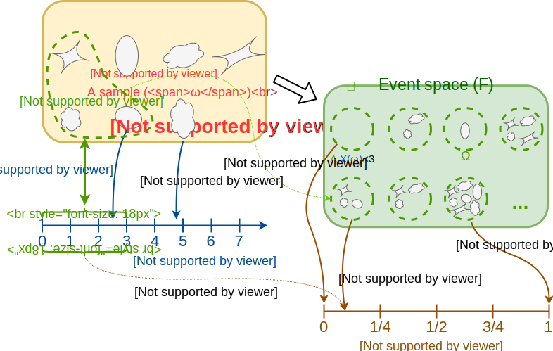

## Background - Probability Theory Review

One of the most common tasks in machine learning is to produce a system that can make predictions based on some observed data. This is done by building a model to describes the relationship between the observed data and the quantity which we would like to predict. One of the common ways to describe this relationship is through a probabilistic model.

A large portion of this course will be devoted to the problem of building the model. In this tutorial, however, we will only focus on the part of making predictions based on a given probabilistic model.

### 🎰 Basic Concepts

We shall start with a quick recap of the basics of probability theory. As an example, we will take a look at the following random phenomenon:

> We take a glass full of juice and pour it on the floor (don't try this at home) and look at the shape of the resulting spill.

Below is a table and a schematic diagram of some probabilistic concepts which we can define related to this phenomenon:

| name | Usually donated by | Definition | Example  |
| :--- | --- | --- | --- |
| **A random phenomenon** |- | Some process which generates random outcomes |  Spilling a glass of juice on the floor and examining at the shape of the spill |
| **A sample** | $$\omega$$ | A single outcome of the process |  Some specific spill shape |
| **Sample space** | $$\Omega$$ | The space of all possible outcomes of the given process. $$\Omega=\left\lbrace\forall\omega\right\rbrace$$ |  The space of all possible spill shapes |
| **Random Variables (RV)** | $$X\left(\omega\right)$$,$$Y\left(\omega\right)$$,... | A function $$X:\Omega\rightarrow\mathbb{R}$$ which assigns a real number to a given sample | A function which returns the perimeter of a spill: $$X_1\left(\omega\right)$$ A function which returns the area of a spill:  $$X_2\left(\omega\right)$$ |
| **An event** | $$A$$,$$B$$,... | A collection of events, i.e., a subset of the sample space $$A\subseteq\Omega$$. We would often define an event through a condition on random variables. |  The collection of all spills with a perimeter smaller than 2: $$A=\left\lbrace\omega: X_1\left(\omega\right)<2 \right\rbrace$$ The collection of all spills with an area larger than 1: $$B=\left\lbrace\omega: X_2\left(\omega\right)>1 \right\rbrace$$ |
| **Event space** | $$\mathcal{F}$$ | A space of events. $$A\in\mathcal{F}$$  | The space of all possible collections of spills shape |
| **Probability measure** | $$Pr\left(A\right)$$ | A function $$Pr:\mathcal{F}\rightarrow\left[0,1\right]$$ which returns the probability of a random sample to be an element in some event $$A$$ | $$Pr\left(A\right)=Pr\left(X_1<2\right)=0.1$$ $$Pr\left(X_1<0\right)=Pr\left(\emptyset\right)=0$$ $$Pr\left(0\leq X_1\right)=Pr\left(\Omega\right)=1$$ $$Pr\left(A\cup B\right)=Pr\left(X_1<2\ \text{or}\ X_2>1\right)=0.6$$ $$Pr\left(A\cap B\right)=Pr\left(X_1<2\ \text{and}\ X_2>1\right)=0.01$$ |
| **Conditional probability measure** | $$Pr\left(AǀB\right)$$ | A function $$Pr:\mathcal{F}_1\times\mathcal{F}_2\rightarrow\left[0,1\right]$$ which returns the probability of a random sample to be an element in event $$A$$ given that it is an element in event $$B$$ | The probability of a spill to have a diameter smaller than 2, given that it has an area larger than 1: $$Pr\left(AǀB\right)=Pr\left(X_1<2ǀX_2>1\right)=0.02$$ |

- In the last two rows, we have used $$X<2$$ as a shorthand for $$\left\lbrace\omega:X\left(\omega\right)<2\right\rbrace$$. This is, in fact, a common shorthand writing which we will be using from here on.

 

Note that by definition, any function of a random variable (RV) is also an RV. For example $$X\left(\omega\right)^2$$ or $$g\left(X\left(\omega\right)\right)$$ in general.

#### Realizations

The outcome of an RV (random variable) for a given sample is called a realization. We will use upper case letters do denote RVs and the equivalent lower case latter to denote their realization. I.e., for the RV $$X$$ we will have: $$x=X\left(\omega\right)$$

**Slight abuse of notation**: In many cases, we will use the name samples to refer to the realizations (and not to the samples from the sample space).

#### Random Vectors

We will usually be interested in working with a series of RVs. In this case, we will usually pack them together in a vector, called a random vector.

We will use bold letters to denote vectors, and will usually define them as column vectors:

$$
\boldsymbol{X}=\left[X_1,X_2,\ldots,X_n\right]^T
$$

and it's realization:

$$
\boldsymbol{x}=\left[x_1,x_2,\ldots,x_n\right]^T
$$

### Toy Model: The 🍕 Pizza & Pancakes 🥞 Drive-Thru

We would like to help a new local drive-thru business that sells pizzas and pancakes. Which would like to be able to make some predictions regarding his business.

#### ✍️ Exercise 1.1 - Warm-Up

The random phenomenon we will be interested in is that of a customer making an order. Our sample will a single customer making an order. Give examples for:

- 2 discrete random variables
- 2 continuous random variables
- 2 events
- 2 possible probability measures.
- A possible probability measure using the union of the 2 events.
- A possible probability measure using the intersection of the 2 events.
- A possible probability measure using the exclusion of the 2 events.
- A possible conditional probability measure.

Make sure that all the probability measures are consistent with one another.

##### 💡 Solution

- 2 discrete random variables
  - $$X\left(\omega\right)$$: The number of pizza slices the customer ordered.🍕
  - $$Y\left(\omega\right)$$: The number of pancakes slices the customer ordered.🥞

- 2 continuous random variables
  - $$L\left(\omega\right)$$: The length of the customer's car in meters. 🚗
  - $$T\left(\omega\right)$$: The amount of tip the customer left in dollars. 💵

- 2 events
  - The customer ordered exactly 1 slice of pizza: $$X=1$$.
  - The customer left more then 2$ tip $$T>2$$.
  
- 2 possible probability measures.
  - The probability that the customer ordered 1 slice: $$Pr\left(X=1\right)=0.2$$.
  - The probability that the customer has left more than 2$ tip: $$Pr\left(T>2\right)=0.5$$.
  
- A possible probability measure using the union of the 2 events.
  - The probability that the customer **either** ordered 1 slice **or** left more than 2$ tip $$Pr\left(X=1 \cup T>2\right)=0.6$$.
  
- An example of a possible probability measure using the intersection of the 2 events.
  - The probability that the customer ordered 1 slice **and** left more than 2$ tip $$Pr\left(X=1 \cap T>2\right)=0.1$$.
  
- An example of a possible probability measure using the exclusion of the 2 events.
  - The probability that the customer ordered 1 slice **but did not** leave more than 2$ tip $$Pr\left(X=1 - T>2\right)=0.4$$.
  
- An example of a possible conditional probability measure.
  - The probability that the customer ordered 1 slice **given that** he left more than 2$ tip $$Pr\left(X=1 \lvert T>2\right)=0.5$$.
  
### 📊 Distributions

The following definitions/rules describe the case of random vector, but they hold just as well for a scalar RV in the degenerate case of a random vector of length 1.

#### Distribution Functions

The distribution of a random vector describes the probability that it's realizations will be equal to some given values/range of values. The distribution can be described in one of the following functions:

##### A Cumulative Distribution Function (CDF)

The CDF of a random vector $$\boldsymbol{X}$$ is usually denoted by $$F_{\boldsymbol{X}}\left(\boldsymbol{x}\right)$$ and is defined as:

$$
F_{\boldsymbol{X}}\left(\boldsymbol{x}\right)=Pr\left(X_1\leq x_1 \cap X_2\leq x_2 \ldots \cap X_n\leq x_n\right)
$$

##### For a Discrete RV/Random Vector: A Probability Mass Function (the PMF)

The PMF of a discrete random vector $$\boldsymbol{X}$$ is usually denoted by $$f_\boldsymbol{X}\left(\boldsymbol{x}\right)$$ or $$p_\boldsymbol{X}\left(\boldsymbol{x}\right)$$ and is defined as:

$$
p_{\boldsymbol{X}}\left(\boldsymbol{x}\right)=Pr\left(X_1=x_1 \cap X_2=x_2 \ldots \cap X_n=x_n\right)
$$

##### For a Continuous or Mixed RV: A Probability Density Function (PDF)

The PDF of a continuous random vector $$\boldsymbol{X}$$ is also usually denoted by $$f_\boldsymbol{X}\left(\boldsymbol{x}\right)$$ or $$p_\boldsymbol{X}\left(\boldsymbol{x}\right)$$.

In the cases where the CDF of a random vector is differentiable, then the pdf is defined as it's derivative:

$$
p_\boldsymbol{X}\left(\boldsymbol{x}\right)=\frac{\partial}{\partial x_1}\frac{\partial}{\partial x_3}\ldots\frac{\partial}{\partial x_n}F_{\boldsymbol{X}}\left(\boldsymbol{x}\right)
$$

Otherwise, it is defined through the following integral:

$$
F_\boldsymbol{X}\left(\boldsymbol{x}\right)=\int_{-\infty}^{x_1}\int_{-\infty}^{x_2}\ldots\int_{-\infty}^{x_n}p_\boldsymbol{X}\left(\boldsymbol{x}\right)dx_n\ldots dx_2 dx_1
$$

#### Conditional Distribution

We will also be interested in talking about the distribution of random vector when conditioned on some other random vectors. Similarly to the regular distributions, the conditional distribution is defined using the condition probability:

##### CDF

$$
F_{\boldsymbol{X}\lvert \boldsymbol{Y}}\left(\boldsymbol{x}\lvert \boldsymbol{Y}=\boldsymbol{y}\right)=Pr\left(X_1\leq x_1 \cap X_2\leq x_2 \ldots \cap X_n\leq x_n\lvert \boldsymbol{Y}=\boldsymbol{y}\right)
$$

##### PMF

$$
p_{\boldsymbol{X}\lvert \boldsymbol{Y}}\left(\boldsymbol{x}\lvert \boldsymbol{Y}=\boldsymbol{y}\right)=Pr\left(X_1=x_1 \cap X_2=x_2 \ldots \cap X_n=x_n\lvert \boldsymbol{Y}=\boldsymbol{y}\right)
$$

##### PDF

$$
p_{\boldsymbol{X}\lvert \boldsymbol{Y}}\left(\boldsymbol{x}\lvert \boldsymbol{Y}=\boldsymbol{y}\right)=\frac{\partial}{\partial x_1}\frac{\partial}{\partial x_3}\ldots\frac{\partial}{\partial x_n}F_{X}\left(\boldsymbol{x}\lvert \boldsymbol{Y}=\boldsymbol{y}\right)
$$

#### Some Basic Rules

##### The law of total probability

$$
p_\boldsymbol{X}\left(\boldsymbol{x}\right)=\underbrace{\sum_{\boldsymbol{y}\in\left\lbrace \boldsymbol{Y}\left(\omega\right),\omega\in\Omega\right\rbrace}p_{\boldsymbol{X},\boldsymbol{Y}}\left(\boldsymbol{x},\boldsymbol{y}\right)}_\text{For discrete RV}=\underbrace{\int_{-\infty}^{\infty}p_{\boldsymbol{X},\boldsymbol{Y}}\left(\boldsymbol{x},\boldsymbol{y}\right)d\boldsymbol{y}}_\text{For cont. RV}
$$

In these cases, where $$p_X\left(\boldsymbol{x}\right)$$ represents the distribution of only a subsection of the RVs, we referred to it as the **marginal distribution**.

The sum over $$\left\lbrace Y\left(\omega\right),\omega\in\Omega\right\rbrace$$ represents the sum over all the possible values $$\boldsymbol{y}$$ can take (without repetitions).

##### The Conditional Distributions Definition:

$$
p_{\boldsymbol{X}\lvert \boldsymbol{Y}}\left(\boldsymbol{x}\lvert \boldsymbol{Y}=\boldsymbol{y}\right)=\frac{p_{\boldsymbol{X},\boldsymbol{Y}}\left(\boldsymbol{x},\boldsymbol{y}\right)}{p_{\boldsymbol{Y}}\left(\boldsymbol{y}\right)}
$$

##### Bayes' Theorem:

By using the above relation for both $$p_{\boldsymbol{Y}\lvert \boldsymbol{X}}$$ and $$p_{\boldsymbol{X}\lvert \boldsymbol{Y}}$$ we can derive the following useful relationship:

$$
p_{\boldsymbol{Y}\lvert \boldsymbol{X}}\left(\boldsymbol{y}\lvert \boldsymbol{X}=\boldsymbol{x}\right)
=\frac{p_{\boldsymbol{X}\lvert \boldsymbol{Y}}\left(x\lvert \boldsymbol{Y}=\boldsymbol{y}\right)p_{\boldsymbol{Y}}\left(\boldsymbol{y}\right)}{p_{\boldsymbol{X}}\left(\boldsymbol{x}\right)}
=\underbrace{\frac{p_{\boldsymbol{X}\lvert \boldsymbol{Y}}\left(\boldsymbol{x}\lvert \boldsymbol{Y}=\boldsymbol{y}\right)p_{\boldsymbol{Y}}\left(\boldsymbol{y}\right)}{\sum_{\tilde{\boldsymbol{y}}} p_{\boldsymbol{X}\lvert \boldsymbol{Y}}\left(\boldsymbol{x}\lvert \boldsymbol{Y}=\tilde{\boldsymbol{y}}\right)p_{\boldsymbol{Y}}\left(\tilde{\boldsymbol{y}}\right)}}_\text{For discrete RV}
=\underbrace{\frac{p_{\boldsymbol{X}\lvert \boldsymbol{Y}}\left(\boldsymbol{x}\lvert \boldsymbol{Y}=\boldsymbol{y}\right)p_{\boldsymbol{Y}}\left(\boldsymbol{y}\right)}{\int_{-\infty}^{\infty}p_{\boldsymbol{X}\lvert \boldsymbol{Y}}\left(\boldsymbol{x}\lvert \boldsymbol{Y}=\tilde{\boldsymbol{y}}\right)p_{\boldsymbol{Y}}\left(\tilde{\boldsymbol{y}}\right)d\tilde{\boldsymbol{y}}}}_\text{For cont. RV}
$$

### Back to The 🍕 Pizza & Pancakes 🥞 Drive-Thru

#### ✍️ Exercise 1.2 - Discrete Distributions

We are given the following joint distribution of the number of slices and the number of pancakes customers buy:

| $$X$$ 🍕 \ $$Y$$ 🥞 |  0   |  1   |  2   |  3   |
| ------------------- | ---- | ---- | ---- | ---- |
|          0          | 0    | 0.15 | 0.2  | 0.05 |
|          1          | 0.08 | 0.03 | ???  | 0.04 |
|          2          | 0.02 | 0.03 | 0.04 | 0.01 |
|          3          | 0.1  | 0.05 | 0.05 | 0.1  |

(We will assume that 3 is the maximal number of pizza slices or pancakes a custer will buy).

**A**) What is the missing number in the table?

**B**) What is the probability that a customer will buy 1 slice of pizza, given that he is not going to buy any pancakes?

**C**) what is the probability that 2 independent customers will buy 3 pizza slices all together?

##### 💡 Solution

**A**) The sum of all possible event should always be 1, therefore the missing value must be equal to:

$$
p_{X,Y}\left(1,2\right) = 1 - \sum_{\left(x,y\right)\neq\left(1,2\right)} p_{X,Y}\left(x, y\right) = 0.05
$$

**B**) By definition:

$$
p_{X\lvert Y}\left(1\lvert Y=0\right)
= \frac{p_{X,Y}\left(1,0\right)}{p_{Y}\left(0\right)}
= \frac{p_{X,Y}\left(1,0\right)}{\sum_{x=0}^3 p_{X,Y}\left(x,0\right)}
= \frac{0.08}{0+0.08+0.02+0.1} = 0.4
$$

**C**) Since the two events which are independent, the probability that both of them will happen is given by the product of the two probabilities. In order to calculate the probability buy a total of 3 pancakes we must sum over all the combinations which sum-up to 3 pancakes: (customer 1:0 & customer 2: 3, customer 1:1 & customer 2: 2, etc.. ).

We shall start by calculating the marginal distribution of the amount of pizza slices bought according to:

$$
p_X\left(x\right)=\sum_y p_{X,Y}\left(x,y\right)=\begin{cases}
0.4 & x=0 \\
0.2 & x=1 \\
0.1 & x=2 \\
0.3 & x=3
\end{cases}
$$

Therefore the probability of two customers buying 3 slices is:

$$
\begin{aligned}
Pr\left(X_1+X_2=3\right)
& = P_X\left(0\right)P_X\left(3\right)
+ P_X\left(1\right)P_X\left(2\right)
+ P_X\left(2\right)P_X\left(1\right)
+ P_X\left(3\right)P_X\left(0\right) \\
& = 0.4\cdot0.3+0.2\cdot0.1+0.1\cdot0.2+0.3\cdot0.4=0.28
\end{aligned}
$$

#### ✍️ Exercise 1.3 - Mixed Distributions

As it turns out, there is a correlation between the length of a customer's car and the number of pizza slices he orders.

A deep survey of this relation has divided the customers into 4 groups according to the number of slices the usually order, an came out with a probabilistic model for the length of the car of each group. According to the model the distribution of the length of a customers car, $$L$$, conditioned on the number of slices he orders, $$X$$, has a normal distribution with the following parameters:

$$
L \lvert X=x \sim N\left(4 + 0.2\cdot x, 0.1^2\right)
$$

We can spot a customer with a car length of 4.4m heading towards the drive-thru, and we would like to start preparing his pizzas. Find the conditional distribution of the pizza slices he would order given that his car length is 4.4m. I.e., find $$p_{X\lvert L}\left(x\lvert L=4.4\right)$$

##### 💡 Solution

According to Bayes' theorem:

$$
p_{X\lvert L}\left(x,l=4.4\right)
=\frac{p_{L\lvert X}\left(4.4\lvert X=x\right)p_X\left(x\right)}{p_L\left(4.4\right)}
=\frac{p_{L\lvert X}\left(4.4\lvert X=x\right)p_X\left(x\right)}{\sum_{\tilde{x}} p_{L\lvert X}\left(4.4\lvert X=\tilde{x}\right)p_X\left(\tilde{x}\right)}
$$

We shell start by calculating the nominator, $$p_{L\lvert X}\left(4.4\lvert X=x\right)p_X\left(x\right)$$:

$$
\begin{aligned}
p_{L|X}\left(4.4\lvert X=x\right)p_X\left(x\right)
& = \begin{cases}
\frac{1}{0.1\sqrt{2\pi}}\exp\left(-\frac{\left(l-4-0.2\cdot 0\right)^2}{2\cdot0.1^2}\right)\cdot0.4 & x=0 \\
\frac{1}{0.1\sqrt{2\pi}}\exp\left(-\frac{\left(l-4-0.2\cdot 1\right)^2}{2\cdot0.1^2}\right)\cdot0.2 & x=1 \\
\frac{1}{0.1\sqrt{2\pi}}\exp\left(-\frac{\left(l-4-0.2\cdot 2\right)^2}{2\cdot0.1^2}\right)\cdot0.1 & x=2 \\
\frac{1}{0.1\sqrt{2\pi}}\exp\left(-\frac{\left(l-4-0.2\cdot 3\right)^2}{2\cdot0.1^2}\right)\cdot0.3 & x=3
\end{cases}\\
& = \begin{cases}
0.11 & x=0 \\
0.24 & x=1 \\
0.2 & x=2 \\
0.36 & x=3
\end{cases}\\
\end{aligned}
$$

Now we can easily calculate the denominator, which is in fact the normalization factor of the nominator:

$$
p_L\left(4.4\right)=\sum_{\tilde{x}} p_{L\lvert X}\left(4.4\lvert X=\tilde{x}\right)p_X\left(\tilde{x}\right)=0.912
$$

Therefore:

$$
p_{X\lvert L}\left(x\lvert L=4.4\right)
=\frac{1}{0.912}\begin{cases}
0.11 & x=0 \\
0.24 & x=1 \\
0.2 & x=2 \\
0.36 & x=3
\end{cases}
=\begin{cases}
0.12 & x=0 \\
0.27 & x=1 \\
0.22 & x=2 \\
0.4 & x=3
\end{cases}
$$

### 🗜️ Expectations

#### The expectation value\Mean

The expectation value or mean of a random vector is defined as:

$$
\mu_{\boldsymbol{X}}=\mathbb{E}\left[\boldsymbol{X}\right]
=\underbrace{\sum_{\boldsymbol{x}\in\left\lbrace \boldsymbol{X}\left(\omega\right),\omega\in\Omega\right\rbrace} \boldsymbol{x}\cdot p_{\boldsymbol{X}}\left(\boldsymbol{x}\right)}_\text{For discrete RV}
=\underbrace{\int_{-\infty}^\infty \boldsymbol{x}\cdot p_{\boldsymbol{X}}\left(\boldsymbol{x}\right)d\boldsymbol{x}}_\text{For cont. RV}
$$

#### Variance

The variance of a (scalar) RV, $$X$$, is define as:

$$
\sigma_X^2=\text{var}\left(X\right)=\mathbb{E}\left[\left(X-\mu_X\right)^2\right]=\mathbb{E}\left[\left(X^2\right)\right]-\mu_X^2
$$

Where $$\sigma_X$$ is called the standard deviation of $$X$$ and is define as the square root of the variance.

#### Covariance

For a pair of RV, the covariance is defined by:

$$
\text{cov}\left(X,Y\right)=\mathbb{E}\left[\left(X-\mu_X\right)\left(Y-\mu_Y\right)\right]=\mathbb{E}\left[\left(XY\right)\right]-\mu_X\mu_Y
$$

#### Covariance Matrix

For a random vector, we will define a covariance matrix, where the $$i,j$$ element of the matrix is the covariance of $$X_i$$ and $$X_j$$:

$$
\Sigma_{\boldsymbol{X},i,j}=\text{cov}\left(X_i,X_j\right)
$$

This can also be written as:

$$
\Sigma_{\boldsymbol{X}}=\mathbb{E}\left[XX^T\right]-\mu_{\boldsymbol{X}}\mu_{\boldsymbol{X}}^T
$$

### Gaussian Vectors (Multivariate Normal Distribution)

One important distribution of a random vector is the distribution of a Gaussian vector, which is also called a multivariate normal distribution. A random vector is a Gaussian random vector if any linear combination of its components produces an RV with a normal distribution.

The multivariate normal distribution of a Gaussian vector $$\boldsymbol{X}$$, is defined by it's a mean $$\boldsymbol{\mu}_{\boldsymbol{X}}$$, the covariance matrix $$\Sigma_\boldsymbol{X}$$:

$$
p_\boldsymbol{X}\left(\boldsymbol{x}\right)=\frac{1}{\sqrt{\left(2\pi\right)^n\left\lvert\Sigma\right\rvert}}\exp\left(-\tfrac{1}{2}\left(\boldsymbol{x}-\boldsymbol{\mu}_X\right)^T\Sigma^{-1}\left(\boldsymbol{x}-\boldsymbol{\mu}_X\right)\right)
$$

Where $$n$$ in the length of the Gaussian vector.

#### Conditional Distributions

In many cases we would like to calculate the distribution of a subset of the Gaussian vector conditioned by the rest of the vector. We shall split the vector into to part and denote the first part by $$\boldsymbol{X}_a$$ and the second by $$\boldsymbol{X}_b$$, such that:

$$
\boldsymbol{X}=\left[\boldsymbol{X}_a^t,\boldsymbol{X}_b^t\right]^T
$$

Similarly we will divide the mean vector and the covariance matrix in a similar way:

$$
\boldsymbol{\mu}_\boldsymbol{X}=\left[\boldsymbol{\mu}_a^t,\boldsymbol{\mu}_b^t\right]^T \\
\Sigma_{\boldsymbol{X}}=\begin{bmatrix}\Sigma_{a,a} & \Sigma_{a,b} \\ \Sigma_{b,a} & \Sigma_{b,b}\end{bmatrix}
$$

The distribution of $$\boldsymbol{X}_a\lvert \boldsymbol{X}_b=\boldsymbol{x}_b$$ will also be a multivariate normal distribution with the following parameters:

$$
\bar{\boldsymbol{\mu}}=\boldsymbol{\mu}_a+\Sigma_{a,b}\Sigma_{b,b}^{-1}\left(\boldsymbol{x}_b-\boldsymbol{\mu}_b\right) \\
\bar{\Sigma}=\Sigma_{a,a}-\Sigma_{a,b}\Sigma_{b,b}^{-1}\Sigma_{b,a}
$$

#### ✍️ Exercise 1.4 - Conditional Multivariate Normal Distribution

**A**) We are given the following parameters of a Gaussian vector:

$$
\boldsymbol{\mu}_\boldsymbol{X}=\left[0, 0, 0\right]^T \\
\Sigma_{\boldsymbol{X}}=\begin{bmatrix}1 & 0 & 0 \\ 0 & 4 & 3 \\ 0 & 2 & 5\end{bmatrix}
$$

Calculate $$p_{X_1\lvert X_2,X_3}$$

**B**) We are given the following parameters of a Gaussian vector:

$$
\boldsymbol{\mu}_\boldsymbol{X}=\left[0, 0, 0\right]^T \\
\Sigma_{\boldsymbol{X}}=\begin{bmatrix}1 & 2 & 0 \\ 2 & 4 & 0 \\ 0 & 0 & 5\end{bmatrix}
$$

Calculate $$p_{X_1\lvert X_2,X_3}$$

**C**) We are given the following parameters of a Gaussian vector:

$$
\boldsymbol{\mu}_\boldsymbol{X}=\left[0, 0, 0\right]^T \\
\Sigma_{\boldsymbol{X}}=\begin{bmatrix}1 & 1 & 1 \\ 1 & 2 & 1 \\ 1 & 1 & 2\end{bmatrix}
$$

Calculate $$p_{X_1\lvert X_2,X_3}$$

##### 💡 Solution

**A**) We will define $$\boldsymbol{X}_a=\left[X_1\right]^T$$ and $$\boldsymbol{X}_b=\left[X_2,X_3\right]^T$$

And accordingly:

$$
\boldsymbol{\mu}_a=\begin{bmatrix}0\end{bmatrix},
\boldsymbol{\mu}_b=\begin{bmatrix}0 \\ 0\end{bmatrix},
\Sigma_{a,a}=\begin{bmatrix}1\end{bmatrix}
\Sigma_{a,b}=\begin{bmatrix}0 & 0\end{bmatrix}
\Sigma_{b,a}=\begin{bmatrix}0 \\ 0\end{bmatrix}
\Sigma_{b,b}=\begin{bmatrix}4 & 3 \\ 2 & 5\end{bmatrix}
$$

Following the formula for the section above the mean and covariance of the conditional distribution will be:

$$
\bar{\boldsymbol{\mu}}=\begin{bmatrix}0\end{bmatrix}+\begin{bmatrix}0 & 0\end{bmatrix}\begin{bmatrix}4 & 3 \\ 2 & 5\end{bmatrix}^{-1}\left(\boldsymbol{x}_b-\begin{bmatrix}0 \\ 0\end{bmatrix}\right)=0 \\
\bar{\Sigma}=\begin{bmatrix}1\end{bmatrix}-\begin{bmatrix}0 & 0\end{bmatrix}\begin{bmatrix}4 & 3 \\ 2 & 5\end{bmatrix}^{-1}\begin{bmatrix}0 \\ 0\end{bmatrix}=1
$$

**B**) Similarly

$$
\boldsymbol{\mu}_a=\begin{bmatrix}0\end{bmatrix},
\boldsymbol{\mu}_b=\begin{bmatrix}0 \\ 0\end{bmatrix},
\Sigma_{a,a}=\begin{bmatrix}1\end{bmatrix}
\Sigma_{a,b}=\begin{bmatrix}2 & 0\end{bmatrix}
\Sigma_{b,a}=\begin{bmatrix}2 \\ 0\end{bmatrix}
\Sigma_{b,b}=\begin{bmatrix}4 & 0 \\ 0 & 5\end{bmatrix}
$$

And

$$
\bar{\boldsymbol{\mu}}=\begin{bmatrix}0\end{bmatrix}+\begin{bmatrix}2 & 0\end{bmatrix}\begin{bmatrix}4 & 0 \\ 0 & 5\end{bmatrix}^{-1}\left(\boldsymbol{x}_b-\begin{bmatrix}0 \\ 0\end{bmatrix}\right)=\tfrac{1}{2}x_2 \\
\bar{\Sigma}=\begin{bmatrix}1\end{bmatrix}-\begin{bmatrix}2 & 0\end{bmatrix}\begin{bmatrix}4 & 0 \\ 0 & 5\end{bmatrix}^{-1}\begin{bmatrix}2 \\ 0\end{bmatrix}=0
$$

**C**) Similarly

$$
\boldsymbol{\mu}_a=\begin{bmatrix}0\end{bmatrix},
\boldsymbol{\mu}_b=\begin{bmatrix}0 \\ 0\end{bmatrix},
\Sigma_{a,a}=\begin{bmatrix}1\end{bmatrix}
\Sigma_{a,b}=\begin{bmatrix}1 & 1\end{bmatrix}
\Sigma_{b,a}=\begin{bmatrix}1 \\ 1\end{bmatrix}
\Sigma_{b,b}=\begin{bmatrix}2 & 1 \\ 1 & 2\end{bmatrix}
$$

And

$$
\bar{\boldsymbol{\mu}}=\begin{bmatrix}0\end{bmatrix}+\begin{bmatrix}1 & 1\end{bmatrix}\begin{bmatrix}2 & 1 \\ 1 & 2\end{bmatrix}^{-1}\left(\boldsymbol{x}_b-\begin{bmatrix}0 \\ 0\end{bmatrix}\right)=\tfrac{1}{3}x_2+\tfrac{1}{3}x_3 \\
\bar{\Sigma}=\begin{bmatrix}1\end{bmatrix}-\begin{bmatrix}1 & 1\end{bmatrix}\begin{bmatrix}2 & 1 \\ 1 & 2\end{bmatrix}^{-1}\begin{bmatrix}1 \\ 1\end{bmatrix}=\tfrac{1}{3}
$$

## Prediction Theory

### 🔮 The Problem

Let us look at the problem of trying to give an "optimal" prediction for the number of slices a customer will buy given that his car length is 4.3m. In order to do so we must first define what do we mean by "optimal" prediction. Let us look at a few optional definitions:

1. The prediction with the lowest probability to be wrong.
1. The prediction with the lowest error on average.
1. The prediction with the lowest squared error on average.

As it turns out that each of the above definitions results in a different prediction. There is an infinite amount of ways to define the optimal prediction, where each definition is preferable in different scenarios. In this course, we will mostly use the first and last definitions.

### 📉 The Loss and The Risk Functions

It turns out that in most cases, we would like to define the optimal prediction as the prediction which minimizes, on average, some penalty function. Let us write it in a more formal way.

Notations:

- It is common to use the hat symbol to denote the prediction. E.g., $$\hat{x}$$ is a prediction for the RV $$X$$.
- The function calculating the penalty is called the **loss** function. It is a function which assigns a score for how bad is a prediction, given the prediction $$\hat{x}$$ and the actual realization $$x$$. We will denote this function by $$l\left(x,\hat{x}\right)$$
- The expectation value of the loss function is called the **risk** function. Which we will denote by $$R\left(\hat{x}\right)=\mathbb{E}\left[l\left(\hat{x},X\right)\right]$$

Under this definition, the "optimal" prediction can be written as the solution to the following optimization problem:

$$
\hat{x}^*=\underset{\hat{x}}{\arg\min}\ R\left(\hat{x}\right)=\underset{\hat{x}}{\arg\min}\ \mathbb{E}\left[l\left(\hat{x},X\right)\right]
$$

A common notation is to use the star sign ($$*$$) to denote the optimal prediction.

Returning to the 3 examples for above, we can now describe them through their loss function:

| Definition | Loss | Loss Name | Risk Name |
| ---------- | ---- | --------- | --------- |
| lowest probability to be wrong | $$l\left(x,\hat{x}\right)=I\left\lbrace\hat{x}\neq x\right\rbrace$$ | Zero-one loss | Misclassification rate |
| lowest error on average | $$l\left(x,\hat{x}\right)=\left\lvert\hat{x}-x\right\rvert$$ | $$l_1$$ | MAE (mean absolute error) |
| lowest squared error on average | $$l\left(x,\hat{x}\right)=\left(\hat{x}-x\right)^2$$ | $$l_2$$ | MSE (mean squared error) |

### 🔧 A Note About Optimization Problems

Optimization problems are problems of the following form:

$$
\boldsymbol{x}^*=\underset{\boldsymbol{x}}{\arg\min}\ f\left(\boldsymbol{x}\right) \\
\begin{aligned}
\text{subject to}\quad
& g_i\left(\boldsymbol{x}\right)\leq 0,\qquad i=1,\ldots,m \\
& h_j\left(\boldsymbol{x}\right)=0,\qquad j=1,\ldots,p
\end{aligned}
$$

Where:

- $$\boldsymbol{x}$$ is either a scalar or a vector.
- $$f$$ is some arbitrary function, which is usually referred to as the objective function (but people also use many other names).
- The $$g_i$$s and $$h_i$$s are optional additional equality and inequality constraints on $$\boldsymbol{x}$$.

Our goal is to fine the value of $$\boldsymbol{x}$$ which produces the minimal value of $$f\left(\boldsymbol{x}\right)$$ among all $$\boldsymbol{x}$$ which obey the constraints.

The mathematical field of optimization is very broad and deals with finding various methods for efficiently solving such problems. In this course, we will not dive into this field except for a few simple cases:

- The case where there are no constraints and the solution can be found analytically by differentiating $$f\left(\boldsymbol{x}\right)$$ and comparing to zero.
- The case where there are only equality constraints ($$h_i$$s) and the solution can be found analytically by a technique called **Lagrange multipliers**, which we will present shortly.
- The case where $$\boldsymbol{x}$$ is discrete and can only take a small finite set of values. Here we can calculate $$f\left(\boldsymbol{x}\right)$$ for all possible $$\boldsymbol{x}$$ and pick the minimal one.
- The case where there are no constraints and we cannot solve the problem analytically, but we can calculate the gradient of $$f\left(\boldsymbol{x}\right)$$. For this case we will use a method called **gradient descent** which we will introduce later on in the course.

### 📚 Solutions For Popular Loss Functions

#### ✍️ Exercise 1.5

**A**) Show that in the discrete case, the optimal predictor for the zero-one loss is the point with the maximal PMF:

$$
\hat{x}^*=\underset{\hat{x}}{\arg\max}\ p_X\left(\hat{x}\right)\\
$$

**B**) Show that in the continuous case, the optimal predictor for the $$l_1$$ loss is the median:

$$
F_X\left(\hat{x}^*\right)=\tfrac{1}{2}
$$

(in the discrete case the optimal predictor is the point closest to being the median, i.e., the point in which both the probability of being larger and the probability of being smaller then $$\hat{x}$$ are less or equal to $$\tfrac{1}{2}$$)

**C**) Show that the optimal predictor for the $$l_2$$ loss is the mean:

$$
\hat{x}^*\mathbb={E}\left[X\right]
$$

##### 💡 Solution

**A**) As defined above, the zero one-loss is given by $$l\left(x,\hat{x}\right)=I\left\lbrace\hat{x}\neq x\right\rbrace$$, therefore the optimal predictor is:

$$
\begin{aligned}[t]
\hat{x}^*
& = \underset{\hat{x}}{\arg\min}\ \mathbb{E}\left[l\left(\hat{x},X\right)\right] \\
& = \underset{\hat{x}}{\arg\min}\ \mathbb{E}\left[I\left\lbrace\hat{x}\neq X\right\rbrace\right] \\
& = \underset{\hat{x}}{\arg\min}\ \sum_xI\left\lbrace\hat{x}\neq x\right\rbrace p_X\left(x\right)
\end{aligned}
$$

The sum in the last line is simply a sum over all the possible values of $$p_X$$ except for $$x=\hat{x}$$. Therefore we can write it in the following way:

$$
\begin{aligned}[t]
\hat{x}^*
& = \underset{\hat{x}}{\arg\min}\ \underbrace{\left(\sum_x p_X\left(x\right)\right)}_{=1} - p_X\left(\hat{x}\right) \\
& = \underset{\hat{x}}{\arg\max}\ p_X\left(\hat{x}\right)
\end{aligned}
$$

**B**) The $$l_1$$ loss is given by $$\left\lvert\hat{x}-x\right\rvert$$. Therefore the optimal predictor is:

$$
\begin{aligned}[t]
\hat{x}^*
& = \underset{\hat{x}}{\arg\min}\ \mathbb{E}\left[l\left(\hat{x},X\right)\right] \\
& = \underset{\hat{x}}{\arg\min}\ \mathbb{E}\left[\left\lvert\hat{x}-x\right\rvert\right] \\
& = \underset{\hat{x}}{\arg\min}\int_{-\infty}^{\infty}\left\lvert\hat{x}-x\right\rvert p_X\left(x\right)dx \\
\end{aligned}
$$

We can solve this optimization problem by differentiating according to $$\hat{x}$$ and comparing to zero

$$
\frac{d}{d\hat{x}}\int_{-\infty}^{\infty}\left\lvert\hat{x}-x\right\rvert p_X\left(x\right)dx = 0 \\
\Leftrightarrow\int_{-\infty}^{\infty}\frac{d}{d\hat{x}}\left\lvert\hat{x}-x\right\rvert p_X\left(x\right)dx = 0 \\
\Leftrightarrow\int_{-\infty}^{\infty}\text{sign}\left(\hat{x}\right) p_X\left(x\right)dx = 0 \\
\Leftrightarrow\underbrace{\left(\int_{-\infty}^{\hat{x}}p_X\left(x\right)dx\right)}_{=F_x\left(\hat{x}\right)} - \underbrace{\left(\int_{\hat{x}}^{\infty}p_X\left(x\right)dx\right)}_{=1 - F_x\left(\hat{x}\right)} = 0 \\
\Leftrightarrow 2F_x\left(\hat{x}\right) = 1 \\
\Leftrightarrow F_x\left(\hat{x}\right) = \tfrac{1}{2} \\
$$

**C**) The $$l_1$$ loss is given by $$\left(\hat{x}-x\right)^2$$. Therefore the optimal predictor is:

$$
\begin{aligned}[t]
\hat{x}^*
& = \underset{\hat{x}}{\arg\min}\ \mathbb{E}\left[l\left(\hat{x},X\right)\right] \\
& = \underset{\hat{x}}{\arg\min}\ \mathbb{E}\left[\left(\hat{x}-x\right)^2\right] \\
\end{aligned}
$$

We can solve this optimization problem by differentiating according to $$\hat{x}$$ and comparing to zero

$$
\frac{d}{d\hat{x}}\mathbb{E}\left[\left(\hat{x}-x\right)^2\right]=0 \\
\mathbb{E}\left[\frac{d}{d\hat{x}}\left(\hat{x}-x\right)^2\right]=0 \\
\mathbb{E}\left[2\left(\hat{x}-x\right)\right]=0 \\
2\hat{x}\underbrace{\mathbb{E}\left[1\right]}_{=1} - 2\mathbb{E}\left[x\right]=0 \\
\hat{x} = \mathbb{E}\left[x\right] \\
$$

#### ✍️ Exercise 1.6 - Predicting The Number of Pizza Slices

Continuing the task from earlier, we would now like to make a prediction for the amount of pizza slices a customer will order given that the length of his car is 4.4m. Calculate the optimal prediction for each of the 3 loss functions.

##### 💡 Solution

We have found earlier that:

$$
p_{X|L}\left(x|L=4.4\right)=\begin{cases}
0.12 & x=0 \\
0.27 & x=1 \\
0.22 & x=2 \\
0.4 & x=3
\end{cases}
$$

According to the results from the previous question, the optimal predictions are:

- Zero-one loss:

$$
\hat{x}^*=\underset{\hat{x}}{\arg\max}\ p_{X|L}\left(\hat{x}|L=4.4\right)=3
$$

- $$l_1$$ loss:

The value which is closest to being the median is $$\hat{x}^*=2$$

(with a probability of $$0.39$$ to be above and $$0.4$$ to be below)

- $$l_2$$ loss:

$$
\hat{x}^*\mathbb={E}\left[X|L=0.44\right]=0\cdot0.12 + 1\cdot0.27 + 2\cdot0.22 + 3\cdot0.4=1.896
$$

#### ✍️ Exercise 1.7  Heart Rate and Blinking

A new research has found a connection between the blinking rate of a person and his heart rate. We will use $$X_1$$ to denote the RV of a person's heart rate and $$X_2$$ to denote a person's blinking rate. According to the research, the distribution of the random vector $$X=\left[X_1,X_2\right]^T$$ can be roughly modeled using a multivariate normal distribution with the following parameters:

$$
\boldsymbol{\mu} = \begin{bmatrix}70\\10\end{bmatrix}
$$

$$
\Sigma = \begin{bmatrix}100 & 8\\8 & 4\end{bmatrix}
$$

Find the function $$\hat{x}^*_1=h^*\left(x_2\right)$$ which, gives the optimal prediction for a person's heart rate giving his blinking rate. Find the solution for each one of the three losses. Is there a difference between the 3 predictions? Why is that?

##### 💡 Solution

We will use the formula for calculating conditional multivariate normal distribution. In this case

$$
\mu_{X_1\lvert X_2=x_2}=\mu_{1}+\frac{\Sigma_{1,2}}{\Sigma_{2,2}}\left(x_2-\mu_{2}\right)=70+\frac{8}{4}\left(x_2-10\right)=50+2x_2 \\
\sigma_{X_1\lvert X_2=x_2}^2=\Sigma_{1,1}-\frac{\Sigma_{1,2}^2}{\Sigma_{2,2}}=100-\frac{8^2}{4} = 84
$$

Therefore:

$$
X_1\lvert X_2 \sim N\left(50+2x_2,84\right)
$$

Since the mean, the media and the point of the maximal distribution are all the same in a gaussian all the three predictors will be the same and equal to:

$$
\hat{x}^*_1=h^*\left(x_2\right)=50+2x_2
$$

This will always be true for symmetrical distributions such as the normal distribution.

### Lagrange Multipliers

The method of Lagrange multipliers comes to solve an optimization problem with only equality constraints:

$$
\boldsymbol{x}^*=\underset{\boldsymbol{x}}{\arg\min}\ f\left(\boldsymbol{x}\right) \\
\begin{aligned}
\text{subject to}\quad
& h_i\left(\boldsymbol{x}\right)=0,\qquad i=1,\ldots,m \\
\end{aligned}
$$

$$f$$ and the $$h_i$$s must all be differentiable.

We will introduce a new set of variables $$\lambda_i$$, one for each constraint, and define the following function:

$$
\mathcal{L}\left(\boldsymbol{x},\boldsymbol{\lambda}\right) = f\left(\boldsymbol{x}\right) + \sum_i \lambda_i h_i\left(\boldsymbol{x}\right)
$$

$$\mathcal{L}$$ is called the lagrangian and the $$\lambda_i$$s are called the Lagrange multipliers.

It can be shown that the if $$\boldsymbol{x}^*$$ is a solution of the original optimization problem, then there exist some set of values $$\boldsymbol{\lambda}^*$$s for which $$\left(\boldsymbol{x}^*, \boldsymbol{\lambda}^*\right)$$ is a stationary point of the Lagrangian. I.e.:

$$
\nabla_{\boldsymbol{x},\boldsymbol{\lambda}}\mathcal{L}\left(\boldsymbol{x}^*,\boldsymbol{\lambda}^*\right) = 0
$$

Therefore we can easily find candidates for $$\boldsymbol{x}^*$$ but differentiating and solving this last equation.

#### ✍️ Exercise 1.8  Lagrange Multipliers

Solve the following optimization problem:

$$
\underset{p_1,p_2}{\arg\max}\ p_1\cdot p_2 \\
\begin{aligned}
\text{subject to}\quad
& p_1 + p_2 = 1 \\
\end{aligned}
$$

##### 💡 Solution

We will introduce one Lagrange multiplier $$\lambda$$ and define the following Lagrangian:

$$
\mathcal{L}=p_1\cdot p_2 + \lambda \left(p_1 + p_2-1\right)
$$

By differentiating and comparing to zero we get the following result:

$$
\begin{aligned}
& \begin{cases}
p_2+\lambda=0\\
p_1+\lambda=0\\
p_1+p_2=1\\
\end{cases}\\
\Rightarrow & \begin{cases}
p_1-p_2=0\\
p_1+p_2=1\\
\end{cases}\\
\Leftrightarrow & \begin{cases}
p_2=\tfrac{1}{2}\\
p_1=\tfrac{1}{2}\\
\end{cases}
\end{aligned}
$$
