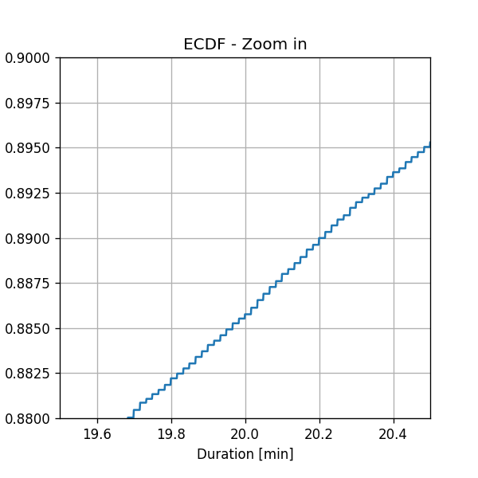
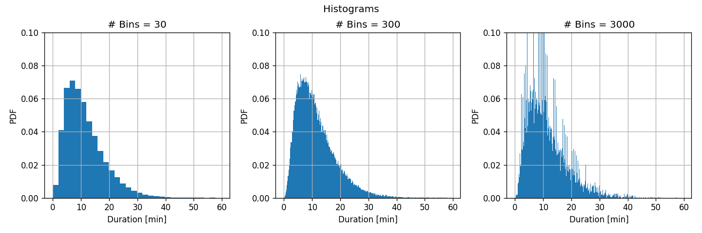
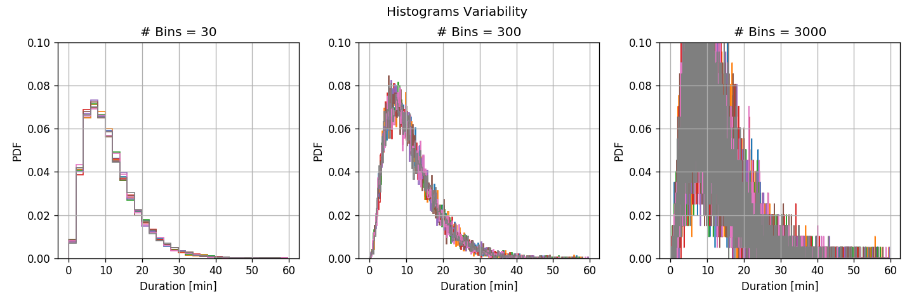
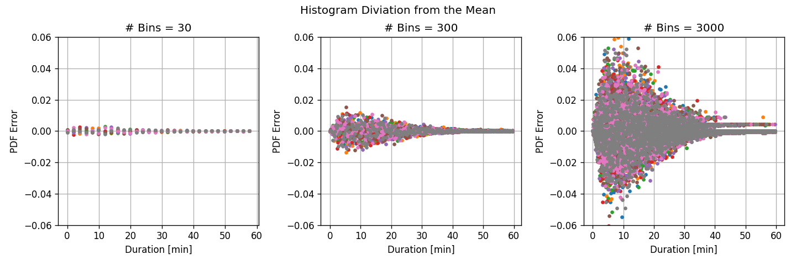
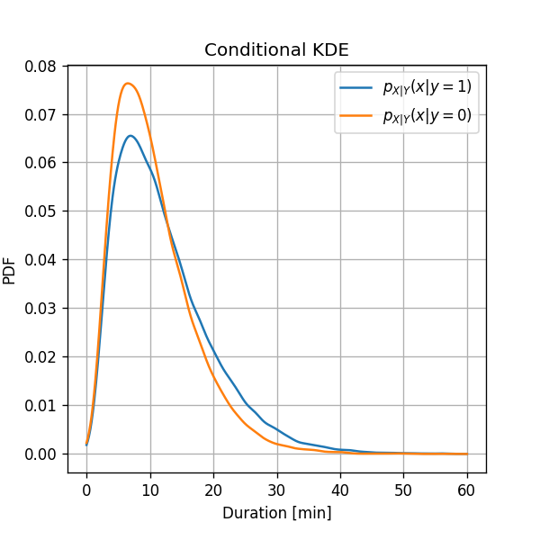
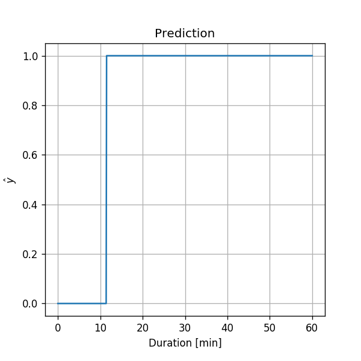

## תיאוריה

בתרגול הקודם למדנו איך לתת תחזיות (פרדיקציות) במקרים שאנחנו יודעים את ההתפלגות של המשתנים האקראיים שאנחנו עוסקים בהם. אולם, בעולם האמיתי מתרחשים תהליכים אקראיים רבים שאיננו יודעים באופן אפריורי את פונקציית ההתפלגות שלהן. בתרגול זה נתחיל לענות על השאלה הבאה: 

"איך ניתן לשערך את אופן ההתפלגות של משתנים מקריים מתוך דגימות (Samples)?" 

סט דגימות כזה מכונה **מדגם** (**Dataset**) או בקיצור Data. לאורך הקורס, נשתמש תמיד בהנחה ש**הדגימים (הנקודות ב- Dataset) בלתי תלויות סטטיסטית ובעלות פילוג זהה (i.i.d.)**. 

סימונים:

- $$N$$ - מספר הדגימות במדגם
- $$\omega_i$$ - הדגם ה $$i$$
- $$X$$, $$Y$$ - משתנים אקראיים
- $$D=\left\lbrace x_i\right\rbrace_{i=1}^N$$ - המדגם (אשר כולל $$N$$ דגמים בעלי פילוג זהה ובלתי תלויים סטטיסטית, i.i.d)
- $$x_i=X\left(\omega_i\right)$$ - הריאלוזציה שמיוחסת לדגם $$\omega_i$$. ערכים אלו נקראים לרוב .**data points**.
- $$p_X\left(x\right)$$ - פונקציית ההסתברות (PMF) או הצפיפות ההסתברות (PDF) של משתנה אקראי.
- $$F_X\left(x\right)$$ - פנקציית הפילוג המצרפי של משתנה אקראי.
- $$I\left\lbrace E\right\rbrace$$ - פונקציית אינדיקטור של האם המאורע $$E$$ התרחש, לדוגמא: $$I\left\lbrace x<y\right\rbrace=\begin{cases}1\ \text{if}\ x<y\\0\ \text{else}\end{cases}$$.
- אנו נשתמש בסימון "כובע" ("hat") לסמן מנת לציין שערוך של ערך בלתי ידוע. לדוגמא נסמן $$\hat{p}_X\left(x\right)$$ לשערוך של $$p_X\left(x\right)$$

המטרה: לשערך את הפילוג של משתנה אקראי מתוך מדגם נתון.

### 🧮 מדידה אמפירית / משערך הצבה (Empirical Measure)

המדידה האמפירית , $$\hat{p}_A$$, הינה שיערוך של הההסתברות, $$Pr\left(A\right)$$, להתרחשות המאורע $$A$$, בהנתן סט של מדידות.

$$
\hat{p}_A=\tfrac{1}{N}\sum_{i=1}^N I\left\lbrace\omega_i\in A\right\rbrace
$$

במילים, אנו משערכים כי ההסתברות להתרשות של מאורע שווה למספר הפעמים היחסי שהמאורע התרחש בסט המדידיות.

### 🎯 תוחלת אמפירית (Empirical mean)

המשערך אמפירי, $$\hat\mu_X$$, הינו המשערך האמפירי של התוחלת  $$\mu_X=\mathbb{E}\left[X\right]$$, של משתנה אקראי $$X$$ כלשהוא:

$$
\hat{\mu}_X=\tfrac{1}{N}\sum_{i=1}^N x_i
$$

באופן דומה, ניתן להגדיר משערך אמפירי לתוחלת של פונקציה כל שהיא של $$X$$, $$f\left(X\right)$$:

$$
\hat{\mu}_{f\left(x\right)}=\tfrac{1}{N}\sum_{i=1}^N f\left(x_i\right)
$$

נשתמש בתובנה זו על לבנות משערכים אמפיריים לפונקציות לשערך את $$p_X\left(x\right)$$ ו $$F_X\left(x\right)$$.

### 📊 שיערוך פונקציית ההסתתרות (במקרה הדיסקרטי)

נוכל לשערך את פונקציית ההסתברות (PMF) של משתנה אקראי על ידי שימוש במדידה האמפירית:

$$
\hat{p}_{X}\left(x\right)=\tfrac{1}{N}\sum_{i=1}^N I\left\lbrace x_i = x\right\rbrace
$$

### 📈 שיערוך של פונקציית הפילוג המצרפית

ידוע גם בתור **ECDF** (Empirical Cumulative Distribution Function).

גם כאן נוחכל לשערך את הפילוג המצרפית על ידי שימוש במדידה אמפירית:

$$
\hat{F}_{X}\left(x\right)=\tfrac{1}{N}\sum_{i=1}^N I\left\lbrace x_i \leq x\right\rbrace
$$

**הערה**: תוצאת השיערוך תהיה תמיד פנוקציה קבועה למקוטעין (אם אי רציפויות), גם במקרים בהם פונקציית הפילוג המצרפי רציפה.

### 📶 שיערוך פונקציית צפיפות ההסתברות על ידי היסטוגרמה

היסטוגרמה היא שיטה לשערוך פונקציית צפיפות ההסתברות (PDF).

הרעיון הוא כדלקמן: 

- לבצע קוונטיזציה (Quantization) לסט דיסקרטי של ערכים על ידי חלוקה לסט תאים נפרדים (Bins) של טווח הערכים שהמשתנה האקראי יכול לקבל 
- שערוך אמפירי של ההסתברות להיות בכל תא (Bin). 
- שימוש בהתפלגות אחידה להתפלגות הערכים בתוך כל תא. 

 **הערה:** בחירת גודל התאים (Bins) משפיעה באופן משמעותי על איכות השערוך של ה PDF. 

כלל אצבע: לחלק את טווח הערכים ל-$$\sqrt{N}$$ תאים בגודל אחיד. 

נסמן ב $$l_k$$ ו  $$r_k$$ את הגבול השמאלי והימני בהתאמה של התא התא ה$$k$$. ההסטוגרמה נתונה על ידי:

$$
h_X\left(l_k \leq x < r_k\right) = \underbrace{\tfrac{1}{N}\sum_{i=1}^N I\left\lbrace l_k \leq x_i < r_k\right\rbrace}_\text{The probability of being in the k-th bin}\cdot\underbrace{\tfrac{1}{r_k-l_k}}_\text{Uniform distribution inside the bin}
$$

### 📉 שיערוך פונקציית צפיפות ההסתברות על ידי Kernel Density Estimation (KDE)

KDE הינה שיטה נוספת לשערוך פונקציית צפיפות ההסתברות. בשיטה זו אנו מייצרים פונקציית צפיפות הסתברות חלקה על ידי שימוש בפונקציית מחליקה המכונה **פונקציית גרעין** (**kernel**) או **Parzan window**

שתי בחירות נפוצות לגרעינים הינם:

- חלון מרובע:

  

 $$\phi\left(x\right)=I\left\lbrace\left\lvert x\right\rvert\leq0.5\right\rbrace$$

- גאוסיאן:

  

$$\phi\left(x\right)=\frac{1}{\sqrt{2\pi}}\exp\left(-\frac{x^2}{2}\right)$$

פונקציית הגרעין תהיה תמיד פונקציית הסתברות תקנית (חיובית שאינטרגל עליה שווה ל1).

בנוסף לבחירה של הגרעין עלינו לגם לקבוע את רוחב הגרעין. הקביעה של רוח הגרעין נעשית עלי די מתיחה של פונקציית הגרעין פי $$h$$ באופן הבא:

$$
\phi_{h}\left(x\right)=\frac{1}{h}\phi\left(\frac{x}{h}\right)
$$
בעבור שני הגרעינים לעיל, נקבל:

- לחלון המרובע נקבל:

$$
\hat{p}_{\phi,h,X}\left(x\right) = \frac{1}{N\cdot h}\sum_{i=1}^N \phi\left(\frac{x-x_i}{h}\right)
$$

-  במקרה הגאוסי, פרמטר הרוחב הוא בדיוק סטיית התקן של הגאוסיאן ולכן נסמן אותו בסימון המקובל $$\sigma$$:

$$
\phi_{\sigma}\left(x\right)=\frac{1}{\sqrt{2\pi}\sigma}\exp\left(-\frac{x^2}{2\sigma^2}\right)
$$

ניתן לחשוב על הדרך ניבנית הפונקצייה המשוערכת באופן הבא:

1. מתחילים עם פונקציית צפיפות הסתברות אשר מכילה $$N$$ פונקציות דלתא בגובה $$\tfrac{1}{N}$$ כל נקודת דגימה.

2. מחליקים את פונקציית הצפיפות על ידי קונבולוציה עם פונקציית הגרעין.

   

פונקציית הצפיפות המשוערכת מתקבלת על ידי:
$$
\hat{p}_{\phi,h,X}\left(x\right) = \frac{1}{N}\sum_{i=1}^N \phi_{h}\left(x-x_i\right)=\frac{1}{N\cdot h}\sum_{i=1}^N \phi\left(\frac{x-x_i}{\alpha}\right)
$$

כלל אצבע לבחירת רוחב הגרעין במקרה הגאוסי הינו $$\sigma=\left(\frac{4\cdot\text{std}\left\lbrace x_i\right\rbrace}{3N}\right)^\frac{1}{5}$$,  כאשר $$\text{std}\left(x\right)$$ הינה הסטיית תקן של המדידיות.

## משערכים כמשתנים אקראיים ופרמטרי טיב

חשוב לציין שכל אחד מן המשערכים שתוארו לעיל הינם למעשה משתנים אקראיים, זאת מכיוון שהם פונקצייה של המדגם שהוא אוסף של משתנים אקראיים. במקרה זה דגם יחיד אשר בעבור מוגדר המשנה האקראי הינו האוסף של כל ה$$N$$ דגמים אשר יוצרים את המדגם.

אנו יכולים לדבר על הפילוג של השיערוך בעבור המקרה בו חוזרים על התהליך כולו של יצירת כל המדגם וחישוב המשערך שוב ושוב.

נסמן לרגע את המשתנה האקראי של תוצאת השיערוך כ$$\Theta$$ (לדוגמא, הECDF בנקודה מסויימת, או ההיסטוגרמה בערך מסויים). בדומה לכל משתנה אקראי אחר, התוחלת של משתנה אקראי זה מוגדרת כ:
$$
\mu_{\hat\theta}=\mathbb{E}\left[\hat{\theta}\left(D\right)\right]
$$

### הטיה / היסט (Bias)

ההטיה או ההיסט של משערך מוגדרת כ:
$$
\text{Bias}\left(\hat{\theta}\left(D\right)\right)\triangleq\mathbb{E}\left[\hat{\theta}\left(D\right)\right]-\theta=\mu_{\hat\theta}-\theta
$$

(ההפרש בין התוחלת של המשערך לערך האמיתי של האובייקט אותו אנו מנסים לשערך).

כאשר ההטיה שווה ל-0, אנו אומרים שהמשערך **אינו מוטה** (**Unbiased**).

#### ✍️ תרגיל 2.1 - הטיות

א) מהי ההטיה של משערך הECDF עבור נקודה $$x_0$$ כלשהי?

ב) מהי ההטיה של משערך הKDE עבור נקודה $$x_0$$ כלשהי? פתרו עבור המקרה בו רוחב הגרעין, $$h$$, קטן, הניחו כי $$\phi$$ הינה פונקציה סימטרית.

##### 💡 פיתרון

א)

על פי הגדרה, ההטיה של הECDF בנקודה $$x_0$$ נתון על ידי:
$$
\begin{aligned}
\text{Bias}\left(\hat{F}\left(x_0\right)\right)
&=\mathbb{E}\left[\hat{F}\left(x_0\right)\right]-F\left(x_0\right) \\
&=\mathbb{E}\left[\frac{1}{N}\sum_{i=1}^N I\left\lbrace X_i<x_0\right\rbrace\right]-F\left(x_0\right) \\
&=\frac{1}{N}\left(\sum_{i=1}^N \mathbb{E}\left[I\left\lbrace X_i<x_0\right\rbrace\right]\right)-F\left(x_0\right) \\
&=\frac{1}{N}\left(\sum_{i=1}^N F\left(x_0\right)\right)-F\left(x_0\right) \\
&=F\left(x_0\right)-F\left(x_0\right) = 0
\end{aligned}
$$

ולכן משערך זה אינו מוטה (חסר הטיה)

ב)

על פי הגדרה, ההיסט של KDE בנקודה $$x_0$$ נתון על ידי:

$$
\begin{aligned}
\text{Bias}\left(\hat{p}\left(x_0\right)\right)
&=\mathbb{E}\left[\hat{p}\left(x_0\right)\right]-p\left(x_0\right) \\
&=\mathbb{E}\left[\frac{1}{N}\sum_{i=1}^N \phi_{h}\left(x_0-X_i\right)\right]-p\left(x_0\right) \\
&=\frac{1}{N}\left(\sum_{i=1}^N \mathbb{E}\left[\frac{1}{h}\phi\left(\frac{x_0-X_i}{h}\right)\right]\right)-p\left(x_0\right) \\
&=\frac{1}{h}\left(\int_{-\infty}^{\infty}\phi\left(\frac{x_0-x}{h}\right)p\left(x\right)dx\right)-p\left(x_0\right) \\
\end{aligned}
$$

נבצע את החלפת המשתנים הבאה $$\tilde{x}=\frac{x-x_0}{h}$$ לקבלת:

$$
\begin{aligned}
\Rightarrow\text{Bias}\left(\hat{p}\left(x_0\right)\right)
&=\left(\int_{-\infty}^{\infty}\phi\left(-\tilde{x}\right)p\left(x_0+h\tilde{x}\right)d\tilde{x}\right)-p\left(x_0\right) \\
\end{aligned}
$$

בעבור ערכים קטנים של $$h$$ נוכל לקרב את $$p\left(x_0+h\tilde{x}\right)$$ בעזרת טור טיילור

$$
p\left(x_0+h\tilde{x}\right)=p\left(x_0\right)+p'\left(x_0\right)h \tilde{x}+\tfrac{1}{2}p''\left(x_0\right)h^2\tilde{x}^2 + o\left(h^3\tilde{x}^3\right)
$$

וכשנציב את הפיתוח לבביטוי להיסט נקבל:

$$
\begin{aligned}
\Rightarrow\text{Bias}\left(\hat{p}\left(x_0\right)\right)
&=\left(\int_{-\infty}^{\infty}\phi\left(-\tilde{x}\right)\left(p\left(x_0\right)+p'\left(x_0\right)h\tilde{x}+\tfrac{1}{2}p''\left(x_0\right)h^2\tilde{x}^2+o\left(h^3\tilde{x}^3\right)\right)d\tilde{x}\right)-p\left(x_0\right) \\
\end{aligned}
$$

מכיוון ש$$\phi$$ הינה פונקצייה סימטרית, ופונקציית פילוג חוקית מתקיים כי:

$$
\phi\left(-x\right)dx=\phi\left(x\right)dx
$$

$$
\int_{-\infty}^{\infty}\phi\left(x\right)dx=1
$$

ו

$$
\int_{-\infty}^{\infty}\phi\left(x\right)xdx=0
$$

ולכן:

$$
\begin{aligned}
\Rightarrow\text{Bias}\left(\hat{p}\left(x_0\right)\right)
&=p\left(x_0\right)\underbrace{\int_{-\infty}^{\infty}\phi\left(\tilde{x}\right)d\tilde{x}}_{=1}
+h p'\left(x_0\right)\underbrace{\int_{-\infty}^{\infty}\phi\left(\tilde{x}\right)\tilde{x}d\tilde{x}}_{=0}
+h^2\tfrac{1}{2}p''\left(x_0\right)\underbrace{\int_{-\infty}^{\infty}\phi\left(\tilde{x}\right)\tilde{x}^2d\tilde{x}}_{=\text{Var}\left(\phi\right)}
+o\left(h^3\right)-p\left(x_0\right) \\
&=h^2\tfrac{1}{2}p''\left(x_0\right)\text{Var}\left(\phi\right)+o\left(h^3\right)
\end{aligned}
$$

קיבלנו כי משערך הKDE הינו משערך מוטה, וכי בעבור ערכים קטנים של $$h$$, ההטיה שלו פורפוציונית ל$$h^2$$, כמו כן ההטיה פורפוציונית לנגזרת השניה של פונקציית צפיפות ההסתברות בנקודה $$x_0$$. תוצאה זו הינה הגניות שכן משערך הKDE מחליק את פונקציית צפיפות ההסתברות ולכן אנו מצפים לקבל שינויים כלשהם ככל שהפונקציית הצפיפות המקורות פחות חלקה. כמו כן ככל ש$$\alpha$$ גדולה יותר ההחלקה חזקה יותר.

### השונות (Estimator Variance)

כמו לכל משתנה אקראי, השונות של המשערך מוגדרת כ:
$$
\text{Var}\left(\hat{\theta}\left(D\right)\right)=\mathbb{E}\left[\left(\hat{\theta}\left(D\right)-\mu_{\hat\theta}\right)^2\right]=\mathbb{E}\left[\hat{\theta}^2\left(D\right)\right]-\mu_{\hat\theta}^2
$$

השונות מתארת עד את רמת הפיזור של שיערוכים שונים סביב התוחלת. בעשבור משערך עם שונות קטנה השיעורך יהיה מאד מרוכז סביב התוחלת, ובעבור שונות גבוהה השיערוכים יהיו מפוזרים על איזור מאד רחב. אנו נהיה מעוניינים לרוב במשערך עם שונות קטנה.

#### ✍️ תרגיל 2.2 - שונות (לקריאה עצמית)

מהי השונות  של משערך הKDE עבור נקודה $$x_0$$ כלשהי? פתרו עבור המקרה בו רוחב הגרעין, $$h$$, קטן, הניחו כי $$\phi$$ הינה פונקציה סימטרית (לקריאה עצמית)

##### 💡 פיתרון

על פי הגדרה, השונות של KDE בנקודה $$x_0$$ נתון על ידי:

$$
\begin{aligned}
\text{Var}\left(\hat{F}\left(x_0\right)\right)
&=\mathbb{E}\left[\hat{F}^2\left(x_0\right)\right]-\mathbb{E}\left[\hat{F}\left(x_0\right)\right]^2 \\
&=\mathbb{E}\left[\left(\frac{1}{N}\sum_{i=1}^N\phi_h\left(x_0-X_i\right)\right)^2\right] - \mathbb{E}\left[\frac{1}{N}\sum_{i=1}^N\phi_h\left(x_0-X_i\right)\right]^2 \\
&=\frac{1}{N^2}\sum_{i=1}^N\sum_{j=1}^N\mathbb{E}\left[\phi_h\left(x_0-X_i\right)\phi_h\left(x_0-X_j\right)\right]-\mathbb{E}\left[\phi_h\left(x_0-X_i\right)\right]\mathbb{E}\left[\phi_h\left(x_0-X_j\right)\right] \\
\end{aligned}
$$
מכיוון שהדגמים במדגם בתלתי תלויים מתקיים כי בעבור $$i\neq j$$:

$$
\mathbb{E}\left[\phi_h\left(x_0-X_i\right)\phi_h\left(x_0-X_j\right)\right]=\mathbb{E}\left[\phi_h\left(x_0-X_i\right)\right]\mathbb{E}\left[\phi_h\left(x_0-X_j\right)\right]
$$

ולכן:

$$
\begin{aligned}\Rightarrow\text{Var}\left(\hat{F}\left(x_0\right)\right)
&=\frac{1}{N^2}\sum_{i=1}^N\mathbb{E}\left[\phi_h^2\left(x_0-X_i\right)\right]-\mathbb{E}\left[\phi_h\left(x_0-X_i\right)\right]^2 \\
&\leq\frac{1}{N^2}\sum_{i=1}^N\mathbb{E}\left[\phi_h^2\left(x_0-X_i\right)\right] \\
&=\frac{1}{N^2h^2}\sum_{i=1}^N\mathbb{E}\left[\phi^2\left(\frac{x_0-X_i}{h}\right)\right] \\&=\frac{1}{Nh^2}\int_{-\infty}^{\infty}\phi^2\left(\frac{x_0-x}{h}\right)p_X\left(x\right)dx \\
\end{aligned}
$$

נבצע את אותה החלפת המשתנים מקודם: $$\tilde{x}=\frac{x-x_0}{h}$$ ונפתח לטור עד לסדר ראשון:

$$
\begin{aligned}\Rightarrow\text{Var}\left(\hat{F}\left(x_0\right)\right)
&=\frac{1}{Nh}\int_{-\infty}^{\infty}\phi^2\left(\tilde{x}\right)p_X\left(x_0+h\tilde{x}\right)d\tilde{x} \\
&=\frac{1}{Nh}\int_{-\infty}^{\infty}\phi^2\left(\tilde{x}\right)
\left(p\left(x_0\right)+p'\left(x_0\right)h\tilde{x}+o\left(h^2\tilde{x}^2\right)\right)
d\tilde{x} \\
&=\frac{1}{Nh}\left(
p\left(x_0\right)\underbrace{\int_{-\infty}^{\infty}\phi^2\left(\tilde{x}\right)d\tilde{x}}_{\triangleq R\left(\phi\right)}
+hp'\left(x_0\right)\underbrace{\int_{-\infty}^{\infty}\phi^2\left(\tilde{x}\right)
\tilde{x}d\tilde{x}}_{\text{antisymmetric=0}}
+o\left(h^2\right)
\right) \\
&=\frac{1}{Nh}p\left(x_0\right)R\left(\phi\right)
+o\left(\frac{h}{N}\right) \\

\end{aligned}
$$

קיבלנו כי בעבור ערכים קטנים של $$h$$, השונות פורפורציונית ל $$\frac{1}{Nh}$$. נזכיר כי בתרגיל הקודם קיבלהו כי ההטיה פורפורציונית ל$$h^2$$ ולכן לא נוכל להגיע למצב שבו למערך יש גם הטיה קטנה וגם שונות קטנה. תופעה זו הינה תופעה אופיינית והיא מכונה **Bias-Vairnace tradoff**. אנו עוד נדון רבות בתופעה זו בהמשך הקורס.

נשים לב שמכיוון והשונות תלויה גם במספר הדגמים $$N$$, ככל שנגדיל את מספר הדגמים נוכל להקטין את רוחב הגרעין $$h$$ ובכך להקטין את ההטיה ולשמור על אותה השונות.

## תרגיל מעשי

### 🚖 מדגם נסיעות המונית בעיר New York

כחלק מהמאץ של העיר New York להנגיש את המידע אותו אוספת העיר לציבור, היא מפרסמת בכל חודש את רשימת כל נסיעות המונית ופרטיהם אשר בוצעו בעיר באותו חודש. בקורס זה, אנו נעשה שימוש ברשימת הנסיעות מחודש ינואר 2016. ניתן למצוא את הרשימה, [פה](https://www1.nyc.gov/site/tlc/about/tlc-trip-record-data.page).

הרשימה המלאה כוללת מעל 10 מליון נסיעות, בכדי להאיץ את זמן החישוב אנו נעשה שימוש רק ברשימה חלקית הכוללת רק 100 אלף נסיעות (אשר נבחרו באקראי אחרי ניקוי מסויים של הרשימה). את הרשימה החלקית ניתן למצוא [פה](https://technion046195.github.io/semester_2019_spring/datasets/nyc_taxi_rides.csv)

### המגדם ושדותיו

בטבלה מלטה מוצגים עשרת שורות הראשונות ברשימה

<table border="1" style="text-align:center;">
  <thead>
    <tr>
      <th></th>
      <th>passenger
          count</th>
      <th>trip
          distance</th>
      <th>payment
          type</th>
      <th>fare
          amount</th>
      <th>tip
          amount</th>
      <th>pickup
          easting</th>
      <th>pickup
          northing</th>
      <th>dropoff
          easting</th>
      <th>dropoff
          northing</th>
      <th>duration</th>
      <th>day
          of
          week</th>
      <th>day
          of
          month</th>
      <th>time
          of
          day</th>
    </tr>
  </thead>
  <tbody>
    <tr>
      <th>0</th>
      <td>2</td>
      <td>2.768065</td>
      <td>2</td>
      <td>9.5</td>
      <td>0.00</td>
      <td>586.996941</td>
      <td>4512.979705</td>
      <td>588.155118</td>
      <td>4515.180889</td>
      <td>11.516667</td>
      <td>3</td>
      <td>13</td>
      <td>12.801944</td>
    </tr>
    <tr>
      <th>1</th>
      <td>1</td>
      <td>3.218680</td>
      <td>2</td>
      <td>10.0</td>
      <td>0.00</td>
      <td>587.151523</td>
      <td>4512.923924</td>
      <td>584.850489</td>
      <td>4512.632082</td>
      <td>12.666667</td>
      <td>6</td>
      <td>16</td>
      <td>20.961389</td>
    </tr>
    <tr>
      <th>2</th>
      <td>1</td>
      <td>2.574944</td>
      <td>1</td>
      <td>7.0</td>
      <td>2.49</td>
      <td>587.005357</td>
      <td>4513.359700</td>
      <td>585.434188</td>
      <td>4513.174964</td>
      <td>5.516667</td>
      <td>0</td>
      <td>31</td>
      <td>20.412778</td>
    </tr>
    <tr>
      <th>3</th>
      <td>1</td>
      <td>0.965604</td>
      <td>1</td>
      <td>7.5</td>
      <td>1.65</td>
      <td>586.648975</td>
      <td>4511.729212</td>
      <td>586.671530</td>
      <td>4512.554065</td>
      <td>9.883333</td>
      <td>1</td>
      <td>25</td>
      <td>13.031389</td>
    </tr>
    <tr>
      <th>4</th>
      <td>1</td>
      <td>2.462290</td>
      <td>1</td>
      <td>7.5</td>
      <td>1.66</td>
      <td>586.967178</td>
      <td>4511.894301</td>
      <td>585.262474</td>
      <td>4511.755477</td>
      <td>8.683333</td>
      <td>2</td>
      <td>5</td>
      <td>7.703333</td>
    </tr>
    <tr>
      <th>5</th>
      <td>5</td>
      <td>1.561060</td>
      <td>1</td>
      <td>7.5</td>
      <td>2.20</td>
      <td>585.926415</td>
      <td>4512.880385</td>
      <td>585.168973</td>
      <td>4511.540103</td>
      <td>9.433333</td>
      <td>3</td>
      <td>20</td>
      <td>20.667222</td>
    </tr>
    <tr>
      <th>6</th>
      <td>1</td>
      <td>2.574944</td>
      <td>1</td>
      <td>8.0</td>
      <td>1.00</td>
      <td>586.731409</td>
      <td>4515.084445</td>
      <td>588.710175</td>
      <td>4514.209184</td>
      <td>7.950000</td>
      <td>5</td>
      <td>8</td>
      <td>23.841944</td>
    </tr>
    <tr>
      <th>7</th>
      <td>1</td>
      <td>0.804670</td>
      <td>2</td>
      <td>5.0</td>
      <td>0.00</td>
      <td>585.344614</td>
      <td>4509.712541</td>
      <td>585.843967</td>
      <td>4509.545089</td>
      <td>4.950000</td>
      <td>5</td>
      <td>29</td>
      <td>15.831389</td>
    </tr>
    <tr>
      <th>8</th>
      <td>1</td>
      <td>3.653202</td>
      <td>1</td>
      <td>10.0</td>
      <td>1.10</td>
      <td>585.422062</td>
      <td>4509.477536</td>
      <td>583.671081</td>
      <td>4507.735573</td>
      <td>11.066667</td>
      <td>5</td>
      <td>8</td>
      <td>2.098333</td>
    </tr>
    <tr>
      <th>9</th>
      <td>6</td>
      <td>1.625433</td>
      <td>1</td>
      <td>5.5</td>
      <td>1.36</td>
      <td>587.875433</td>
      <td>4514.931073</td>
      <td>587.701248</td>
      <td>4513.709691</td>
      <td>4.216667</td>
      <td>3</td>
      <td>13</td>
      <td>21.783056</td>
    </tr>
  </tbody>
</table>

בתרגול זה אנו נשתמש רק בשני השדות הבאים:

- **duration**: משך הנסיעה הכולל בדקות.
- **time_of_day**: שעת תחילת הנסיעה כמספר (לא שלם)

(תיאור מלא של כל השדות בטבלה ניתן למצוא [פה](https://www1.nyc.gov/assets/tlc/downloads/pdf/data_dictionary_trip_records_yellow.pdf))

### ❓️ בעיה: שיערוך הפילוג של משך הנסיעה

נהג מונית מעוניין לשערך את הפילוג של משך הנסיעות שלו. הוא לקח את הקורס מבוא למערכות לומדות והוא יודע שהוא יוכל לעשות זאת מתוך המידע ההיסטורי אותו אספה עריית New York. בחלק זה של התרגול אנו נעזור לאותו נהג מונית לבצע שיערוך זה.

אופן פורמלי, אנו מועניינים לשערך את הפילוג של משך ניסעות המונית בעיר כפונקציית פילוג מצרפי או כפונקציית צפיפות הסתברות.

### 💡 שיטה 1: ECDF

- נסמן את האוסף של ה100 אלף מדידות של משך הנסיעה  מהטבלה כ $$\left\lbrace x_i\right\rbrace$$

- נחשב את משערך הECDF על פני גריד של ערכים המחילים ב0 בקפיצות של 0.001 עד ל $$\max\left(\left\lbrace x_i\right\rbrace\right)$$

  

  תוצאה:

*שימו לב כי תוצאת ה*שיערוך היא אוסף של פונקציות מדרגה

#### ✍️ תרגיל 2.3

על פי פונקציית הפילוג המצרפי המושערכת, מהו הסיכוי כש נסיעת מונית תערך יותר מ20 דקות?

##### 💡 פיתרון

על פי הגדרהת הפילוג המצרפי:
$$
P\left(X_\text{duration}>20 \text{min}\right)=1 - P\left(X_\text{duration}\leq 20 \text{min}\right)=1-\hat{F}_{X}\left(20\right)=1-0.89=0.11
$$

#### התלות בגודל המדגם

על מנת לראות את התלות בגודל המדגם נחזור על החישוב עם כמויות קטנות יותר של דגמים במדגם. אנו נבחר בארקאי $$N=10,10,1000$$ גדמים מהמדגם ונחזור על החישוב. התוצאה:

באופן לא מפתיע ניתן לראות כי ככל שאנו מגדילים את מספר הדגמים במדרגם המשערך מתקרב ליותר ויותר לפונצקציה חלקה וניתן גם להראות כי השערוך מתקרב (במובן סטיסטי) לפונקציית הפילוג המצרפי האמיתית.

### 💡 שיטה 2: היסטוגרמה

נחשב את ההסטוגרמה של משך הנסיעה בעבור חלוקה של התחום ל30, 300ו 3000 תאים.

*תזכורת*: כלל האצבע לבחירה של מספר התאים הינו $$\sqrt{N}=\sqrt{80000}\approx 280$$.

תוצאה:

לפני שנבחן את התוצאות, נריץ מבחן נוסף. מפצל את המגדם ל8 תתי מדגמים שווים ונחשב את ההיסטוגרמה על על אחד משמונת תתי המדגם. כך נוכל למעשה לקבל תחושה לגבי הפילוג של השיערוך המתקבל מההסטוגרמה. תוצאה:

בכדי להגיד את השונות של ההשיערוך בצורה טובה יותר נחסר משמונת השיערוכים את הממוצע שלהם:

קיבלנו כי:

- בעבור **מספר גדול של תאים**, ההבדלים בין תתי המדגם השונים (**שונות גדולה**) גדול והתאים צרים ולכן ההיסטוגרמה יכולה לקרב בצורה יותר טובה את פונקציית הצפיפות האמיתית (**הטיה קטנה**)
- בעבור **מספר קטן של תאים**, ההבדלים בין תתי מדגמים שונים קטן (**שונות קטנה**) אך התאים מאד רחבים ולכן לא יכולים לקרב את הפונקציה האמיתי בצורה טובה (**הטיה גדולה**)

#### הסבר אינטאיטיבי למקורות השגיאה

- כאשר נשתמש ב**מספר תאים גדול** כל תא יהיה צר ומקור השגיאה העיקרי ינבע מה**אקראיות** בביצירת המדגם הגורמת לשינויים גדולים במספר היחסי של נקודות אשר נופלות בכל תא. שינויים אלו מתבטאים ב**שונות גבוהה** של המעשרך. שגיאה זו תלך ותקטן ככל שנגדיל את כמות הדגמים במדגם.
- כאשר נשתמש ב**מספר תאים קטן**, מקור השגיאה העקרי ינבע מ**יכולת הייצוג המוגבלת** של המודל שלנו. מגבלה זו של המודל תיצור **הטיה** גדולה.
- בפועל אנו נרצה לרוב לבחור ערך ביניים כלשהו אשר לא סובל משונות גלוה מידי וגם לא מהטיה גדולה מידי. כל ההאבצע יכול לרוב לעזור לבחור ערך שכזה.

### 💡 שיטה 3: KDE

שערך כעת את פונקציית צפיפות ההסתברות בעזרת KDE עם חלון גאוסי. נבחן  ערכים שונים לרוחב החלון $$\sigma=0.08,0.8,8$$.

תזכורת, כלל האצבע מציע לבחור רוחב של: $$\sigma=\left(\frac{4\cdot\text{std}\left\lbrace x_i\right\rbrace}{3N}\right)^\frac{1}{5}\approx0.775$$

לשם השוואה, נשרטט את התוצאה של גבי ההסטוגרמה של 300 תאים. תוצאה:

אנו שוב רואים התנהגות דומה לזו של ההסטוגרמה:

- עבור בחירה של **רוחב צר** המשערך יכולה לקרב פרטים "עדינים" יותר, אבל השיערוך רועש יותר. כפי שראינו בתרגיל 2.2, במקרה זה ה**שונות גדולה יותר** וה**הטיה קטנה יותר**.
- עבור בחירה של **רוחב רחב** המעערך ה"חלקה" את הפרטים הקטנים, אבל השיערוך פחות רועש יותר. כפי שראינו בתרגיל 2.2, במקרה זה ה**שונות קטנה יותר** וה**הטיה גדולה יותר**.

### ❓️ בעיה: האם נסיעה התרחשה בזמן שעות העבודה

נרצה לחזות (predict), על סמך משך הנסיעה, האם נסיעה נתונה התרחשה במהלך שעות העבודה או לא, כאשר יום העבודה מוגדת בין השעות 7:00 ו18:00.

נגדיר את המשתנה האקראי $$Y$$ במשתנה ברנולי המתאר האם הנסיעה התרחשה במהלך שעות העבודה או לא. נגדיר כי $$Y=1$$ בעבור נסיעה אשר התרחשה במהלך שעות העבודה ו0 אחרת.

נסמן ב $$p_Y\left(y\right)$$ את פונקציית ההסתברות של $$Y$$

נרצה למצוא את חזאי האופטימאלי $$\hat{y}^*=h\left(x\right)$$ אשר ימזער את ה**missclassification rate** (פונקציית הסיכון המתקבל בעבור פונקציית ההפסד אפס-אחד):

$$
\hat{y}^*=h(x)=\underset{\hat{y}}{\arg\min}\quad R\left(\hat{y}\lvert x\right)=\underset{\hat{y}}{\arg\min}\quad \mathbb{E}\left[I\left\lbrace \hat{y}=Y\right\rbrace\lvert X=x\right]
$$

### 💡 פתרון

ראינו בתרגול הקודם כי החזאי האופטימאלי במקרה זה הינו:

$$
\hat{y}^*=h\left(x\right)=\underset{\hat{y}}{\arg\max}\quad p_{Y\lvert X}\left(\hat{y}\lvert X=x\right)
$$

על מנת לחשב את $$p_{Y\lvert X}$$ נשתמש בכלל בייס:

$$
p_{Y|X}\left(y|X=x\right)=\frac{p_{X|Y}\left(x|Y=y\right)\cdot p_Y\left(y\right)}{p_X\left(x\right)}
$$
נשים לב כי:
$$
\begin{aligned}
\hat{y}^*=h\left(x\right)
& = \underset{\hat{y}}{\arg\max}\quad p_{Y\lvert X}\left(\hat{y}\lvert X=x\right) \\
& = \underset{\hat{y}}{\arg\max}\quad \frac{p_{X|Y}\left(x|Y=y\right)\cdot p_Y\left(y\right)}{p_X\left(x\right)} \\
& = \underset{\hat{y}}{\arg\max}\quad p_{X|Y}\left(x|Y=y\right)\cdot p_Y\left(y\right)
\end{aligned}
$$

#### שלב 1: שיערוך של $$p_Y$$ 

נשערך את פונקציית ההסתברות של $$Y$$ באופן אמפירי:

$$
\hat{p}_Y\left(y\right)=\frac{1}{N}\sum_{i=1}^NI\left\lbrace y_i=y\right\rbrace
$$

נקבל כי:
$$
\hat{p}_Y(y)=
\begin{cases}
0.51&y=0\\
0.49&y=1\\
\end{cases}
$$

#### חיזוי עיוור

אם היה ברצונינו לתת חיזוי עיוור (ללא שום נתונים) להאם נסיעה התרחשה במהלך שעות העבודה הינו מעוניינים לתת את החיזוי הבא:

$$
\hat{y}^*=\underset{\hat{y}}{\arg\max}\qquad \hat{p}_{Y}\left(y\right)=0
$$

תוצאה זו טיווראלית שכן ישנו סיכוי מעט יותר גבוה כי נסיעה תתרח מחוץ לשעות העבודה ולכן נעדיף לתת חיזוי שכזה. בעבור חיזוי זה אנו נטעה בממוצע ב49% מהפעמים.

#### שלב 2: שיערוך $$p_{X|Y}$$

על מנת לשערך את הפילוג המותנה, אנו נשערך באופן בנפרד את  $$p_{X\lvert Y}\left(x\lvert Y=0\right)$$  ואת $$p_{X\lvert Y}\left(x\lvert Y=1\right)$$. אנו נעשה זאת על ידי חלוקת המדגם לשני תתי מדגמים אחד בעבור $$Y=0$$ ואחד בעבור $$Y=1$$, ונשתמש בKDE על מנת לשערך את פונקציית צפיפות ההסתברות של כל שני ההסתברות המותנות.

תוצאה:

ניתן לראות שבמהלך שעות העבודה ישנה סבירות מעט יותר גבוהה כי משך הנסיעה יהיה ארוך יותר. נראה כעת כיצד עובדה זו תשפר את השיערוך שלנו ל $$Y$$.

#### שלב 3: חיזוי בהינתן משך הנסיעה

כזכור, החזאי האופטימאלי נתון על ידי:
$$
\begin{aligned}
\hat{y}^*=h\left(x\right)
& = \underset{\hat{y}}{\arg\max}\quad p_{X|Y}\left(x|Y=y\right)\cdot p_Y\left(y\right) \\
& = 
\begin{cases}
1 & p_{X|Y}\left(x|Y=1\right)\cdot p_Y\left(1\right) > p_{X|Y}\left(x|Y=0\right)\cdot p_Y\left(0\right) \\
0 & else
\end{cases}
\end{aligned}
$$
נשרטט פונקציה זו כתלות ב$$x$$:

מכאן שהחיזוי שלנו יהיה:

$$
\hat{y}\left(x\right)=
\begin{cases}
1 & x\geq11.4 \\
0 & \text{otherwise}
\end{cases}
$$

#### הערכת ביצועים

נוכל לבחון את הביצעים של חזאי זה על סט דוגמאות בילתי תלוי, שיכונה בהמשך **סט המבחן** (**test set**). התוצאה של פונקציית הסיכון של סט המחבן הינו $$0.46$$. זאת אומרת שהצלחנו לשפר במקצת את החזוי שלנו לעומת החיזוי העיוור. כאשר נסתמך גם על נתונים נוספים כגון: מיקום נסיעה, היום בשבוע וכו' נוכל לשפראת החזוי שלנו עוד יותר באופן דומה.