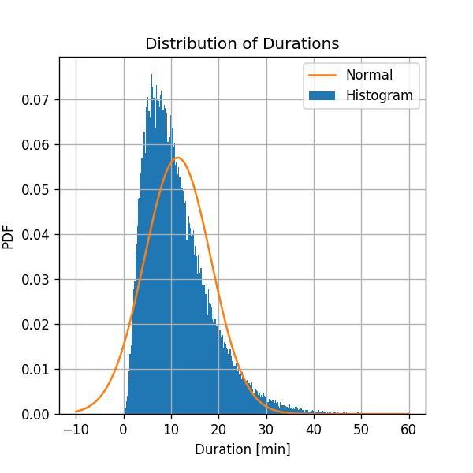
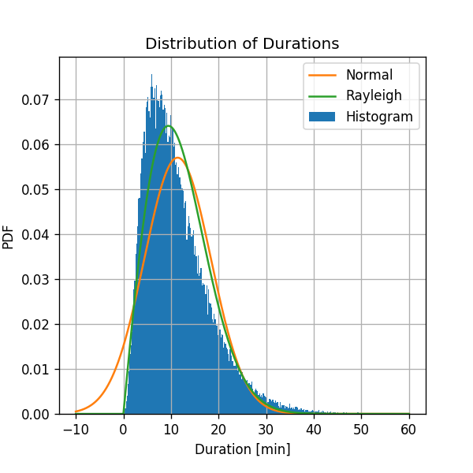
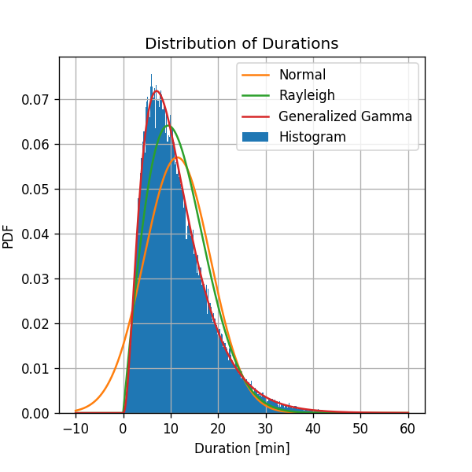

## סימונים: תזכורת

- $$N$$ - מספר הדגימות במדגם
- $$\omega_i$$ - הדגם ה $$i$$
- $$\boldsymbol{X}$$, $$\boldsymbol{Y}$$ - משתנים/וקטורים אקראיים
- $$\boldsymbol{x}_i=\boldsymbol{X}\left(\omega_i\right)$$ - הריאליזציה שמיוחסת לדגם $$\omega_i$$. ערכים אלו נקראים לרוב .**data points**.
- $$D=\left\lbrace \boldsymbol{x}_i\right\rbrace_{i=1}^N$$ - המדגם (אשר כולל $$N$$ ריאליזציות של וקטורים אקראיים בלתי תלויים סטטיסטית ובעלי פילוג זהה, i.i.d)
- $$p_\boldsymbol{X}\left(\boldsymbol{x}\right)$$ - פונקציית ההסתברות (PMF) או הצפיפות ההסתברות (PDF) של משתנה/וקטור אקראי.
- $$F_\boldsymbol{X}\left(\boldsymbol{x}\right)$$ - פנקציית הפילוג המצרפי של משתנה/וקטור אקראי.
- $$I\left\lbrace E\right\rbrace$$ - פונקציית אינדיקטור של האם המאורע $$E$$ התרחש, לדוגמא: $$I\left\lbrace x<y\right\rbrace=\begin{cases}1\ \text{if}\ x<y\\0\ \text{else}\end{cases}$$.
- אנו נשתמש בסימון "כובע" ("hat") על מנת לציין שערוך של ערך בלתי ידוע. לדוגמא נסמן $$\hat{p}_X\left(x\right)$$ לשערוך של $$p_X\left(x\right)$$

מכאן והלאה נשמיט לרוב את שם המשתנה בפונקציות הפילוג במקרים בהם ברור באיזה משתנה אקראי מדובר:

$$
p_X\left(x\right)\rightarrow p\left(x\right)
$$

## תיאוריה

### המטרה

להעריך את $$p\left(\boldsymbol{x}\right)$$ מתוך $$n$$ הדוגמאות במדגם $$D$$.

כפי שנלמד בהרצאה, ניתן להבחין בין הגישות הבאות להסקה סטטיסטית:

- גישה פרמטרית לעומת גישה לא-פרמטרית (א-פרמטרית)

- גישה בייסיאנית לעומת גישה לא-בייסיאנית (קלאסית \ תדירותית).

### הגישה הפרמטרית והלא פרמטרית

#### הבעיה בגישה הלא פרמטרית

בתרגול הקודם התמקדנו בשיטות לשיערוך פילוג המכונות שיטות לא פרמטריות (או א-פרמטריות). לשיטות אלו מספר בעיות:

1. שיטות אלו מניחות כי יש בידינו כמות מספקת של דגימות בכל איזור שבו ישנה הסתברות גדולה מאפס. הבעיה העיקרית עם הנחה זו הינה, שגודל המדגם שאנו צריכים על מנת לקבל שיערוך טוב גדל באופן אקספונציאלי עם מספר המשתנים האקראיים בבעיה. קל להבין זאת במקרה של משתנים בינאריים: עבור משתנה בינארי אחד ישנן שני תוצאות אפשריות, עבור $$N$$ משתנים ישנם $$2^N$$ תוצאות אפשריות, בכדי לשערך את ההסתברות של כל תוצאות האפשריות אנו צריכים מספיק דגימות שיכסו כל קומבינציה אפשרית של המשתנים.
2. התוצאה המתקבלת בשיערוך לא פרמטרי אינה פונקציה שנוח לעבוד איתה, אלא נוסחא בשעזרתה ניתן לחשב את הפילוג בנקודה כלשהי.

#### הגישה הפרמטרית

נציג כעת גישה פופולרית ושימושית יותר המכונה הגישה הפרמטרית. בגישה זו אנו מניחים כי הפילוג הנדרש $$p\left(\boldsymbol{x}\right)$$ הינו בעל צורה ידועה, המוגדרת עד כדי וקטור פרמטרים $$\boldsymbol{\theta}$$, כלומר
$$
p\left(\boldsymbol{x}\right)=p\left(\boldsymbol{x}|\boldsymbol{\theta}\right)
$$
בהינתן המודל הפרמטרי, אנו נרצה למצוא את סט הפרמטרים שיתאים בצורה הטובה ביותר ל-dataset.

במילים אחרות: בגישה זו אנו נציע משפחה של פונקציות פרמטריות, לדוגמא משפחת הגאוסיאנים עם תוחלת ושונות כלשהם, בתקווה כי נוכל לקרב את פונקציית הפילוג בעזרת אחת הפונקציות מהמשפחה על ידי בחירה מתאימה של הפרמטרים. את משפחת הפונקציות הזו אנו מכנים המודל, או המודל הפרמטרי. את סט הפרמטרים של המודל נהוג לייצג כוקטור ולסמנו ב-$$\boldsymbol{\theta}$$. המטרה שלנו, אם כן, הינה בהינתן מודל פרמטרי כלשהו, לשערך את וקטור הפרמטרים האופטימאלי $$\hat{\boldsymbol{\theta}}^*$$ שבעבורו המודל מתאים בצורה מיטבית למדגם הנתון.

הערה: שימו לב כי מימד וקטור הפרמטרים מוגדר מראש ואינו תלוי ב-dataset.

נבדיל עתה בין הגישה הבייסאנית ללא-בייסיאנית לשערוך פרמטרים:

### הגישה הבייסיאנית והלא-בייסיאנית

#### הגישה הבייסיאנית

בגישה זו אנו מניחים כי וקטור הפרמטרים $$\boldsymbol{\theta}$$ הינו ריאליזציה של וקטור אקראי בעל פילוג כלשהוא $$p_0\left(\boldsymbol{\theta}\right)$$. פילוג זה מכונה ה**פילוג הפריורי** (**prior distribution**) או ה**א-פריורי** (**a priori distribution**). מכיוון שאנו מניחים כי וקטור הפרמטרים הינו משתנה מקרי, בהינתן מדגם מסויים נוכל להתייחס לפילוג המותנה של וקטור הפרמטרים בהינתן המדגם $$p\left(\boldsymbol{\theta}\lvert D\right)$$. הפילוג המותנה מכונה ה**פילוג הפוסטריורי** (**posterior distribution**) או **א-פוסטריורי** (**a posteriori distribution**) (או הפילוג בדיעבד). מתוך הפילוג המתקבל נוכל לגזור משערכים שונים עבור וקטור פרמטרים (למשל ההסתברות המקסימאלית, התוחלת וכו').

#### הגישה הלא-בייסיאנית (המכונה גם: קלאסית או תדירותית (**Frequintist**))

בגישה זו אנו נניח כי וקטור הפרמטרים הינו גודל קבוע, אך לא ידוע. תחת גישה זו אין כל העדפה של ערך מסויים של הוקטור על פני ערך אחר. במקרה זה נסמן את הפילוג של המדגם  ב $$p\left(D;\boldsymbol{\theta}\right)$$ על מנת לסמן שהפילוג תלוי בפרמטרים $$\boldsymbol{\theta}$$ (להבדיל מהסימון של פילוג מותנה $$p\left(D\lvert\boldsymbol{\theta}\right)$$). הפונקציה $$p\left(D;\boldsymbol{\theta}\right)$$ מכונה לרוב פונקציית ה**סבירות** (**likelihood**), שכן היא מציינת את הסבירות לקבלת המדגם אותו קיבלנו בעבור וקטור פרמטרים מסויים $$\boldsymbol{\theta}$$, מוקבל גם לסמן אותה באופן הבא:

$$
\mathcal{L}\left(\boldsymbol{\theta}\right)\triangleq p\left(D;\boldsymbol{\theta}\right)
$$

### שיטות שיערוך

בקורס זה נתמקד בשתי שיטות שיערוך פרמטריות, האחת בייסיאנית והשניה לא.

#### משערך (Maximum a Posteriori (MAP (שיטה בייסיאנית)

משערך הMAP משתייך לקטגוריה של שערוך בייסיאני. בשיטה זו נבחר את המשערך האופטימאלי כוקטור הפרמטרים אשר ממקסם את צפיפות ההסתברות האפוסטריורית. כלומר:

$$
\hat{\boldsymbol{\theta}}_{\text{MAP}}=\underset{\boldsymbol{\theta}}{\arg\max}\quad p\left(\boldsymbol{\theta}\lvert D\right)
$$

בפועל, לרוב נשתמש בכלל בייס על מנת לחשב את צפיפות ההסתברות האפוסטריורית. על ידי שימוש בכלל בייס נקבל:

$$
\begin{aligned}
\hat{\boldsymbol{\theta}}_{\text{MAP}}
& = \underset{\boldsymbol{\theta}}{\arg\max}\quad p\left(\boldsymbol{\theta}\lvert D\right) \\
& = \underset{\boldsymbol{\theta}}{\arg\max}\quad \frac{p\left(D\lvert\boldsymbol{\boldsymbol{\theta}}\right)p_0\left(\boldsymbol{\theta}\right)}{p\left(D\right)} \\
& = \underset{\boldsymbol{\theta}}{\arg\max}\quad p\left(D\lvert\boldsymbol{\theta}\right)p_0\left(\boldsymbol{\theta}\right)
\end{aligned}
$$

(מדוע המעבר האחרון נכון?)

ניתן לראות שלמעשה אנו מחפשים את הנקודה שמביאה למקסימום את המכפלה של:

1. ה-Likelihood, $$p\left(D\lvert \boldsymbol{\theta}\right)$$, הסבירות של המדגם שקיבלנו בהינתן וקטור הפרמטרים

2. צפיפות ההסתברות הא-פריורית, Prior: $$p\left(\boldsymbol\theta\right)$$, שלוקחת בחשבון את ההנחה המקדימה שלנו על הסבירות של ערכים שונים של הפרמטרים.

#### משערך Maximum Likelihood Estimator (MLE) (שיטה לא בייסיאנית)

משערך הMLE משתייך לקטגוריה של שערוך לא בייסיאני. בשיטה זו נבחר את המשערך האופטימאלי כוקטור הפרמטרים אשר ממקסם את פונקציית הסבירות. כלומר:

$$
\begin{aligned}
\hat{\boldsymbol{\theta}}_{\text{MLE}}
& = \underset{\boldsymbol{\theta}}{\arg\max}\quad \mathcal{L}\left(\boldsymbol{\theta}\right) \\
& = \underset{\boldsymbol{\theta}}{\arg\max}\quad p\left(D;\boldsymbol{\theta}\right)
\end{aligned}
$$

### הlog-likelihood והנחת הi.i.d.

תחת ההנחה כי הדגמים במדגם הינם i.i.d. (בעלי פילוג זהה ובלתי תלויים סטטיסטית) מתקיים כי:

$$
p\left(D;\boldsymbol{\theta}\right)=p\left(\left\lbrace \boldsymbol{x}_i\right\rbrace_{i=1}^N;\boldsymbol{\theta}\right)=\prod_{i=1}^N p\left(\boldsymbol{x}_i;\boldsymbol{\theta}\right)
$$

בנוסף, נשתמש בעובדה של $$\log$$ הינה פונקציה מונוטונית עולה ולכן:

$$
\underset{x}{\arg\max}\quad f\left(x\right)=\underset{x}{\arg\max}\quad \log\left(f\left(x\right)\right)
$$

מקובל לסמן את ה$$log$$ של פונקציית הסבירות כ $$l\left(\boldsymbol{\theta}\right)\triangleq \log\left(\mathcal{L}\left(\boldsymbol{\theta}\right)\right)$$

מכאן ש:

$$
\begin{aligned}
\hat{\boldsymbol{\theta}}_{\text{MLE}}
& = \underset{\boldsymbol{\theta}}{\arg\max}\quad \mathcal{L}\left(\boldsymbol{\theta}\right) \\
& = \underset{\boldsymbol{\theta}}{\arg\max}\quad l\left(\boldsymbol{\theta}\right) \\
& = \underset{\boldsymbol{\theta}}{\arg\max}\quad \log\left(p\left(D;\boldsymbol{\theta}\right)\right)\\
& = \underset{\boldsymbol{\theta}}{\arg\max}\quad \log\left(\prod_{i=1}^N p\left(\boldsymbol{x}_i;\boldsymbol{\theta}\right)\right) \\
& = \underset{\boldsymbol{\theta}}{\arg\max}\quad \sum_{i=1}^N\log\left(p\left(\boldsymbol{x}_i;\boldsymbol{\theta}\right)\right)
\end{aligned}
$$

באופן זהה:

$$
\begin{aligned}
\hat{\boldsymbol{\theta}}_{\text{MAP}}
& = \underset{\boldsymbol{\theta}}{\arg\max}\quad p\left(D\lvert\boldsymbol{\theta}\right)p_0\left(\boldsymbol{\theta}\right) \\
& = \underset{\boldsymbol{\theta}}{\arg\max}\quad  \sum_{i=1}^N\log\left(p\left(\boldsymbol{x}_i;\boldsymbol{\theta}\right)\right)+\log\left(p_0\left(\boldsymbol{\theta}\right)\right)
\end{aligned}
$$

## תרגילים

#### ✍️ תרגיל 3.1 - שיערוך MLE

נתונות $$N$$ דגימות בלתי תלויות של משתנה אקראי $$X$$: $$\left\lbrace x_i\right\rbrace_{i=1}^N$$, מצאו את משערך הMLE במקרים הבאים:

א) פילוג נורמלי: $$X\sim N\left(\mu,\sigma^2\right)$$ עם פרמטרים $$\mu$$ ו$$\sigma^2$$ לא ידועים.

ב) פילוג אחיד: $$X\sim U\left[0, \theta\right]$$, עם פרמטר $$\theta$$ לא יודע.

ג) פילוג אקספוננציאלי (**לקריאה עצמית**): $$X\sim \exp\left(\theta\right)$$. עם פרמטר $$\theta$$ לא ידוע.

ד) פילוג דיסקרטי: נתונה קוביה בעלת 6 פאות והסתברות $$\left(p_1,\ldots,p_6\right)$$. עם פרמטרים $$\left(p_1,\ldots,p_6\right)$$ לא ידועים.

##### 💡 פיתרון

א) נסמן את וקטור הפרמטרים: $$\theta_1=\mu$$, $$\theta_2=\sigma^2$$ כלומר
$$\boldsymbol{\theta}=\left[\theta_1,\theta_2\right]^T=\left[\mu,\sigma^2\right]^T$$

על פי הגדרה, משערך הMLE נתון על ידי:

$$
\begin{aligned}
\hat{\boldsymbol{\theta}}_{\text{MLE}}
& = \underset{\boldsymbol{\theta}}{\arg\max}\quad \sum_{i=1}^N\log\left(p\left(\boldsymbol{x}_i;\boldsymbol{\theta}\right)\right) \\
& = \underset{\boldsymbol{\theta}}{\arg\max}\quad \sum_{i=1}^N\log\left(\frac{1}{\sqrt{2\pi\theta}_2}\exp\left(-\frac{1}{2\theta_2}\left(x_i-\theta_1\right)^2\right)\right) \\
& = \underset{\boldsymbol{\theta}}{\arg\max}\quad -\frac{N}{2}\log\left(2\pi\theta_2\right)-\sum_{i=1}^N\frac{1}{2\theta}_2\left(x_i-\theta_1\right)^2 \\
\end{aligned}
$$

נפתור על ידי גזירה והשוואה ל 0:

$$
\begin{aligned}
& \begin{cases}
\frac{\partial}{\partial \theta_1}l\left(\theta\right)=0 \\
\frac{\partial}{\partial \theta_2}l\left(\theta\right)=0 \\
\end{cases} \\
\Leftrightarrow & \begin{cases}
\sum_{i=1}^N\frac{1}{\theta}_2\left(x_i-\theta_1\right)=0 \\
-\frac{N}{2\theta_2}+\sum_{i=1}^N\frac{1}{2\theta_2^2}\left(x_i-\theta_1\right)^2=0
\end{cases} \\
\Leftrightarrow & \begin{cases}
\theta_1=\frac{1}{N}\sum_{i=1}^N x_i \\
\theta_2=\frac{1}{N}\sum_{i=1}^N\left(x_i-\theta_1\right)^2
\end{cases} \\
\end{aligned}
$$

מכאן ש:

$$
\hat{\mu}_{\text{MLE}}=\hat{\theta}_1=\frac{1}{N}\sum_{i=1}^N x_i \\
\hat{\sigma^2}_{\text{MLE}}=\hat{\theta}_2=\frac{1}{N}\sum_{i=1}^N\left(x_i-\hat{\mu}_{\text{MLE}}\right)^2
$$

---

ב) פונקציית צפיפות ההסתברות של הפילוג הנתון הינה:

$$
p\left(x_i;\theta\right)=
\begin{cases}
\tfrac{1}{\theta} & \theta\geq x_i\geq 0 \\
0 & \text{else}
\end{cases}
$$

ולכן:

$$
\mathcal{L}\left(\theta\right)=p\left(D;\theta\right)=\prod_{i=1}^N p\left(x_i;\theta\right)=
\begin{cases}
\tfrac{1}{\theta^N} & \forall x_i, x_i\leq\theta \\
0 & \text{else}
\end{cases}
$$

מכאן ש:

$$
\hat{\theta}_{\text{MLE}} = \underset{\theta}{\arg\max}\quad \mathcal{L}\left(\theta;D\right)=\max_i x_i
$$

---

ג) פונקציית צפיפות ההסתברות של הפילוג הנתון הינה:

$$
p\left(x_i;\theta\right)=\theta\exp\left(-\theta x_i\right)
$$

ולכן על פי הגדרת משערך הMLE נקבל כי:

$$
\begin{aligned}
\hat{\theta}_{\text{MLE}}
& = \underset{\theta}{\arg\max}\quad l\left(\theta\right) \\
& = \underset{\theta}{\arg\max}\quad \sum_{i=1}^N\log\left(p\left(\boldsymbol{x}_i;\boldsymbol{\theta}\right)\right) \\
& = \underset{\theta}{\arg\max}\quad N\log\left(\theta\right)-\theta\sum_{i=1}^N x_i \\
\end{aligned}
$$

נפתור על ידי גזירה והשוואה ל 0:

$$
\begin{aligned}
& \frac{\partial}{\partial\theta}l\left(\theta;D\right)=0 \\
\Leftrightarrow & \frac{N}{\theta}-\sum_{i=1}^N x_i=0 \\
\Leftrightarrow & \theta=\frac{1}{\frac{1}{N}\sum_{i=1}^N x_i} \\
\end{aligned}
$$

מכאן ש:

$$
\hat{\theta}_{\text{MLE}} = \frac{1}{\frac{1}{N}\sum_{i=1}^N x_i}
$$

---

ד) נסמן את וקטור הפרמטרים $$\boldsymbol{\theta}=\left[p_1,\ldots,p_6\right]^T$$.

פונקציית ההסתברות של הפילוג הנתון הינה:

$$
p\left(x\right)=\theta_x
$$

רק שהפעם עלינו להתחשב באילוץ: $$\left\lVert\boldsymbol{\theta}\right\rVert_1=\sum_{j=1}^6\theta_j=1$$

נמצא אם כן את משערך הMLE על ידי פתרון בעיית האופטימיזציה המאולצת הבאה:

$$
\begin{aligned}
\underset{\boldsymbol{\theta}}{\arg\max}\quad & l\left(\boldsymbol{\theta}\right) \\
\text{s.t.} & \left\lVert\boldsymbol{\theta}\right\rVert_1=\sum_{j=1}^6\theta_j=1
\end{aligned}
$$

נרשום את הLagrangian

(שימו לב: על מנת למנוע בלבול נשתמש ב$$\mathcal{L}$$ לסימון פונקציית הסבירות ו$$L$$ לסימון של הLagrangian)

$$
\begin{aligned}
L\left(\boldsymbol{\theta},\lambda\right)
& = l\left(\boldsymbol{\theta}\right)-\lambda\left(\sum_{j=1}^6\theta_j-1\right) \\
& = \sum_{i=1}^N\log\left(\theta_{x_i}\right)-\lambda\left(\sum_{j=1}^6\theta_i-1\right) \\
& = \sum_{j=1}^6\underbrace{\sum_{i=1}^N I\left\lbrace x_i=j\right\rbrace}_{\triangleq m_j}\log\left(\theta_j\right)-\lambda\left(\sum_{j=1}^6\theta_i-1\right) \\
& = \sum_{j=1}^6m_j\log\left(\theta_j\right)-\lambda\left(\sum_{j=1}^6\theta_i-1\right) \\
\end{aligned}
$$

כאשר $$m_j$$ הינו מספר הפעמים אשר הערך $$j$$ מופיע במדגם.

נגזור את הLagrangian לפי הפרמטרים $$\boldsymbol{\theta},\lambda$$ ונשווה ל-0:

$$
\begin{aligned}
& \begin{cases}
\frac{\partial}{\partial\theta_l}\log\left(L\left(\boldsymbol{\theta},\lambda\right)\right)=0\\
\frac{\partial}{\partial\lambda}\log\left(L\left(\boldsymbol{\theta},\lambda\right)\right)=0\\
\end{cases} \\
\Leftrightarrow & \begin{cases}
\frac{m_l}{\theta_l}-\lambda=0\\
\sum_{j=1}^6\theta_j-1=0\\
\end{cases} \\
\Leftrightarrow & \begin{cases}
\theta_l=\frac{m_l}{\lambda}\\
\sum_{j=1}^6\theta_j=1\\
\end{cases} \\
\Leftrightarrow & \begin{cases}
\theta_l=\frac{m_l}{\lambda}\\
\sum_{j=1}^6\frac{m_j}{\lambda}=1\\
\end{cases} \\
\Leftrightarrow & \begin{cases}
\theta_l=\frac{m_l}{N}\\
\lambda=\sum_{j=1}^6m_j=N\\
\end{cases} \\
\end{aligned}
$$

קיבלנו כי

$$
\hat{p}_{l,\text{MLE}}=\hat{\theta}_l=\frac{m_l}{N}=\frac{1}{N}\sum_{i=1}^N I\left\lbrace x_i=l\right\rbrace
$$

כלומר משערך הMLE הינו המדידה האמפירית של ההסתברות של לקבלת הערך מסויים.

##### נדון במקרי הקצה

1. עבור הטלה בודדת, $$N=1$$, שתוצאתה $$x_0$$ נקבל פונקציית צפיפות משוערכת של $$\hat{p}_X\left(x\right)=I\left\lbrace x=x_0\right\rbrace$$. זאת אומרת שתוצאת הקוביה תהיה תמיד $$x_0$$
1. בגבול שבו $$N\rightarrow\infty$$ מתקבל על פי חוק המספרים הגדולים כי

$$
\hat{p}_{l,\text{MLE}}\rightarrow p\left(l\right)=p_l
$$

#### ✍️ תרגיל 3.2

נתון שהרווח היומי של חברת "רווחילי" מתפלג גאוסית $$X\sim N\left(\theta,\sigma_X\right)$$. נתון לנו מדגם אשר מכיל את הרווחים של החברה ב$$N$$ הימים האחרונים $$\left\lbrace x_i\right\rbrace_{i=1}^N$$.

לשם הפשטות נניח שהרווחים בימים שונים הינם בעלי פילוג זהה וכי הם בלתי תלויים סטטיסטית, כלומר הם משתנים i.i.d.

בשאלה זו נניח ש $$\sigma_X$$ הינו פרמטר ידוע וקבוע ונרצה לחשב את תוחלת הרווח היומי, כלומר לשערך את .$$\theta$$ לשם כך, יוסי הציע להשתמש במודל עבור ההתפלגות הפירורית של $$\mu_x$$ בהתאם למחקר שביצעו על חברות שונות במשק. יוסי טען שתוחלת הרווח היומי של חברות מתפלגת נורמלי
$$\mu_X\sim N\left(\mu_M,\sigma_M\right)$$
, עם פרמטרים ידועים $$\mu_M$$ ו $$\sigma_M$$.

א) חשב את משערך הMAP בהתאם למדגם ולפילוג האפריורי שהציע יוסי.

ב) נתחו את תוצאת השיערוך המתקבלת עבור ערכים שונים של $$\sigma_X$$ ו $$\sigma_M$$.

##### 💡 פיתרון

נחשב את משערך הMAP על פי הגדרה

$$
\begin{aligned}
\hat{\theta}_{\text{MAP}}
& = \underset{\theta}{\arg\max}\quad p\left(D\lvert \theta\right)p_0\left(\theta\right) \\
& = \underset{\theta}{\arg\max}\quad \sum_{i=1}^N\log\left(p\left(x_i\lvert \theta\right)\right) + \log\left(p_0\left(\theta\right)\right) \\
& = \underset{\theta}{\arg\max}\quad \sum_{i=1}^N\log\left(\frac{1}{\sqrt{2\pi\sigma_X^2}}e^{-\frac{\left(x_i-\theta\right)^2}{2\sigma_X^2}}\right) + \log\left(\frac{1}{\sqrt{2\pi\sigma_M^2}}e^{-\frac{\left(\theta-\mu_M\right)^2}{2\sigma_M^2}}\right) \\
& = \underset{\theta}{\arg\max}\quad -\frac{N}{2}\log\left(2\pi\sigma_X^2\right)-\frac{1}{2\sigma_X^2}\sum_{i=1}^N\left(x_i-\theta\right)^2 - \frac{1}{2}\log\left(2\pi\sigma_M^2\right) - \frac{1}{2\sigma_M^2}\left(\theta-\mu_M\right)^2\\
& = \underset{\theta}{\arg\min}\quad \frac{1}{2\sigma_X^2}\sum_{i=1}^N\left(x_i-\theta\right)^2 + \frac{1}{2\sigma_M^2}\left(\theta-\mu_M\right)^2\\
\end{aligned}
$$

נגזור ונשווה ל-0

$$
\frac{\partial}{\partial\theta}\left(\frac{1}{2\sigma_X^2}\sum_{i=1}^N\left(x_i-\theta\right)^2 + \frac{1}{2\sigma_M^2}\left(\theta-\mu_M\right)^2\right)=0\\
\Leftrightarrow \frac{1}{\sigma_X^2}\sum_{i=1}^N\left(\theta-x_i\right) + \frac{1}{\sigma_M^2}\left(\theta-\mu_M\right)=0 \\
\Leftrightarrow \theta=\frac{\frac{1}{\sigma_X^2}\sum_{i=1}^Nx_i + \frac{1}{\sigma_M^2}\mu_M}{\frac{N}{\sigma_X^2} + \frac{1}{\sigma_M^2}} \\
\Leftrightarrow \hat{\theta}=\frac{\frac{1}{\sigma_X^2/N}\frac{1}{N}\sum_{i=1}^Nx_i + \frac{1}{\sigma_M^2}\mu_M}{\frac{1}{\sigma_X^2/N} + \frac{1}{\sigma_M^2}} \\
$$

קיבלנו כי:

$$
\hat{\theta}_{\text{MAP}}=\frac{\frac{1}{\sigma_X^2/N}\frac{1}{N}\sum_{i=1}^Nx_i + \frac{1}{\sigma_M^2}\mu_M}{\frac{1}{\sigma_X^2/N} + \frac{1}{\sigma_M^2}}
$$

נשים לב למספר דברים:

- הביטוי $$\frac{1}{N}\sum_{i=1}^Nx_i$$ הינו הערך אשר ממקסם את הפילוג המותנה של המדגם בהינתן  $$\theta$$ (פונקציית הlikelihood). זהו למעשה משערך הMLE.
- הערך $$\mu_M$$ הינו הערך אשר ממקסם את הפילוג האפריורי.
- הגודל $$\sigma_X^2/N$$ הינו השונות של הגודל $$\frac{1}{N}\sum_{i=1}^Nx_i$$

התוצאה שאותה קיבלנו הינה למעשה ממוצע מושכלל בין הערך אשר ממקסם את הlikelihood, אשר תלוי במדגם, לבין הערך אשר ממקסם את הפילוג האפריורי. המשקל של כל ערך שווה לאחד חלקי שונות הפילוג של אותו ערך. הגודל של אחד חלקי שונות למעשה מבטא את רמת הוודאות שיש לנו לגבי הדיוק של הערך.

ב) נסתכל על מקרי הקצה.

- כאשר $$\sigma_X/N\ll\sigma_M$$ אזי החלק אשר תלוי במדגם מקבל את מרבית המשקל, ומתקיים כי:

$$
\hat{\theta}_{\text{MAP}}\approx\frac{1}{N}\sum_{i=1}^Nx_i
$$

במקרה זה הפילוג האפיריורי רחב מאד ואין הבדל גדול בין ההסתברות האפריורית של ערכים יחסית קרובים ולכן ההשפעה של הפילוג האפריורי קטנה.

- כאשר $$\sigma_X/N\gg\sigma_M$$ אזי החלק אשר תלוי בפילוג האפריורי מקבל את מרבית המשקל,  ומתקיים כי:

$$
\hat{\theta}_{\text{MAP}}\approx\mu_M
$$

## בעיה מעשית

### 🚖 תזכורת: מדגם נסיעות המונית בNew York

עשרת הדגמים הראשונים במדגם הנסיעות בעיר New York

<table border="1" style="text-align:center;">
  <thead>
    <tr>
      <th></th>
      <th>passenger_count</th>
      <th>trip_distance</th>
      <th>payment_type</th>
      <th>fare_amount</th>
      <th>tip_amount</th>
      <th>pickup_easting</th>
      <th>pickup_northing</th>
      <th>dropoff_easting</th>
      <th>dropoff_northing</th>
      <th>duration</th>
      <th>day_of_week</th>
      <th>day_of_month</th>
      <th>time_of_day</th>
    </tr>
  </thead>
  <tbody>
    <tr>
      <th>0</th>
      <td>2</td>
      <td>2.768065</td>
      <td>2</td>
      <td>9.5</td>
      <td>0.00</td>
      <td>586.996941</td>
      <td>4512.979705</td>
      <td>588.155118</td>
      <td>4515.180889</td>
      <td>11.516667</td>
      <td>3</td>
      <td>13</td>
      <td>12.801944</td>
    </tr>
    <tr>
      <th>1</th>
      <td>1</td>
      <td>3.218680</td>
      <td>2</td>
      <td>10.0</td>
      <td>0.00</td>
      <td>587.151523</td>
      <td>4512.923924</td>
      <td>584.850489</td>
      <td>4512.632082</td>
      <td>12.666667</td>
      <td>6</td>
      <td>16</td>
      <td>20.961389</td>
    </tr>
    <tr>
      <th>2</th>
      <td>1</td>
      <td>2.574944</td>
      <td>1</td>
      <td>7.0</td>
      <td>2.49</td>
      <td>587.005357</td>
      <td>4513.359700</td>
      <td>585.434188</td>
      <td>4513.174964</td>
      <td>5.516667</td>
      <td>0</td>
      <td>31</td>
      <td>20.412778</td>
    </tr>
    <tr>
      <th>3</th>
      <td>1</td>
      <td>0.965604</td>
      <td>1</td>
      <td>7.5</td>
      <td>1.65</td>
      <td>586.648975</td>
      <td>4511.729212</td>
      <td>586.671530</td>
      <td>4512.554065</td>
      <td>9.883333</td>
      <td>1</td>
      <td>25</td>
      <td>13.031389</td>
    </tr>
    <tr>
      <th>4</th>
      <td>1</td>
      <td>2.462290</td>
      <td>1</td>
      <td>7.5</td>
      <td>1.66</td>
      <td>586.967178</td>
      <td>4511.894301</td>
      <td>585.262474</td>
      <td>4511.755477</td>
      <td>8.683333</td>
      <td>2</td>
      <td>5</td>
      <td>7.703333</td>
    </tr>
    <tr>
      <th>5</th>
      <td>5</td>
      <td>1.561060</td>
      <td>1</td>
      <td>7.5</td>
      <td>2.20</td>
      <td>585.926415</td>
      <td>4512.880385</td>
      <td>585.168973</td>
      <td>4511.540103</td>
      <td>9.433333</td>
      <td>3</td>
      <td>20</td>
      <td>20.667222</td>
    </tr>
    <tr>
      <th>6</th>
      <td>1</td>
      <td>2.574944</td>
      <td>1</td>
      <td>8.0</td>
      <td>1.00</td>
      <td>586.731409</td>
      <td>4515.084445</td>
      <td>588.710175</td>
      <td>4514.209184</td>
      <td>7.950000</td>
      <td>5</td>
      <td>8</td>
      <td>23.841944</td>
    </tr>
    <tr>
      <th>7</th>
      <td>1</td>
      <td>0.804670</td>
      <td>2</td>
      <td>5.0</td>
      <td>0.00</td>
      <td>585.344614</td>
      <td>4509.712541</td>
      <td>585.843967</td>
      <td>4509.545089</td>
      <td>4.950000</td>
      <td>5</td>
      <td>29</td>
      <td>15.831389</td>
    </tr>
    <tr>
      <th>8</th>
      <td>1</td>
      <td>3.653202</td>
      <td>1</td>
      <td>10.0</td>
      <td>1.10</td>
      <td>585.422062</td>
      <td>4509.477536</td>
      <td>583.671081</td>
      <td>4507.735573</td>
      <td>11.066667</td>
      <td>5</td>
      <td>8</td>
      <td>2.098333</td>
    </tr>
    <tr>
      <th>9</th>
      <td>6</td>
      <td>1.625433</td>
      <td>1</td>
      <td>5.5</td>
      <td>1.36</td>
      <td>587.875433</td>
      <td>4514.931073</td>
      <td>587.701248</td>
      <td>4513.709691</td>
      <td>4.216667</td>
      <td>3</td>
      <td>13</td>
      <td>21.783056</td>
    </tr>
  </tbody>
</table>

### ❓️ הבעיה: שיערוך הפילוג של משך הנסיעה

אנו מעוניינים לשערך את הפילוג של משך הנסיעה

### 💡 ניסיון 1: MLE ופילוג גאוסי

נשתמש במודל של פילוג נורמלי לתיאור הפילוג של משך הנסיעה. למודל זה שני פרמטרים, התוחלת $$\mu$$ והשונות $$\sigma$$ .

#### פתרון

סימונים והנחות:

- $$N$$ - מספר הדגמים במדגם.

- $$\boldsymbol{\theta}=\left[\mu,\sigma\right]^T$$ - וקטור הפרמטרים של המודל
- $$p_\text{normal}\left(x_i;\boldsymbol{\theta}\right)=\frac{1}{\sqrt{2\pi\sigma^2}}\exp\left(-\frac{\left(x_i-\mu\right)^2}{2\sigma^2}\right), i=1,...,N$$ - המודל

ראינו כי בעבור המודל הנורמלי, ניתן למצוא את הפרמטרים של משערך הMLE באופן מפורש (אנליטית), והפתרון נתון על ידי:

$$
\mu=\displaystyle{\frac{1}{N}\sum_i x_i} \\
\sigma=\sqrt{\displaystyle{\frac{1}{N}\sum_i\left(x_i-\mu\right)^2}}
$$

בעבור המדגם הנתון נקבל:

$$
\hat{\mu} = 11.4\ \text{min} \\
\hat{\sigma} = 7.0\ \text{min}
$$

נשרטט את ההיסטוגרמה של של משכי הנסיעה יחד עם הפילוג הנורמלי המשוערך:

נראה כי הפילוג הנורמלי נותן קירוב מאד גס לפילוג האמיתי. במקרים רבים קירוב זה יהיה מספיק, אך במקרה זה ננסה לשפר את השיערוך שלנו.

עובדה אחת שמאד מטרידה לגבי הפילוג שקיבלנו הינה שישנו סיכוי לא אפסי לקבל נסיעות עם משך נסיעה שלילי.

ננסה להציע מודל טוב יותר.

### 💡 נסיון 2: MLE ופילוג Rayleigh

פילוג Rayleigh מתאר את הפילוג של האורך האוקלידי ($$l_2$$ norm) של וקטור גאוסי דו מימדי עם תוחלת 0 וחוסר קורלציה ופילוג זהה לשני רכיבי הוקטור. במלים אחרות, עבור וקטור בעל הפילוג הבא:

$$
\boldsymbol{Z}\sim N\left(\begin{bmatrix} 0 \\ 0 \end{bmatrix}, \begin{bmatrix} \sigma^2 & 0 \\ 0 & \sigma^2 \end{bmatrix}\right)
$$

פילוג Rayleigh מתאר את הפילוג של הגודל  $$\left\lVert\boldsymbol{Z}\right\rVert_2=\sqrt{Z_x^2+Z_y^2}$$ 

פונקציית צפיפות ההסתברות של פילוג Reyligh נתונה על ידי:

$$
p_\text{Rayleigh}\left(z;\sigma\right)=\frac{z}{\sigma^2}\exp\left({-\frac{z^2}{2\sigma^2}}\right), \quad z\geq0
$$

נשים לב כי הפילוג מוגדר רק בעבור ערכים חיוביים. לפילוג זה פרמטר יחיד $$\sigma$$ שנקרא פרמטר סקאלה (scale parameter). בניגוד לפילוג הנורמלי, פה $$\sigma$$ אינה שווה לסטיית התקן של הפילוג.

ניתן מוטיבציה קצרה לבחירה שלנו במודל זה.

#### מוטיבציה לשימוש בפילוג Rayleigh

נתחיל עם ההנחה שוקטור המחבר את נקודת תחילת הנסיעה עם נקודת סיום הנסיעה הינו וקטור דו מימדי אשר מפולג נרמלית ולשם הפשטות נניח כי רכיביו מפולגים עם פילוג זהה וחסר קורלציה.

בנוסף לשם הפשטות נניח כי המונית נוסעת בקירוב בקו ישר בין נקודת ההתחלה והסיום ולכן המרחק אותו נוסעת המכונית יהיה מפולג על פי פילוג Reyleigh. נניח בנוסף כי מהירות הנסיעה קבוע ולכן משך הנסיעה פורפורציוני למרחק ולכן גם הוא יהיה מפולג על פי פילוג Reyleigh.

#### פתרון

לשם השלמות נסמן את וקטור הפרמטרים של ב: $$\theta=\left[\sigma\right]$$

במקרה זה המודל נתון על ידי:

$$
p_\text{rayleigh}\left(\boldsymbol{x};\theta\right)=\prod_{i=1}^{N}\frac{x_i}{\theta^2}\exp\left(-\frac{x_i^2}{2\theta^2}\right)
$$

ופונקציית ה log likelihood תהיה:

$$
\begin{aligned}
l_\text{rayleigh}\left(\theta|\{x\}\right)
& = \sum_i\log\left(p_\text{rayleigh}\left(x_i;\theta\right)\right) \\
& = \sum_i\log\left(x_i\right)-2N\log\left(\theta\right)-\frac{1}{2\theta^2}\sum_ix_i^2
\end{aligned}
$$

בעיית האופטימיזציה שלנו תהיה:

$$
\hat{\boldsymbol{\theta}}=\underset{\boldsymbol{\theta}}{\arg\min}\ -\sum_i\log\left(x_i\right)+2N\log\left(\theta\right)+\frac{1}{2\theta^2}\sum_ix_i^2
$$

גם בעבור המקרה הזה נוכל לפתור את בעיית האופטימיזציה באופן אנליטי על ידי גזירה והשוואה לאפס:

$$
\frac{\partial l_\text{rayleigh}\left(\theta|\{x\}\right)}{\partial\theta}=0 \\
\Leftrightarrow -\frac{2N}{\theta}+\frac{\sum_ix^2}{\theta^3}=0 \\
\Leftrightarrow \hat{\sigma} = \theta=\sqrt{\frac{1}{2N}\sum_i x^2}
$$

בעבור המדגם הנתון נקבל:

$$
\hat{\sigma} = 9.5
$$

נוסיף את השיערוך החדש שקיבלנו לגרף ממקודם:

על פי הדמיון בין ההיסטוגרמה לפונקציות הפילוג ששיערכנו, נראה כי המודל של פילוג Rayleigh נותן תוצאה מעט יותר טובה מהמודל הנורמלי, בנוסף ניתן לראות גם כי כעת אין הסתברות שונה מ0 לקבל משך נסיעה שלילי.

ננסה מודל נוסף.

### 💡נסיון 3: MLE ו Generalized Gamma Distribution

פילוג Rayleigh הינו מקרה פרטי של משפחה כללית יותר של פונקציות פילוג המכונה Generalized Gamma Distribution. פונקציית צפיפות ההסתברות של משפחה זו נתונה על ידי:

$$
p_\text{gengamma}\left(z;\sigma,a,c\right)=
\frac{cz^{ca-1}\exp\left(-\left(z/\sigma\right)^c\right)}{\sigma^{ca-1}\Gamma\left(a\right)}
, \quad z\geq0
$$

(כשאר $$\Gamma$$ היא פונקציה המוכנה [פונקציית גמא (gamma function)](https://en.wikipedia.org/wiki/Gamma_function) )

למודל זה 3 פרמטרים: $$\boldsymbol{\theta}=\left[\sigma, a, c\right]^T$$.

בעבור $$c=2$$ ו $$a=1$$ נקבל את פילוג Rayleight כאשר $$\sigma_{gamma}=2\sigma_{rayleigh}$$ .

בניגוד למקרים של פילוג נורמלי ופילוג Rayleigh, במקרה זה לא נוכל למצוא בקלות את הפרמטרים האופטימאלים של המשערך באופן אנליטי. לכן, לשם מציאת הפרמטרים נאלץ להעזר בפתרון נומרי. בפועל נעשה שימוש באחת החבילה של Python הנקראת SciPy. חבילה זו מכילה מודלים הסברותיים רבים ומכילה מספר רב של כלים הקשורים למודלים אלו, כגון מציאת הפרמטרים האופטימאלים בשיטת MLE על סמך מדגם נתון. את הפונקציות הקשורות למודל הGeneralized Gamma Distribution ניתן למצוא [כאן](https://docs.scipy.org/doc/scipy/reference/generated/scipy.stats.gengamma.html#scipy.stats.gengamma).

אתם תעשו שימוש בפונקציות אלו בתרגיל הבית הרטוב.

שימוש בפונקציה הנ"ל, מניב את התוצאות הבאות:

$$
\hat{a} = 4.4 \\
\hat{c} = 0.8 \\
\hat{\sigma} = 1.6
$$

נוסיף את השיערוך החדש שקיבלנו לגרף הקודם:

ניתן לראות המודל של Generalized Gamma Distribution אכן מניב תוצאה אשר דומה מאד לצורת ההסטוגרמה.

## תרגילים

#### ✍️ תרגיל 3.3: תרגיל ממבחן - אביב 2019, מועד ב' שאלה 3

נתונות לנו $$N$$ מדידות i.i.d., $$\left\lbrace x_i\right\rbrace_{i=1}^N$$ כאשר $$x_i$$ מגיע מההתפלגות הבאה:

$$
p\left(x\right)=\frac{1}{\mu}e^{-\frac{1}{\mu}\left(x-\theta\right)}\qquad x\geq\theta,\mu>0
$$

א) מצאו את משערך הMLE עבור הפרמטר $$\mu$$ בהנחה כי $$\theta$$ פרמטר ידוע

ב) מצאו את משערך הMLE עבור הפרמטר $$\theta$$ בהנחה כי $$\mu$$ פרמטר ידוע

##### 💡 פתרון

א) פונקציית הlikelihood (הפעם כפונקציה של $$\mu$$ כי הוא המשתנה הלא ידוע בסעיף זה):

$$
L\left(\mu\right)=\prod_{i=1}^N\frac{1}{\mu}e^{-\frac{1}{\mu}\left(x_i-\theta\right)}=\frac{1}{\mu^N}e^{-\frac{1}{\mu}\sum_{i=1}^N\left(x_i-\theta\right)}I\left\lbrace\mu>0\right\rbrace
$$

נניח כאן כי $$\mu>0$$ אחרת האינדיקטור מתאפס.

$$
l\left(\mu\right)=\log\left(L\left(\mu\right)\right)=-N\log\left(\mu\right)-\frac{1}{\mu}\sum_{i=1}^N\left(x_i-\theta\right)
$$

מגזירה והשוואה לאפס נקבל:

$$
\frac{\partial}{\partial\mu}l\left(\mu\right)=-\frac{N}{\mu}+\frac{1}{\mu^2}\sum_{i=1}^N\left(x_i-\theta\right)=0 \\
\Rightarrow \hat{\mu}_{\text{MLE}}=\frac{1}{N}\sum_{i=1}^N\left(x_i-\theta\right)=0
$$

הנגזרת השנייה שלילית ולכן זוהי אכן נקודת מקסימום.

ב) נכתוב את ה-likelihood:

$$
L\left(\theta\right)=\prod_{i=1}^N\frac{1}{\mu}e^{-\frac{1}{\mu}\left(x_i-\theta\right)}I\left\lbrace x_i\geq\theta\right\rbrace=\frac{1}{\mu^N}e^{-\frac{1}{\mu}\sum_{i=1}^N\left(x_i-\theta\right)}I\left\lbrace \min\left\lbrace x_i\right\rbrace\geq\theta\right\rbrace
$$

נשים לב כי $$L\left(\theta\right)$$ היא פונקציה מונוטונית עולה ב $$\theta$$ בתחום שבו $$\min\left\lbrace x_i\right\rbrace\geq\theta$$. לכן שמערך הסבירות המירבית יתקבל בערך המקסימאלי האפשרי עבור $$\theta$$ בתחום זה: $$\hat{\theta}_{\text{MLE}}=\min\left\lbrace x_i\right\rbrace$$.

