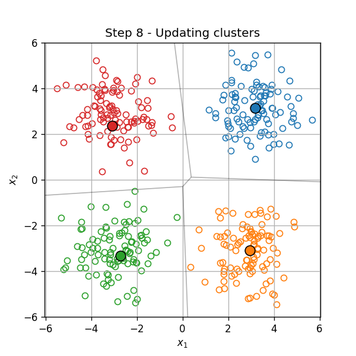
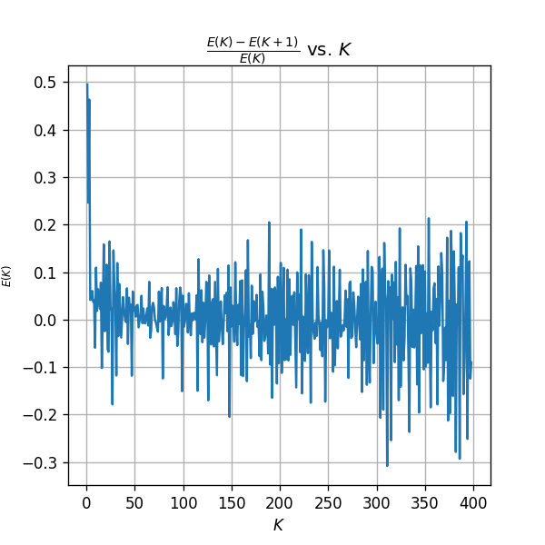

## תיאוריה -אשכול

המטרה באלגוריתמי אשכול הינה לחלק אוסף של פרטים לקבוצות המכונים אשכולות (clusters), כאשר לכל קבוצה איזשהן תכונות דומות.

{: .inline-img width="400px"} &#x21E6; {: .inline-img width="400px"}

2 דוגמאות למקרים שבהם נרצה לאשכל אוסף נתונים:

1. על מנת לבצע הנחות על אחד מהפרטים באשכול על סמך פרטים אחרים באשכול. לדוגמא: להציע ללקוח בחנות אימטרנט מוצרים על סמך מוצרים שקנו לקוחות אחרים באשכול שלו. 
2. לתת טיפול שונה לכל אשכול. לדוגמא משרד ממשלתי שרוצה להפנות לקבוצות שונות באוכלוסיה לערוצים שונים: אפליקציה, אתר אינטרנט, נציג טלפוני או הפניה למוקד שירות.

## אלגוריתמי אשכול שונים

ישנם מספר רב של דרכים לבצע אישכול לאוסף נתונים, בהתאם לכך קיימים גם מספר רב של אלגוריתמים לעשות כן. בתיעוד של החבילה הפייתונית  [scikit-learn](https://scikit-learn.org/), בה נשתמש בתרגילים הרטובים בקורס, ישנה השוואה בין האשכולות המתקבלים מהפעלה של האלגוריתמים בחבילה על שישה toy models דו מימדיים.

{: width="100%"}

נציין כי לרוב נעבוד עם נתונים ממימד גבוה, שם לא נוכל לצייר את האשכולות על מנת להבין את אופי החלוקה.

בקורס זה נלמד על האלגוריתם K-Means (העמודה השמאלית ביותר).

### האלגוריתם K-Means

סימונים:

- $$K$$ - מספר האשכולות אשר נקבע מראש.
- $$G_i$$ - אוסף האינדקסים של האשכול ה-$$i$$. לדוגמא: $$S_4=\left\lbrace3, 6, 9, 13\right\rbrace$$
- $$\left\lvert G_i\right\rvert$$ - גודל האשכול ה-$$i$$ (מספר הפרטים בקבוצה)
- $$\left\lbrace G_i\right\rbrace$$ - החלוקה מסויימת לאשכולות
- $$\left\lbrace G_i\right\rbrace^*$$ - החלוקה האופטימאלית (תחת קריטריון מסויים)

בהינתן אוסף של וקטרים, האלגוריתם K-Means מנסה למצוא את החלוקה של הוקטורים לאשכולות, שבעבורה הסכום של המרחק הריבועי הממוצע בין כל פרט לבין שאר חברי האשכול שלו יהיה מינמאלי. זאת אומרת:

$$
\left\{G_i\right\}^*=\underset{\left\{G_i\right\}}{\arg\min}\sum_{i=1}^K\frac{1}{\left\lvert G_i\right\rvert}\sum_{j,k\in S_i}\left\lVert \boldsymbol{x}_j-\boldsymbol{x}_k \right\rVert^2
$$

מרכז המסה (center of mass or centroid) או המרכז של אשכול מוגדר כנקודה הממוצעת של כל הפריטים בו: $$\boldsymbol{\mu}_i=\frac{1}{\left\lvert G_i\right\rvert}\sum_{\boldsymbol{x}\in G_i}\boldsymbol{x}$$

ניתן להראות כי בעיית האופטימיזציה לעיל, שקולה לבעיה הבאה, של מיזעור סכום המרחקים הריבועיים בין כל הוקטורים למרכז המסה של האשכול שלהם:

$$
\left\{G_i\right\}^*=\underset{\left\{G_i\right\}}{\arg\min}\sum_{i=1}^K\sum_{j\in G_i}\left\lVert \boldsymbol{x}_j-\boldsymbol{\mu}_i \right\rVert^2
$$

#### שלבי האלגוריתם

האלגוריתם K-Means הוא אלגוריתם איטרטיבי אשר מופעל באופן הבא:

- איתחול: $$t=0$$, בחירת $$K$$ מרכזי אשכולות 
$$\left\lbrace \mu_i^{\left(0\right)} \right\rbrace_{i=1}^K$$
- חזרה עד להתכנסות ($$G_i^{\left(t+1\right)}=G_i^{\left(t\right)},\forall i$$) על:
  - שיוך כל נקודה לאשכול, על פי המרכז הקרוב עליו ביותר:

$$
S_i^{\left(t\right)}=\left\lbrace  j: i=\underset{k}{\arg\min}\quad \left\lVert \boldsymbol{x}_j-\boldsymbol{\mu}_k \right\rVert^2\right\rbrace
$$

במקרה של שני מרכזים במרחק זהה נבחר בזה בעל האינדקס הנמוך יותר.
  - עדכון מרכזי האשכולות על פי: $$\boldsymbol{\mu}_i=\frac{1}{\left\lvert G_i\right\rvert}\sum_{\boldsymbol{x}\in G_i}\boldsymbol{x}$$ (אם $$\left\lvert G_i\right\rvert=0$$, $$\mu_i^{\left(t+1\right).}=\mu_i^{\left(t\right)}$$
  - קידום: $$t\leftarrow t+1$$

#### דוגמא

אתחול:
{: width="300px"}

עדכון המרכזים:

{: width="300px"}

עכדון האשכלות:

{: width="300px"}

עדכון המרכזים:

{: width="300px"}

וחוזר חלילה (הסדר הוא מימין לשמאל):

{: .inline-img width="300px"}
{: .inline-img width="300px"}
{: .inline-img width="300px"}
{: .inline-img width="300px"}
{: .inline-img width="300px"}
{: .inline-img width="300px"}
{: .inline-img width="300px"}
{: .inline-img width="300px"}
{: .inline-img width="300px"}
{: .inline-img width="300px"}
{: .inline-img width="300px"}

#### תכונות

- מובטח כי האישכול משתפר בכל צעד (סכום המרחקים מהממוצעים יורד).
- מובטח כי האלגוריתם יתכנס. זאת אומרת שהוא יעצר לאחר מספר סופי של עדכונים.
- **לא** מובטח כי האלגוריתם יתכנס לפתרון האופטימאלי. אם כי בפועל במרבית המקרים האלגוריתם מתכנס לפתרון אשר קרוב מאד לאופטימאלי במובן של סכום המרחקים מהממוצעים.
- אתחולים שונים יכולים להוביל לתוצאות שונות.

#### בחירת מספר האשכולות K

{: .inline-img width="400px"}
{: .inline-img width="400px"}
{: .inline-img width="400px"}
{: .inline-img width="400px"}

בבעיות מסויימות מספר האשכולות בו נרצה להשתמש הינו ידוע מראש, אחר במקרים אחרים יהיה עלינו לקבוע אותו כתלות בנתונים.

##### שיפור יחסי קטן

נגדיר את שגיאת האשכול בתור שורש ממוצע הריבועים ((Root Mean Square (RMS) של המרחקים מהממוצעים:

$$
E\left(K\right)=\sqrt{\frac{1}{N}\sum_{i=1}^K\sum_{j\in G_i}\left\lVert \boldsymbol{x}_j-\boldsymbol{\mu}_i \right\rVert^2}
$$

(זהו למעשה הגודל אותו מנסה האלגוריתם למזערת בתוספת $$\frac{1}{N}$$ והשורש. גודל זה מעט יותר נוח לעבודה משום שהוא ביחדות של מרחק ופחות מושפע מגודל המדגם).

שגיאה זו תלך ותקטן ככל שנגדיל את  מספר האשכולות $$K$$. דרך אחת לבחירת מספר האכשולות הינה מספר המשקולות המימינאלי שבעבורו הוספת אשכול נוסף נותן שיפור היחסי זניח. זאת:

$$
\underset{K}{\arg\min}\quad K,\qquad\text{s.t.} \frac{E\left(K\right)-E\left(K+1\right)}{E\left(K\right)}<\epsilon
$$

נראה זאת על הדוגמא הקודמת. נשרטט את השגיאה כתלות במספר האשכולות:

{: width="400px"}

הגדלה סביב $$K=4$$:

{: width="400px"}

נשרטט גם את השיפור היחסי, $$\frac{E\left(K\right)-E\left(K+1\right)}{E\left(K\right)}$$, המתקבל בעבור כל אשכול שאנו מוסיפים:

{: width="400px"}

{: width="400px"}

ניתן לראות כי אכן בנקודה $$K=4$$ ישנו שינו גדול בשיפוע של הגרף $$E\left(K\right)$$ וכמו כן השיפור היחסי צונח משמעותית. לכן במקרה זה, הגיוני במקרה זה לבחור 4 אשכולות.

