## תיאוריה -אשכול

המטרה באלגוריתמי אשכול הינה לחלק אוסף של פרטים לקבוצות המכונים אשכולות (clusters), כאשר לכל קבוצה איזשהן תכונות דומות.

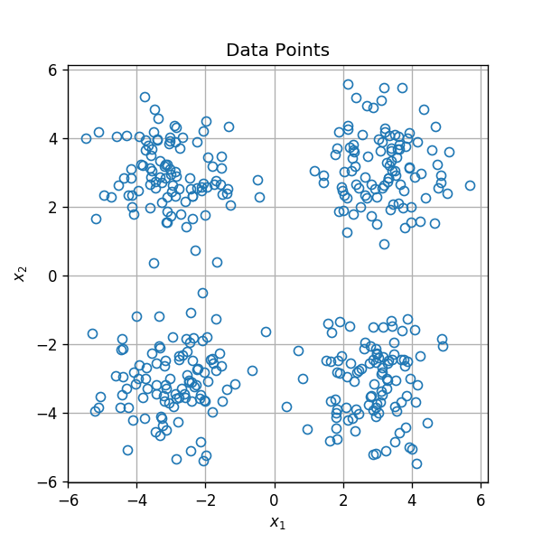{: width="350px"} &#x21E6; 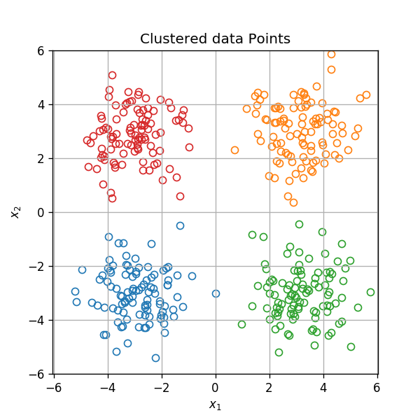{: width="350px"}

2 דוגמאות למקרים שבהם נרצה לאשכל אוסף נתונים:

1. על מנת לבצע הנחות על אחד מהפרטים באשכול על סמך פרטים אחרים באשכול. לדוגמא: להציע ללקוח מסויים בחנות אינטרנט מוצרים על סמך מוצרים שקנו לקוחות אחרים באשכול שלו.
2. לתת טיפול שונה לכל אשכול. לדוגמא משרד ממשלתי שרוצה להפנות קבוצות שונות באוכלוסיה לערוצי מתן שירות שונים: אפליקציה, אתר אינטרנט, נציג טלפוני או הפניה פיסית למוקד שירות.

### אלגוריתמי אשכול שונים

קיימות דרכים רבות לבצע אישכול לאוסף של נתונים. בהתאם לכך קיימים גם מספר רב של אלגוריתמים לעשות כן. בתיעוד של החבילה הפייתונית  [scikit-learn](https://scikit-learn.org/), בה נעשה שימוש רב בתרגילים הרטובים בקורס, ישנה השוואה בין האשכולות המתקבלים מאלגוריתמים האישכול השונים בחבילה, בעבור שישה toy models דו מימדיים:

{: width="100%"}

נציין כי לרוב נעבוד עם נתונים ממימד גבוה, שם לא נוכל, כמו כאן, לצייר את האשכולות על מנת להבין את אופי החלוקה.

בקורס זה נלמד על האלגוריתם K-means (העמודה השמאלית ביותר).

### האלגוריתם K-means

סימונים:

- $$K$$ - מספר האשכולות (גודל אשר נקבע מראש).
- $$G_i$$ - אוסף האינדקסים של האשכול ה-$$i$$. לדוגמא: $$G_5=\left\lbrace3, 6, 9, 13\right\rbrace$$
- $$\left\lvert G_i\right\rvert$$ - גודל האשכול ה-$$i$$ (מספר הפרטים בקבוצה)
- $$\left\lbrace G_i\right\rbrace$$ - חלוקה מסויימת לאשכולות
- $$\left\lbrace G_i\right\rbrace^*$$ - החלוקה האופטימאלית (תחת קריטריון מסויים)

בהינתן אוסף של וקטורים, האלגוריתם K-Means מנסה למצוא את החלוקה של הוקטורים לאשכולות, שבעבורה הסכום על פני כל הוקטורים של המרחק הריבועי הממוצע בין הוקטור לבין שאר חברי האשכול שלו, יהיה מינמאלי. זאת אומרת, K-means, מנסה לפתור את הבעיה הבאה :

$$
\underset{\left\{G_i\right\}}{\arg\min}\sum_{i=1}^K\frac{1}{2\left\lvert G_i\right\rvert}\sum_{j,k\in G_i}\left\lVert \boldsymbol{x}_j-\boldsymbol{x}_k \right\rVert^2
$$

(ה2 במכנה אינו משפיע על בעיית האופטימיזציה, והוא שם על מנת לבטל את הסכימה הכפולה על כל זוג פרטים)

##### הבעיה השקולה

מרכז המסה (center of mass or centroid) או המרכז של אשכול מוגדר כנקודה הממוצעת של כל הפריטים בו: $$\boldsymbol{\mu}_i=\frac{1}{\left\lvert G_i\right\rvert}\sum_{i\in G_i}\boldsymbol{x}_i$$

ניתן להראות כי בעיית האופטימיזציה לעיל, שקולה לבעיה של מיזעור הסכום על פני כל הוקטורים של המרחק הריבועי בין הוקטור למרכז המסה של האשכול שלו:

$$
\left\{G_i\right\}^*=\underset{\left\{G_i\right\}}{\arg\min}\sum_{i=1}^K\sum_{j\in G_i}\left\lVert \boldsymbol{x}_j-\boldsymbol{\mu}_i \right\rVert^2
$$

##### שלבי האלגוריתם

האלגוריתם K-Means הוא אלגוריתם איטרטיבי אשר מופעל באופן הבא:

- איתחול: $$t=0$$, בחירת $$K$$ מרכזי אשכולות $$\left\lbrace \mu_i^{\left(0\right)} \right\rbrace_{i=1}^K$$
- חזרה עד להתכנסות (עד אשר $$G_i^{\left(t\right)}=G_i^{\left(t-1\right)}\quad\forall i$$):
  - שיוך כל נקודה לאשכול, על פי המרכז הקרוב עליו ביותר, כלומר, $$x$$ שייך לקבוצה $$G_i^{\left(t\right)}$$ אם :

    $$
    i=\arg\min_{j=1,...,C} \left\lVert\boldsymbol{x}-\boldsymbol{\mu}_j^{\left(t\right)}\right\rVert^2
    $$

    (במקרה של שני מרכזים במרחק זהה נבחר בזה בעל האינדקס הנמוך יותר).

  - עדכון מרכזי האשכולות על פי: $$\boldsymbol{\mu}_i^{\left(t+1\right)}=\frac{1}{\left\lvert G_i^{\left(t\right)}\right\rvert}\sum_{i\in G_i^{\left(t\right)}}\boldsymbol{x}_i$$ (אם $$\left\lvert G_i^{\left(t\right)}\right\rvert=0$$ אז $$\mu_i^{\left(t+1\right).}=\mu_i^{\left(t\right)}$$)
  - קידום: $$t\leftarrow t+1$$

#### דוגמא

אתחול (וחלוקה ראשונית לאשכולות):

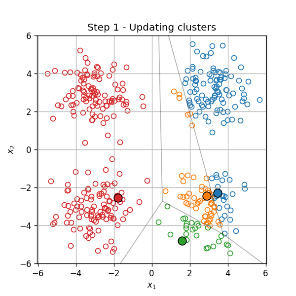{: width="350px"}

עדכון המרכזים:

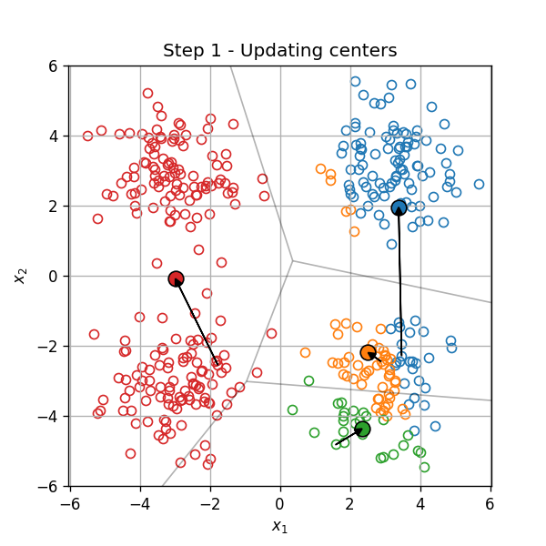{: width="350px"}

עדכון האשכולות:

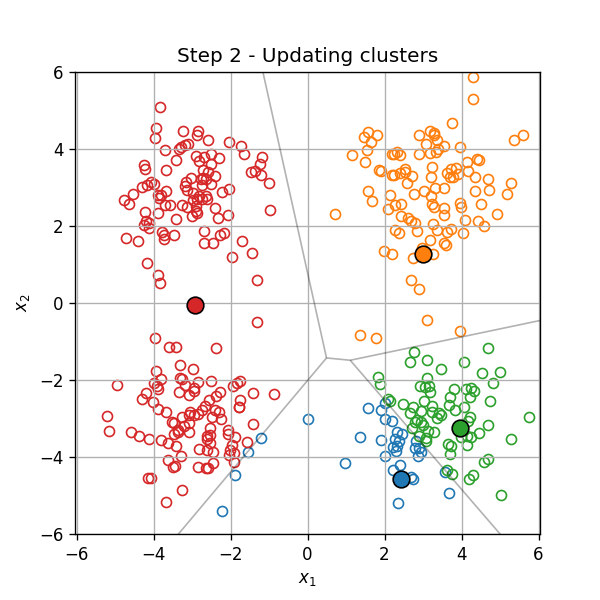{: width="350px"}

עדכון המרכזים:

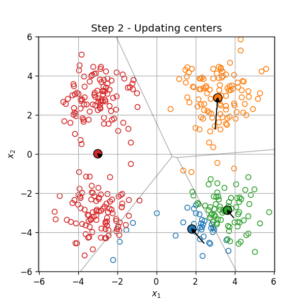{: width="350px"}

וחוזר חלילה (הסדר הוא מימין לשמאל):

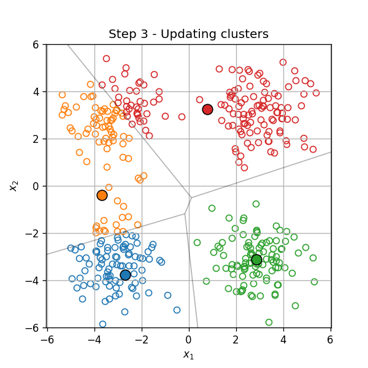{: width="350px"}
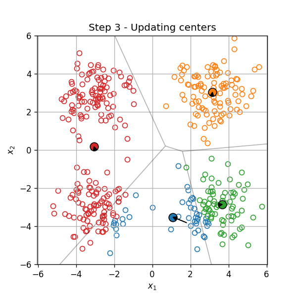{: width="350px"}
{: width="350px"}
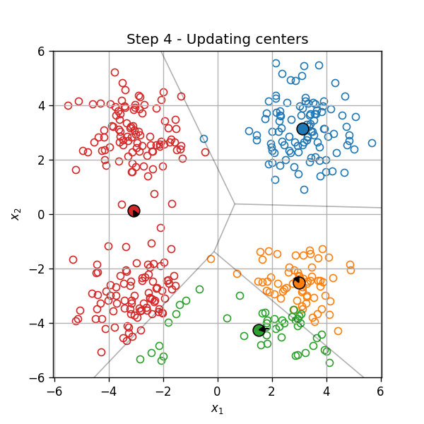{: width="350px"}
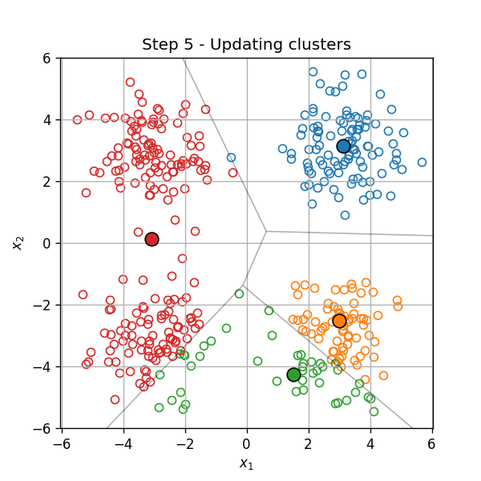{: width="350px"}
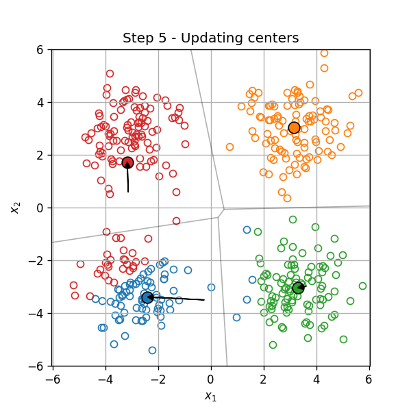{: width="350px"}
{: width="350px"}
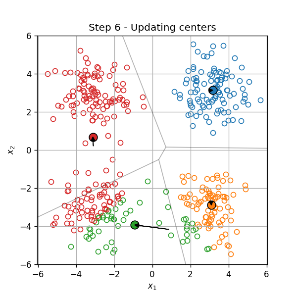{: width="350px"}
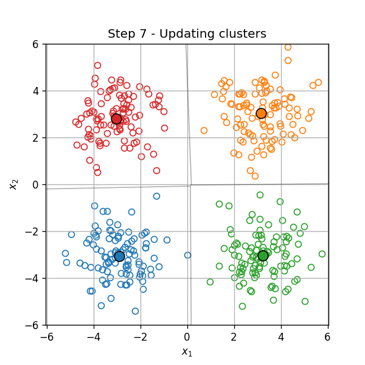{: width="350px"}
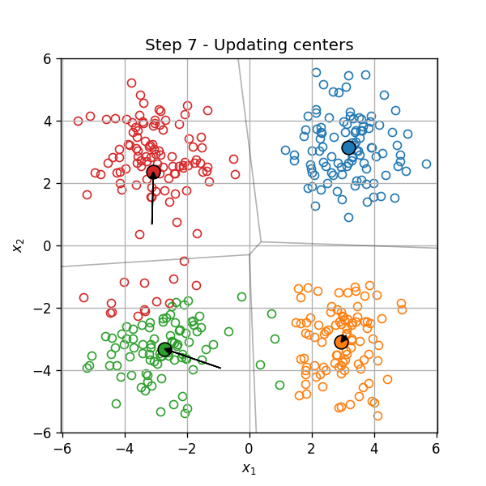{: width="350px"}

#### תכונות

- מובטח כי פונקציית המטרה (סכום המרחקים מהממוצעים) תקטן בכל צעד (אלגוריתם חמדן Greedy).
- מובטח כי האלגוריתם יתכנס למינימום מקומי. זאת אומרת שהוא יעצר לאחר מספר סופי של עדכונים.
- **לא** מובטח כי האלגוריתם יתכנס לפתרון האופטימאלי. אם כי בפועל במרבית המקרים האלגוריתם מתכנס לפתרון אשר קרוב מאד לאופטימאלי.
- אתחולים שונים יכולים להוביל לתוצאות שונות.

#### בחירת מספר האשכולות K

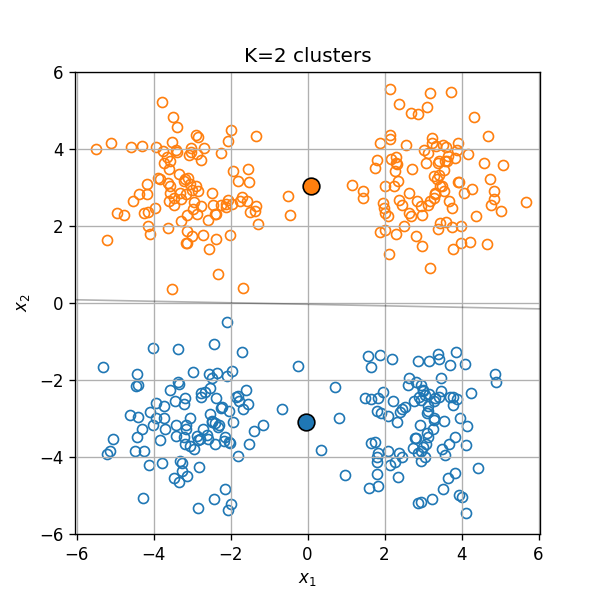{: width="350px"}
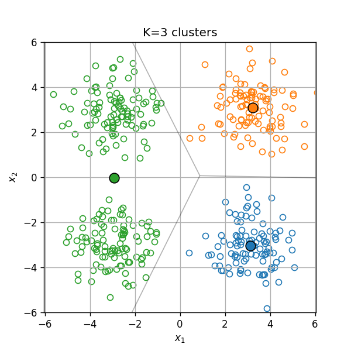{: width="350px"}
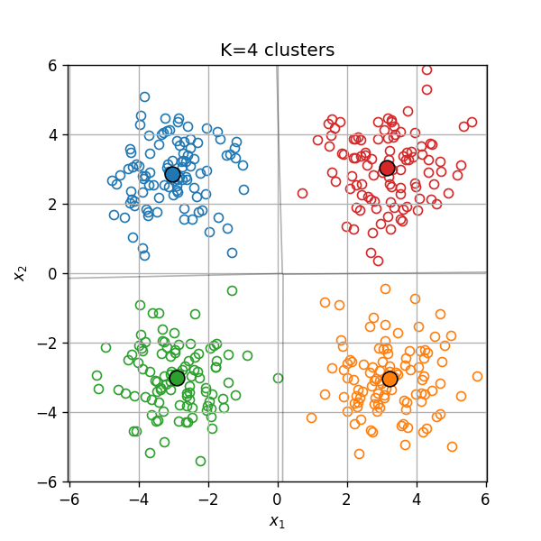{: width="350px"}
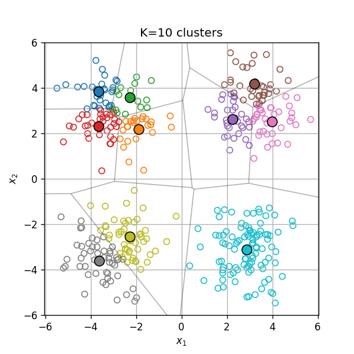{: width="350px"}

בבעיות מסויימות מספר האשכולות בו נרצה להשתמש הינו ידוע מראש, אחר במקרים אחרים יהיה עלינו לקבוע אותו כתלות בנתונים.

##### שיטה לקביעת מספר האשכולות: שיפור יחסי קטן

נגדיר את שגיאת האשכול בתור שורש ממוצע הריבועים Root Mean Square (RMS) של המרחקים מהממוצעים:

$$
E\left(K\right)=\sqrt{\frac{1}{N}\sum_{i=1}^K\sum_{j\in G_i}\left\lVert \boldsymbol{x}_j-\boldsymbol{\mu}_i \right\rVert^2}
$$

(זוהי למעשה פונקציית המטרה בתוספת חלוקה ב $$N$$ והוצאת שורש. נוח לעבוד עם גודל זה משום שהוא פחות מושפע מגודל המדגם והוא ביחידות של מרחק ולא מרחק ריבועי). שגיאה זו תלך ותקטן ככל שנגדיל את  מספר האשכולות $$K$$.

דרך אחת לבחירת מספר האשכולות הינה למצוא את הנקודה שבה הגדלת מספר האשכולות ב1 תוביל לשיפור יחסי זניח בשגיאת האשכול. זאת אומרת:

$$
\underset{K}{\arg\min}\quad K,\qquad\text{s.t.} \frac{E\left(K\right)-E\left(K+1\right)}{E\left(K\right)}\triangleq\frac{-\Delta E\left(K\right)}{E\left(K\right)}<\epsilon
$$

נראה זאת על הדוגמא הקודמת. נשרטט את השגיאה כתלות במספר האשכולות:

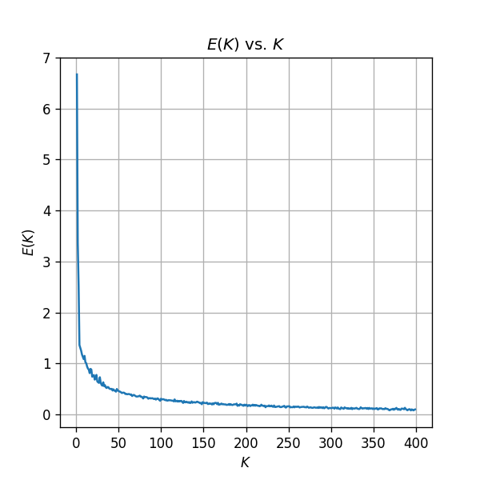{: width="400px"}

הגדלה סביב $$K=4$$:

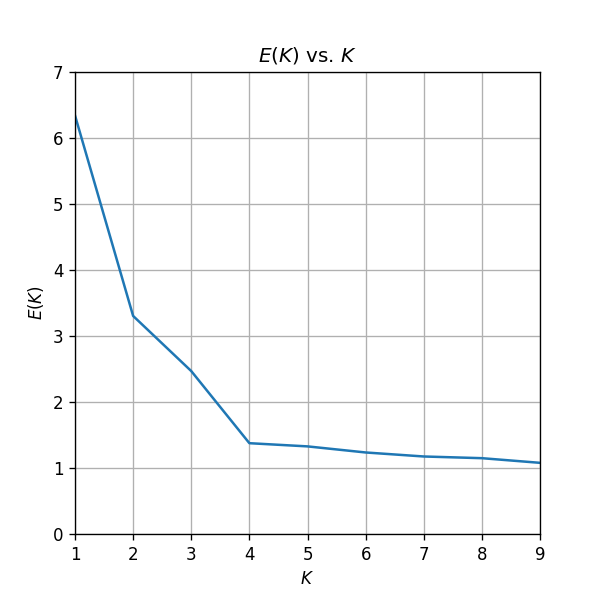{: width="400px"}

נשרטט את השיפור היחסי, $$\frac{\Delta E\left(K\right)}{E\left(K\right)}$$, המתקבל מההוספה של כל אשכול שאנו מוסיפים:

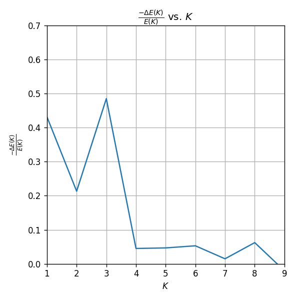{: width="400px"}

ניתן לראות כי אכן בנקודה $$K=4$$ ישנו שינו גדול בשיפוע של הגרף $$E\left(K\right)$$ וכמו כן השיפור היחסי צונח משמעותית. לכן במקרה זה, הגיוני במקרה זה לבחור 4 אשכולות.

## תרגילים

#### ✍️ תרגיל 4.1

נתונות $$\left(1+3\alpha\right)n$$ נקודות שונות:

- $$n$$ נקודות בקואורדינאטות $$A=\left(-6,6\right)$$
- $$\alpha n$$ נקודות בכל אחת מהקואורדינאטות $$B=\left(6,6\right),C=\left(8,6\right),D=\left(1,-6\right)$$

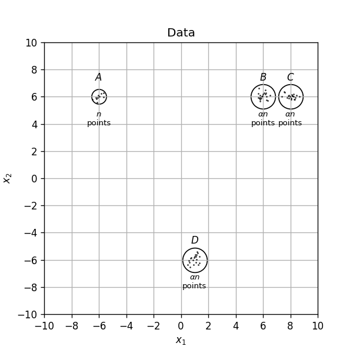{: width="600px"}
(הנקודות יושבות אחת על השניה בכל קואורדינטה, ומצויירות כעיגולים רק לצורך השרטוט). רוצים לבצע אשכול של הנקודות ל3 אשכולות בעזרת K-Means.

א) מאתחלים את המרכזים על ידי בחירה אקראית של 3 מתוך ארבעת הנקודות A,B,C,D. לאילו חלוקות יתכנס האלגוריתם בעבור כל אחת מארבעת האתחולים האפשריים.

ב) מהו האשכול האופטימאלי (הממזער של פונקציית המטרה)? רשמו את הפתרון כתלות בפרמטר $$\alpha$$. (ניתן להניח כי בפתרון האופטימאלי כל הנקודות שנמצאות באותו המקום משוייכות לאותו האשכול)

ג) האם קיים אתחול אשר בעבורו האלגוריתם לא יתכנס לפתרון בעל הערך המינימאלי שמצאתם בסעיף הקודם? הדגימו.

#### 💡 פיתרון

א) נחשב את תוצאת האלגוריתם בעבור כל אחת מארבעת האתחולים:

**מרכזים ב A,B ו C**:

{: width="270px"}
{: width="270px"}
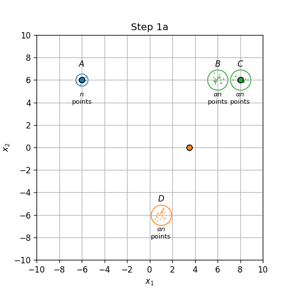{: width="270px"}
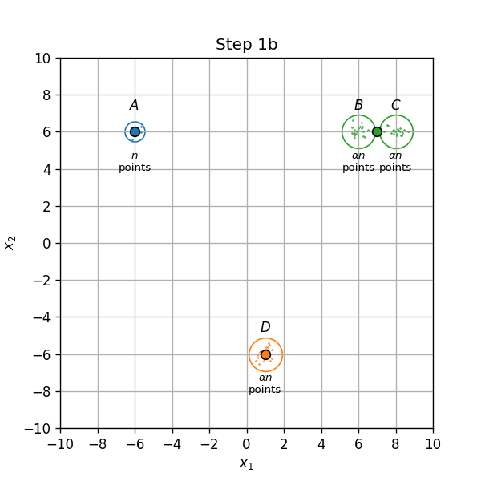{: width="270px"}

- שיוך התחלתי (0a): נקודות בA,B ו C ישוייכו למרכז אשר הנמצא עליהם, והנקודות בD ישוייכו למרכז שבB.
- עדכון מרכזים (0b): המרכז שב B יזוז לאמצע הדרך שבין הנקודות B ו D.
- עדכון אשכולות (1a): הנקודת שבB ישוייכו כעת למרכז שבC.
- עדכון מרכזים (1b): המרכז שבין B ל D יזוז לD, והמרכז שבC יזוז למחצית הדרך שבין B לC.

**מרכזים ב A,B ו D**:

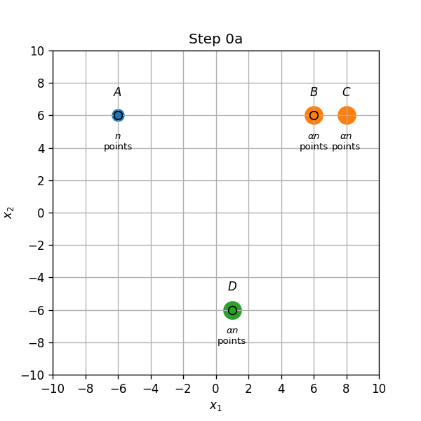{: width="270px"}
{: width="270px"}

- שיוך התחלתי (0a): נקודות בA,B ו D ישוייכו למרכז אשר נמצא עליהם, והנקודות בC ישוייכו למרכז שבB.
- עדכון מרכזים (0b): המרכז שב B יזוז לאמצע הדרך שבין הנקודות B ו C.
  

**מרכזים ב A,C ו D**:

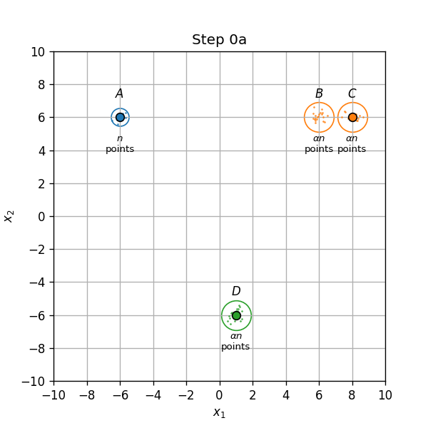{: width="270px"}
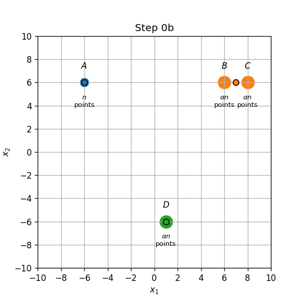{: width="270px"}

- שיוך התחלתי (0a): נקודות בA,C ו D ישוייכו למרכז אשר נמצא עליהם, והנקודות בB ישוייכו למרכז שבC.
- עדכון מרכזים (0b): המרכז שב C יזוז לאמצע הדרך שבין הנקודות B ו C.
  

**מרכזים ב B,C ו D**:

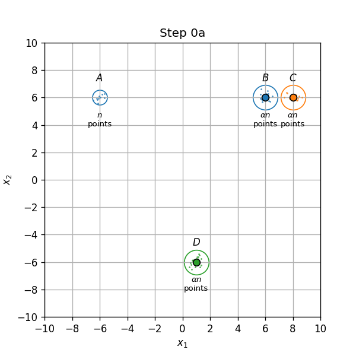{: width="270px"}

- שיוך התחלתי (0a): נקודות בB,C ו D ישוייכו למרכז אשר נמצא עליהם, והנקודות בA ישוייכו למרכז שבB.
- עדכון מרכזים (0b): המרכז שב B יזוז לנקודה שהיא המרכז של הנקודות A ו B. (משום שכמות הנקודות בשתי הקבוצות שונה, נקודה זו היא לא אמצע הדרך בניהם).

השלב הבא של עידכון האשכולות תלוי במיקום של המרכז החדש. 

**מקרה 1**: הנקודות ב-B קרובות יותר למרכז החדש מאשר למרכז שב-C ולכן האלגוריתם מסתיים.

{: width="270px"}

**מקרה 2**, המרכז החדש **רחוק** יותר לנקודה B מאשר הנקודה C, אזי הנקודות בB יהיו מושייכות כעת למרכז בנקודה C, והמשך האלגוריתם יהיה:

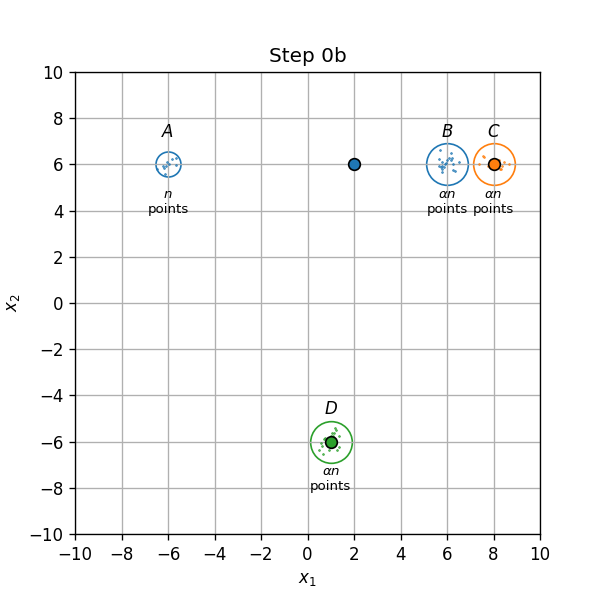{: width="270px"}
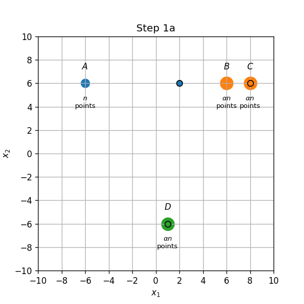{: width="270px"}
{: width="270px"}

נמצא את התנאי על $$\alpha$$ שבעבורו מתרחש מקרה 2. נסמן ב$$\boldsymbol{\mu}_1$$ את המרכז שבין A לB לאחר עדכון המרכזים הראשון. המיקום של $$\boldsymbol{\mu}_1$$ נתון על ידי הממוצע המשוכלל של הקואורדיאנטות A ו B:

$$
\boldsymbol{\mu}_1=\frac{n\vec{A}+\alpha n\vec{B}}{\left(1+\alpha\right)n}=\frac{\left(-6\hat{x}_1 + 6\hat{x}_2\right)+\alpha\left(6\hat{x}_1 + 6\hat{x}_2\right)}{1+\alpha}=\frac{\alpha-1}{\alpha+1}6\hat{x}_1 + 6\hat{x}_2
$$

על מנת שיתרחש עידכון על המרחק בין המרכז החדש נקודה B גדול מ2:

$$
\left\lVert\left(6\hat{x}_1 + 6\hat{x}_2\right)-\left(\frac{\alpha-1}{\alpha+1}6\hat{x}_1 + 6\hat{x}_2\right)\right\rVert>2 \\
\Leftrightarrow 6-\frac{\alpha-1}{\alpha+1}6>2 \\
\Leftrightarrow \frac{\alpha-1}{\alpha+1}6<4 \\
\Leftrightarrow\alpha<5
$$

ב) אנו מועניינים למצוא את האשכול אשר מביא למינימום את הפונקציית המטרה הבאה:

$$
\sum_{i=1}^K\frac{1}{2\left\lvert G_i\right\rvert}\sum_{j,k\in S_i}\left\lVert \boldsymbol{x}_j-\boldsymbol{x}_k \right\rVert^2
$$

נוכל לפסול פתרונות בהן ישנו אשכול ריק, משום שבמקרה זה נוכל לשייך אליו נקודות כלשהן על מנת להקטין את פונקציית המטרה. לכן הפתרון האופטימאלי חייב להיות אחד מששת האישכולים הבאים:

- (A,B), (C), (D)
- (A,C), (B), (D)
- (A,D), (B), (C)
- (B,C), (A), (D)
- (B,D), (A), (C)
- (C,D), (A), (B)

התרומה של האשכולות שמכילים נקודה בודדת לפונקציית המטרה הינה 0, ולכן יש לחשב רק את התרומה של האשכול שמכיל זוג נקודות. למשל, עבור האשכול (A,B), (C), (D) נקבל:

$$
\sum_{i=1}^K\sum_{j\in G_i}\left\lVert \boldsymbol{x}_j-\boldsymbol{\mu}_i \right\rVert^2
=n\left(-6-6\frac{\alpha-1}{\alpha+1}\right)^2 + \alpha n\left(6-6\frac{\alpha-1}{\alpha+1}\right)^2=n\cdot \frac{36}{\left(\alpha+1\right)^2}\left(4\alpha^2+4\alpha\right)=\frac{144\alpha n}{\alpha+1}
$$

ועבור האשכול (B,C), (A), (D) נקבל:
$$
\sum_{i=1}^K\sum_{j\in G_i}\left\lVert \boldsymbol{x}_j-\boldsymbol{\mu}_i \right\rVert^2
=\alpha n\left(1\right)^2 + \alpha n\left(1\right)^2=2\alpha n
$$

נחשב את הערך של פונקצייות המטרה בעבור כל אחד מששת האשכולים:

| Clusters | Objective |
| -------- | --------- |
| (A,B), (C), (D) | $$144\frac{\alpha n}{\alpha+1}$$ |
| (A,C), (B), (D) | $$193\frac{\alpha n}{\alpha+1}$$ |
| (A,D), (B), (C) | $$196\frac{\alpha n}{\alpha+1}$$ |
| (B,C), (A), (D) | $$2\alpha n$$ |
| (B,D), (A), (C) | $$30.5\alpha n$$ |
| (C,D), (A), (B) | $$42.5\alpha n$$ |
{: dir="ltr" style="font-size:15"}

נשים לב כי הפתרון האופטימאלי יהיה חייב להיות (A,B),(C),(D) או (B,C),(A),(D) (משום שכל השאר בהכרח גדולים מהם). נבדוק בעבור אלו ערכים של $$\alpha$$ האשכול הראשון הינו האופטימאלי:

$$
144\frac{\alpha n}{\alpha+1}<2\alpha n \\
\Leftrightarrow \alpha>71
$$

אם כן, בעבור $$\alpha>71$$ הפתרון האופטימאלי הינו (A,B),(C),(D) ובעבור $$\alpha<71$$ הפתרון האופטימאלי הינו  (B,C),(A),(D).

נסכם כי עבור אתחול המרכזים בנקודות B,C ו-D נקבל:

- עבור $$\alpha<5$$  האלגוריתם ישדך את B ו-C וזהו הפתרון האופטימאלי גלובלית.
- עבור $$\alpha>71$$  האלגוריתם ישדך את A ו-B וזה הפתרון האופטימאלי גלובלית.
- עבור $$5<\alpha<71$$  האלגוריתם ישדך את A ו-B אולם זהו אינו הפתרון הגלובלי.

נבדוק בעבור האתחולים מהסעיף הקודם, מהם המקרים שבהם האלגוריתם אינו מתכנס לפתרון האופטימאלי:

- בעבור $$\alpha>71$$ הפתרון האופטימאלי הינו (A,B),(C),(D), אך עבור 3 מתוך 4 האיחולים שבדקנו האלגוריתם התכנס לפתרון של  (B,C),(A),(D).
- בעבור $$\alpha<71$$ הפתרון האופטימאלי הינו  (B,C),(A),(D), אך במקרה של $$\alpha>5$$ ואתחול של מרכזים ב B,C ו D מתקבל הפתרון של (A,B),(C),(D).

ג) כל מקרים שצויינו בסעיף הקודם. בנוסף,ניתן לדוגמא לאתחל שניים מתוך שלושת המרכזים בנקודות מאד רחוקות, ואז כל הנקודות ישוייכו למרכז השלישי.

## בעיה מעשית

### 🚖 תזכורת: מדגם נסיעות המונית בNew York

עשרת הדגמים הראשונים במדגם הנסיעות בעיר New York

<table border="1" style="text-align:center;">
  <thead>
    <tr>
      <th></th>
      <th>passenger_count</th>
      <th>trip_distance</th>
      <th>payment_type</th>
      <th>fare_amount</th>
      <th>tip_amount</th>
      <th>pickup_easting</th>
      <th>pickup_northing</th>
      <th>dropoff_easting</th>
      <th>dropoff_northing</th>
      <th>duration</th>
      <th>day_of_week</th>
      <th>day_of_month</th>
      <th>time_of_day</th>
    </tr>
  </thead>
  <tbody>
    <tr>
      <th>0</th>
      <td>2</td>
      <td>2.768065</td>
      <td>2</td>
      <td>9.5</td>
      <td>0.00</td>
      <td>586.996941</td>
      <td>4512.979705</td>
      <td>588.155118</td>
      <td>4515.180889</td>
      <td>11.516667</td>
      <td>3</td>
      <td>13</td>
      <td>12.801944</td>
    </tr>
    <tr>
      <th>1</th>
      <td>1</td>
      <td>3.218680</td>
      <td>2</td>
      <td>10.0</td>
      <td>0.00</td>
      <td>587.151523</td>
      <td>4512.923924</td>
      <td>584.850489</td>
      <td>4512.632082</td>
      <td>12.666667</td>
      <td>6</td>
      <td>16</td>
      <td>20.961389</td>
    </tr>
    <tr>
      <th>2</th>
      <td>1</td>
      <td>2.574944</td>
      <td>1</td>
      <td>7.0</td>
      <td>2.49</td>
      <td>587.005357</td>
      <td>4513.359700</td>
      <td>585.434188</td>
      <td>4513.174964</td>
      <td>5.516667</td>
      <td>0</td>
      <td>31</td>
      <td>20.412778</td>
    </tr>
    <tr>
      <th>3</th>
      <td>1</td>
      <td>0.965604</td>
      <td>1</td>
      <td>7.5</td>
      <td>1.65</td>
      <td>586.648975</td>
      <td>4511.729212</td>
      <td>586.671530</td>
      <td>4512.554065</td>
      <td>9.883333</td>
      <td>1</td>
      <td>25</td>
      <td>13.031389</td>
    </tr>
    <tr>
      <th>4</th>
      <td>1</td>
      <td>2.462290</td>
      <td>1</td>
      <td>7.5</td>
      <td>1.66</td>
      <td>586.967178</td>
      <td>4511.894301</td>
      <td>585.262474</td>
      <td>4511.755477</td>
      <td>8.683333</td>
      <td>2</td>
      <td>5</td>
      <td>7.703333</td>
    </tr>
    <tr>
      <th>5</th>
      <td>5</td>
      <td>1.561060</td>
      <td>1</td>
      <td>7.5</td>
      <td>2.20</td>
      <td>585.926415</td>
      <td>4512.880385</td>
      <td>585.168973</td>
      <td>4511.540103</td>
      <td>9.433333</td>
      <td>3</td>
      <td>20</td>
      <td>20.667222</td>
    </tr>
    <tr>
      <th>6</th>
      <td>1</td>
      <td>2.574944</td>
      <td>1</td>
      <td>8.0</td>
      <td>1.00</td>
      <td>586.731409</td>
      <td>4515.084445</td>
      <td>588.710175</td>
      <td>4514.209184</td>
      <td>7.950000</td>
      <td>5</td>
      <td>8</td>
      <td>23.841944</td>
    </tr>
    <tr>
      <th>7</th>
      <td>1</td>
      <td>0.804670</td>
      <td>2</td>
      <td>5.0</td>
      <td>0.00</td>
      <td>585.344614</td>
      <td>4509.712541</td>
      <td>585.843967</td>
      <td>4509.545089</td>
      <td>4.950000</td>
      <td>5</td>
      <td>29</td>
      <td>15.831389</td>
    </tr>
    <tr>
      <th>8</th>
      <td>1</td>
      <td>3.653202</td>
      <td>1</td>
      <td>10.0</td>
      <td>1.10</td>
      <td>585.422062</td>
      <td>4509.477536</td>
      <td>583.671081</td>
      <td>4507.735573</td>
      <td>11.066667</td>
      <td>5</td>
      <td>8</td>
      <td>2.098333</td>
    </tr>
    <tr>
      <th>9</th>
      <td>6</td>
      <td>1.625433</td>
      <td>1</td>
      <td>5.5</td>
      <td>1.36</td>
      <td>587.875433</td>
      <td>4514.931073</td>
      <td>587.701248</td>
      <td>4513.709691</td>
      <td>4.216667</td>
      <td>3</td>
      <td>13</td>
      <td>21.783056</td>
    </tr>
  </tbody>
</table>

### ❓️ הבעיה: מציאת חניונים

חברת מוניות רוצה לשכור $$K$$ מגרשי חניה ברחבי העיר NYC בהם יוכלו לחכות המוניות שלה בין הנסיעות.

לשם כך היא מעוניינת לבחור באופן אופטימאלי את המיקומים של מגרשי החניות האלו כך שהמרחק הממוצע מנקודת הורדת הנוסע למרגש החניה הקרוב יהיה מינימאלי.

#### שדות רלוונטיים

הפעם נתמקד בשתי השדות:

- **dropoff_easting** - הקואורדינאטה האורכית (מזרח-מערב) של סיום הנסיעה
- **dropoff_northing** - הקואורדינאטה הרוחבית (צפון-דרום) של סיום הנסיעה

(למתעניינים: הקואורדינאטות נתונות בUTM-WGS84, היחידות הן בקירוב קילומטר).

#### ויזואליזציה של נקודות ההורדה

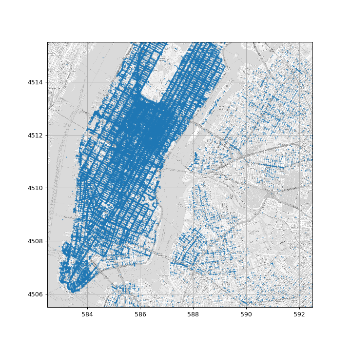

### הגדרה פורמאלית של הבעיה

נשתמש בסימונים הבאים:

- $$X$$ הוקטור האקראי של מיקום סיום הנסיעה
- $$\boldsymbol{c}_i$$: המיקום של מגרש החניה ה-$$i$$.
- $$N$$: מספר הנסיעות במדגם.

המטרה: למצוא את מיקומי החניונים האופטימאליים אשר ממזערים את:

$$
R\left(\left\lbrace\boldsymbol{c}_i\right\rbrace\right)=\mathbb{E}\left[\min_{i}\left\lVert\boldsymbol{x}-\boldsymbol{c}_i\right\rVert\right]
$$

מכיוון שאנו לא יודעים את הפילוג של $$X$$ נחליף את התוחלת על $$X$$ בתוחלת האמפירית

$$
\hat{R}\left(\left\lbrace\boldsymbol{c}_i\right\rbrace\right)=\frac{1}{N}\sum_{j}\min_{i}\left\lVert\boldsymbol{x}_j-\boldsymbol{c}_i\right\rVert
$$

את הבעיה שקיבלנו ניתן לרשום כבעיית אשכול. נגדיר את האשכול $$G_i$$, כאוסף כל הנסיעות שהחניון ה$$i$$ הוא הקרוב ביותר לנקודת הסיום שלהן. באופן זה נוכל לרשום את הפונקציית המטרה שלנו באופן הבא:

$$
\hat{R}\left(\left\lbrace\boldsymbol{c}_i\right\rbrace\right)=\frac{1}{N}\sum_{i=1}^K\sum_{j\in G_i}\left\lVert\boldsymbol{x}_j-\boldsymbol{c}_i\right\rVert
$$

### פתרון באמצעות K-Means

נשים לב כי הבעיה שקיבלנו דומה מאד לבעיה אותה K-Means מנסה לפתור, עם הבדל משמעותי אחד. K-Means ממזער את המרחק ה**ריבועי** הממוצע בעוד שאנו מחפשים למזער את המרחק האוקלידי. ישנם אלגוריתמים מורכבים יותר אשר פותרים את הבעיה שלנו, אך לבינתיים נשאר עם K-Means.

*נציין שזהו מצב נפוץ שבו איננו מסוגלים לפתור בעיה מסויימת באופן ישיר אז אנו פותרים בעיה דומה לה בתקווה לקבל תוצאות מספקות, אך לא בהכרח אופטמאליות.*

#### ✍️ תרגיל 4.2

1) השתמשו באלגוריתם K-Means על מנת לבחור את המיקום של 10 מגרשי חניה.

2) חשבו את ה- Empirical Risk.

#### 💡 פתרון

תוצאות ההרצה המתקבלות:

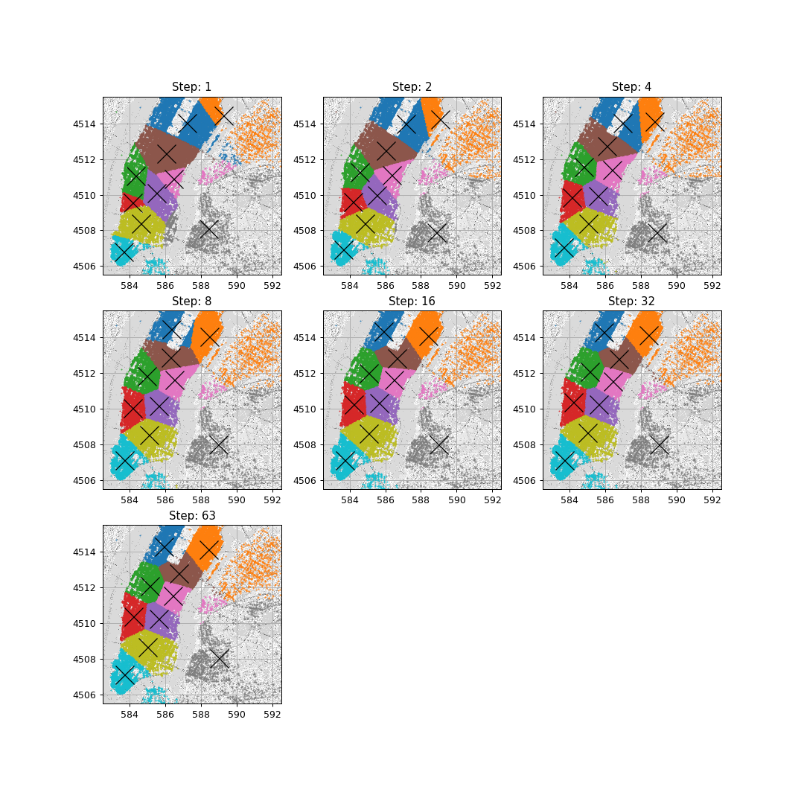

המרחק נסיעה הממוצע המתקבל הינו 700 מ'.

#### ✍️ תרגיל 4.3

1) ציינו שתי סיבות מדוע המיקומים שקיבלנו הם לא בהכרח אופטימאליים

2) הציעו דרכים לשפר את התוצאות על סמך הסיבות מסעיף הקודם.

#### 💡 פתרון

שתי סיבות לחוסר אופטימאליות והצעות לשיפור:

1) K-Mean לא מבטיח התכנסות למינימום הגלובלי. דרך אחת לשפר את תוצאות האלגוריתם הינה להריץ אותו מספר פעמים עם איתחולים שונים.

2) כפי שציינו קודם K-Mean ממזערת את השגיאה הריבועית הממוצעת. ניתן אם כן לשפר קלות את התוצאות על ידי שמירה על האשכולות אך תיקון המרכז לנקודה אשר ממזערת את המרחק עצמו.

**הערה** הנקודה אשר ממזערת את המרחק עצמו בינה לבין כל שאר הנקודות באשכול נקראת החציון הגיאומטרי *The Geometric Median* ([wiki](https://en.wikipedia.org/wiki/Geometric_median)). ניתן למצוא נקודה זו על ידי שימוש באלגוריתם המוכונה *Weiszfeld's algorithm*.

## ❓️ בעיה 2: מציאת מספר החניונים האופטימאלי

עד כה השתמשנו ב10 חניונים, נרצה כעת לבחור גם מספר זה בצורה מיטבית. באופן כללי ככל שנגדיל את מספר החניונים מרחק הנסיעה לחניונים יקטן, אך מנגד התחזוקה של כל חניון עולה כסף.

נניח כי:

1. עלות האחזקה של חניון הינה 10k$ לחודש.
2. בכל חודש יהיו בדיוק 100k נסיעות.
3. עלות הנסיעה של מונית בדרך לחניון הינה 3$ לקילומטר.

#### ✍️ תרגיל 4.4

1. תחת ההנחות, נסחו את פונקציית הסיכון שמתאימה לעלות אחזקת והפעלת מגרשי חניה.
2. ​     השתמשו באלגוריתם K-Means ומצאו את ערך ה-K האופטימלי באמצעות  Grid search עבור K בין 1 ל-25.

#### 💡 פתרון

נרשום תחת הנחות אלו את העלות החודשית של אחזקת החניונים והנסיעה אליהם:

$$
R\left(\left\lbrace\boldsymbol{c}_i\right\rbrace, K\right)= 10\cdot K+100\cdot3\cdot\mathbb{E}\left[\min_{j}\left\lVert\boldsymbol{x}-\boldsymbol{c}_j\right\rVert\right]
$$

והמקבילה האמפירית:

$$
\hat{R}\left(\left\lbrace\boldsymbol{c}_i\right\rbrace, K\right)= 10\cdot K+300\cdot\frac{1}{N}\sum_{i=1}^K\sum_{\boldsymbol{x}_j\in G_i}\left\lVert\boldsymbol{x}_j-\boldsymbol{c}_i\right\rVert
$$

### מספר החניונים כHyper parameter

כעת עלינו לבצע אופטימיזציה גם על מספר החניונים וגם המיקום שלהם. ראינו כיצד ניתן למצוא פתרון בעבור $$K$$ נתון, אך אין לנו דרך פשוטה להכליל את זה ל$$K$$ כלשהו. כן נוכל אבל לעבור על כל ערכי $$K$$ הרלוונטים, לפתור את הבעיה עבורם ולבסוף לקחת את הפתרון הטוב ביותר.

מקרה זה, שבו יש בידינו שיטה יעילה למצוא את הפתרון האופטימאלי רק אחרי שקיבענו חלק מהפרמטרים, הינו מקרה נפוץ. את אותם פרמטרים שאין לנו שיטה יעילה לבחור אותם אנו מכנים לרוב ה**Hyper-parameters** של המודל. שני hyper-parameters בהם כבר נתקלנו בקורס הינם:

- מספר ורוחב התאים של היסטוגרמה
- רוחב וסוג הגרעין בKDE

לרוב נאלץ לבחור את ערכם של הhyper-parameters על ידי:

1. חיפוש על גריד (grid search) או מעבר על כל האפשרויות (brute force).
2. ניסוי וטעיה. כאשר לרוב נתחיל מאיזשהו ניחוש מושכל.

### פתרון באמצעות K-Means וסריקת על K.

נריץ את אלגוריתם הK-Means בעבור כל ערך של $$K$$ בתחום $$1\leq K \leq 25$$, נשרטט את עלות הנסיעה, עלות אחזקת החניונים והעלות הכוללת:

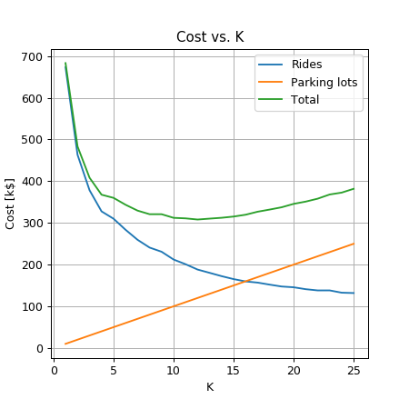

נקבל כי:

- מספר החניונים האופטימאלי הינו: 12.
- מרחק הנסיעה הממוצע יהיה 630 מ'.
- העלות הכוללת תהיה 308.12k$ לחודש.

## תרגילים נוספים

#### ✍️ תרגיל 4.5

נתבונן בבעיית "האשכול" החד-מימדית הבאה:
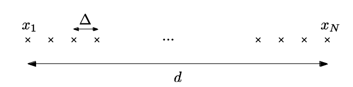{: width="600px"}

כאשר הנקודות $$\left\lbrace x_i\right\rbrace_{i=0}^N$$ ממוקמות באופן אחיד באינטרוול $$\left[0,d\right]$$ ומספרן $$N\rightarrow\infty$$. (וכמובן $$\Delta\rightarrow 0$$).

הראו כי האלגוריתם K-Means עם $$K=2$$ מתכנס למינימום הגלובלי של השגיאה הריבועית **מכל תנאי התחלה סביר** (כלומר, המרכזים ההתחלתיים ממוקמים באינטרוול $$\left[0,d\right]$$).

#### 💡 פיתרון

נסמן ב $$x^{\left(n\right)}$$ את נקודת ההחלטה באיטרציה $$n$$ וב- $$\mu_2^{\left(n\right)},mu_1^{\left(n\right)}$$ את המרכזים באיטרציה $$n$$. מהנתון, בקירוב הרצף:

$$
x^{\left(0\right)}=\frac{\mu_1^{\left(0\right)}+\mu_2^{\left(0\right)}}{\alpha d}
$$

עם $$0\geq\alpha\geq1$$ כלשהו.

באיטרציה הראשונה, נקבל

$$
\begin{cases}
\mu_1^{\left(1\right)}=\frac{1}{2}\alpha d \\
\mu_2^{\left(1\right)}=\alpha d+\frac{d-\alpha d}{2}=\frac{1+\alpha}{2}d
\end{cases}\\
\Rightarrow x^{\left(1\right)}=\frac{\mu_1^{\left(1\right)}+\mu_2^{\left(1\right)}}{\alpha d}=\frac{1}{2}\alpha d+\frac{1}{4}d
$$

ובאופן כללי,

$$
\begin{cases}
\mu_1^{\left(n\right)}=\frac{1}{2} x^{\left(n-1\right)}\\
\mu_2^{\left(n\right)}=\frac{x^{\left(n-1\right)}+d}{2}\\
\end{cases}\\
\Rightarrow x^{\left(n\right)}=\frac{1}{2}x^{\left(n-1\right)}+\frac{1}{4}d
$$

נפתור את הרקורסיה:

$$
x^{\left(n\right)}=\frac{1}{2}x^{\left(n-1\right)}+\frac{1}{4}d=d\left(\frac{1}{4}+\frac{1}{8}\right)+\frac{1}{2^2}x^{\left(n-2\right)}=\frac{d}{4}\sum_{i=0}^{n-1}\frac{1}{2^i}+\frac{1}{2^n}x^{\left(0\right)}
$$

מכאן שבגבול $$n\rightarrow\infty$$ מתקיים כי $$x^{\left(n\right)}\rightarrow\frac{d}{2}$$, שזהו כמובן הפתרון האופטימאלי (חלוקה של הקטע לשני חלקים שווים).
