## תיאוריה

### סימונים

- $$D=\left\lbrace x_i,y_i\right\rbrace_{i=1}^{n}$$ - דוגמאות (דגימות - samples) בלתי תלויות של $$X$$ עם פרדיקציה ידועה $$Y$$.
- $$X$$ - מרחב הקלט. $$x\in X$$.

מרחב הפלט תלוי במשימה, נבחין בין שתי משימות שונות:

##### סיווג (classification)

המטרה היא סיווג דוגמאות לאחת מבין מספר סופי של מחלקות אשר הגדרנו מראש. לדוגמא: זיהוי חתול וכלב מתמונה.

- $$\Omega$$ - מרחב סופי של קטגוריות (מחלקות), $$i=1,\ldots,N$$.
- $$f:X\rightarrow\Omega$$ - חזאי אשר מסווג כל $$x\in X$$ ל-$$y\in\Omega$$.

##### רגרסיה (regression)

המטרה הינה מציאת חזאי $$f:X\rightarrow\mathcal{R}$$ אשר מקיים את הקשר הבא $$f\left(x_i\right)=y_i$$, לכל צמד $$x\in X,y\in Y$$. הפלט $$y$$ הינו ערך מסויים שאנו רוצים לחזות באמצעות החזאי $$f$$ ובהינתן קלט $$x$$.

לדוגמא: מתן תחזית לערך מניה מסויימת על סמך נתוני הבורסה.

$$f:X\rightarrow\mathcal{R}$$ מסווג כל $$x\in X$$ ל $$y\in \mathcal{R}$$.

#### רגרסיה - דוגמא
 בהינתן סט של דירות בקרבת הטכניון בעל מאפיין של מרחק הליכה ומחיר הדירה, נרצה ללמוד פונקציה המקיימת את הקשר בין מרחק הליכה למחיר הדירה.

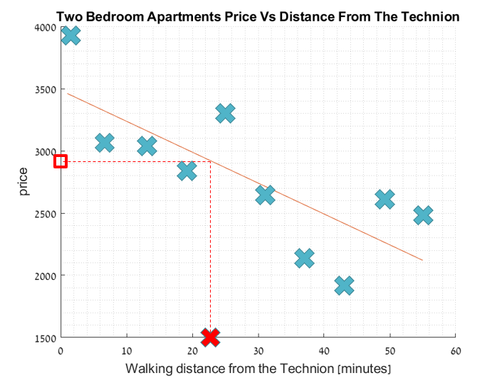

#### סיווג - דוגמא
חיזוי של שייכות דוגמא חדשה לאחת המחלקות של דמויות קומיקס מועדפות.
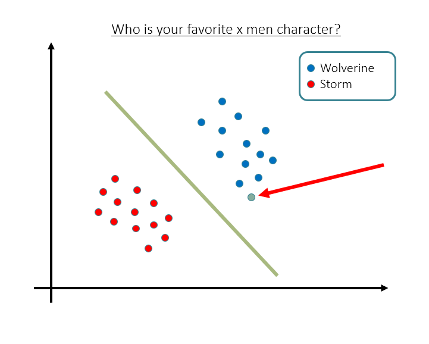

### בחירת סדר המודל

- למשל עבור מיפויים לינאריים $$\mathcal{F}=\left\lbrace f\left(x\right)=\boldsymbol{w}^T\boldsymbol{x}+b\lvert\forall\boldsymbol{x}\in\mathbb{R}^d,b\in\mathbb{R}\right\rbrace$$ בחירת הגודל $$d+1$$.
- סדר המודל (למשל, מספר הפרמטרים במודל פרמטרי) קובע, כעיקרון, את גודל קבוצת הפונקציות הכלולות במודל. ככל שסדר המודל גדול יותר, כך קבוצה זו עשירה יותר, ומכילה פונקציות מסובכות יותר.
- סוגיה יסודית בבחירת סדר המודל הינה הניגוד הבא:
  - מודל פשוט מדי (בעל סדר נמוך) לא יאפשר תיאור מדוייק של הקשר ה"אמיתי" בין הקלט לפלט.
  - מודל מסובך מדי (בעל סדר גבוה) הוא בעל מספר גדול של דרגות חופש, ולפיכך עלול לדרוש מספר רב של דוגמאות על מנת לבצע הכללה סבירה.

בפועל, יש שתי דרכים משלימות להסתכל על ההשפעה של גודל המודל הנבחר על ביצועי המסווג/חזאי שנקבל.

הראשונה, מציגה את ההשפעה הגאומטרית של בחירת סדר המודל ומכונה פירוק לשגיאות השערוך והקירוב ( Estimation-Approximation Error Decomposition).

השנייה מציגה את ההשפעה הסטטיסטית של בחירת סדר המודל ומכונה ה-  Bias-Variance Tradeoff.

כפי שנראה בהמשך, שתי הדרכים הללו מאפשרות להשיג מסקנה דומה לגבי tradeoff בסיסי אשר קיים בבחירת סדר המודל:

סדר מודל נמוך מידי יגרום לנו לנו לשגיאה מסוג אחד, בעוד שסדר מודל גבוה מידי יגרום לנו לשגיאה מן הסוג השני. במילים אחרות, שתי התופעות מדגישות כי עלינו להביא לאיזון מסויים של סדר המודל - לא קטן מידי ולא גדול מידי.

על כן, תוך כדי בלבול מסויים של המונחים, לעיתים מתייחסים לשתי התופעות השונות הללו בתור ה- Bias-Variance tradeoff.

#### Estimation and Approximation Error

נגדיר את הנוטציה הבאה:

$$
R\left(\hat{f}\right)=\mathbb{E}_{\left(\boldsymbol{x},y\right)\sim p_{X,Y}}\left(\ell\left(\hat{f}\left(\boldsymbol{x}\right),y\right)\right)
$$

פונקציית הסיכון האימפירית (empirical risk):

$$
\hat{R}\left(\hat{f}\right)=\frac{1}{N}\sum_i \ell\left(\hat{f}\left(\boldsymbol{x}\right),y\right)
$$

כאשר $$\ell$$ - פונקציית מחיר כלשהי, למשל:

- $$\ell\left(\hat{f}\left(\boldsymbol{x}\right),y\right)=\begin{cases}0 & \hat{f}\left(x\right)=y \\ 1 & \text{otherwise}\end{cases}$$
- $$\ell\left(\hat{f}\left(\boldsymbol{x}\right),y\right)=\left(\hat{f}\left(\boldsymbol{x}\right)-y\right)^2$$

כפי שצויין בהרצאה, ניתן לפרק את השגיאה של החזאי שלנו באופן הבא:
$$
R\left(\hat{f}\right)=E_{\text{app}}\left(F\right) + E_{\text{est}}\left(\hat{f},F\right)
$$

כאשר

$$
E_{\text{app}}\left(F\right)=\min_{f\in F} R\left(f\right)\triangleq R\left(f\right),\text{with}\quad f^*=\underset{f\in F}{\arg\min}\quad R\left(f\right) \\E_{\text{est}}\left(\hat{f},F\right)=R\left(\hat{f}\right)-R\left(f^*\right)
$$

כאשר $F$ הינה משפחת ההיפותיזות או המודל.

*  $E_{app}(F)$ היא שגיאת הקירוב (Approximation) היא מציינת את הסיכון המינימאלי שחזאי **כלשהו** מתוך המודל $$F$$ יכול להשיג. גודל זה הינו דטרמיניסטי ואינו תלוי בסדרת הלימוד.

* $E_{est}(\hat f,F)$ היא שגיאת השערוך (Estimation) והיא מציינת את ההפרש של הסיכון האופטימאלי מתוך המודל, $f^*$, לבין החזאי שנבחר על ידי אלגוריתם הלימוד, $\hat f=\hat f(D)$.

ניתן לתאר זאת מבחינה גאומטרית באופן הבא:

##### **מקורות השגיאה:**

* ככל שנגדיל את סדר המודל, למעשה נגדיל את משפחת המודלים אפשרית $F$ וכך שגיאת הקירוב <u>**תיקטן**</u>. זאת מכיון ש- $F$ תהיה קרובה יותר לפונקציה האמיתית $f_0$  שאנו מנסים ללמוד. 
* מצד שני, ככל שנגדיל את $F$  כך **<u>תגדל</u>** גם שגיאת השערוך, שכן ה- data שלנו קבוע וננסה להשתמש בו ללמוד מודל יותר בעל מספר גדול של דרגות חופש. במילים אחרות, ככל שסדר המודל גדל, נצטרך מספר דוגמאות רב יותר על מנת לבצע הכללה סבירה, אחרת, דבר זה יגרום לנו להסביר באמצעות המודל גם את הרעש ב- data.

ראו דיון מעמיק יותר בהרצאה (מבוא ללמידה מודרכת).

#### Bias-Variance Tradeoff

במקרה זה אנחנו מניחים שה- Data נוצר מתוך מודל סטטיסטי מהצורה הבאה:
$$
Y=f(X)+\epsilon
$$
כאשר $\epsilon$ הוא רעש אקראי במדידות שאינו תלוי ב- $X,Y$ בעלת תוחלת 0.

ה- Bias-Variance Tradeoff מתייחס לשגיאה הסטטיסטית שנובעת מפירוק ה-  Mean Squared Error (MSE):
$$
\text{MSE}=\mathbb{E} \left[ (Y-\hat f(X))^2\right]
$$
גודל זה מתאר את <u>**תוחלת**</u> השגיאה של החזאי הנלמד ביחס לערכים האמיתיים שהוא אמור לחזות.

נגדיר שני גדלים סטטיסטיים:

ה- Bias של החזאי, מתאר כמה טוב המודל הנבחר מתאר את המודל האמיתי (בתוחלת).
$$
\text{Bias} \left[ \hat f(x;D)\right]=\mathbb{E} \left[ \hat f(x;D) \right] - f(x)
$$
ה- Variance של החזאי מתאר כמה הפער בין המודל $F$ והמודל האמיתי תלוי בהגרלת סט האימון. 
$$
\text{Var} \left[\hat f(x;D)\right]=\mathbb{E} \left[ \hat f(x;D)^2  \right] -\mathbb{E} \left[ \hat f(x;D)  \right]^2
$$

ניתן להראות ששגיאת ה- MSE ניתנת לרישום באופן הבא:
$$
\text{MSE}= \left(\text{Bias}(\hat f(x;D))\right)^2 + \text{Var} \left[ \hat f(x;D)\right] + \text{Var}(\epsilon)
$$

##### מקורות שגיאה

נשים לב שהשגיאה מתפרקת ל-3 איברים:

- Bias גבוה - מודל פשוט מדי (בעל סדר נמוך) לא יאפשר תיאור מדויק של הקשר ה"אמיתי" בין הקלט לפלט.
- Variance גבוה - מודל מסובך מידי (בעל סדר גבוה) הוא בעל מספר גדול של דרגות חופש, ולפיכך עלול לדרוש מספר רב של דוגמאות על מנת לבצע הכללה סבירה.
- רעש גבוה במדידות - זוהי שגיאה מובנית ב- Data ולכן היא לא תלויה בבחירת המודל ואין דרך להקטין אותה.

* הסבר מפורט לפיתוח ניתן למצוא בקישור הבא:

  https://towardsdatascience.com/mse-and-bias-variance-decomposition-77449dd2ff55

#### התאמת יתר - דוגמא

ניתן לראות שככל שהמודל בעל שונות יותר גדולה (הסדר של המודל גדל) נכנסים למצב של התאמת יתר, כך שהמודל לומד באופן מדויק את הדוגמאות מתוך סט הספציפי ויכולת ההכללה נפגעת. 

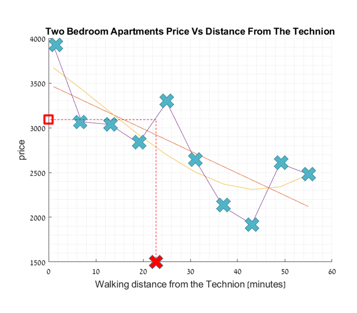

#### Bias vs. Variance אילוסטרציה
הפגיעה במרכז המטרה מציג ה- Bias (שגיאת הקירוב), הפיזור מציג את ה- Variance (שגיאת השערוך). 

**הערה**: התמונות נלקחו מהאתר: [https://towardsdatascience.com/understanding-the-bias-variance-tradeoff-165e6942b229](https://towardsdatascience.com/understanding-the-bias-variance-tradeoff-165e6942b229).

### תהליך הלימוד (ולידציה)

נחלק את ה-Data שיש לנו לשלוש קבוצות:

1. סט אימון (training set) - סט דוגמאות מתוייג $$D=\left\lbrace x_i,y_i\right\rbrace_{i=1}^n$$ שבאמצעותו האלגוריתם לומד.
2. סט אימות (validation set) - סט דוגמאות מתוייג $$D=\left\lbrace x_i,y_i\right\rbrace_{i=1}^n$$ שבאמצעותו נעריך את טיבם של המודלים על מנת לבחור בניהם.
3. סט בוחן (test set) - סט דוגמאות מתוייג $$D=\left\lbrace x_i,y_i\right\rbrace_{i=1}^n$$ שבאמצעותו נעריך את ביצועי המודל הסופי שבחרנו.
     
    **הערה**: השימוש בסט זה הינו השלב האחרון בתהליך הלמידה, ואין להשתמש בו כדי להעריך את ביצועי המודל במהלך הלימוד.

#### דוגמא לאימות בבעיית רגרסיה
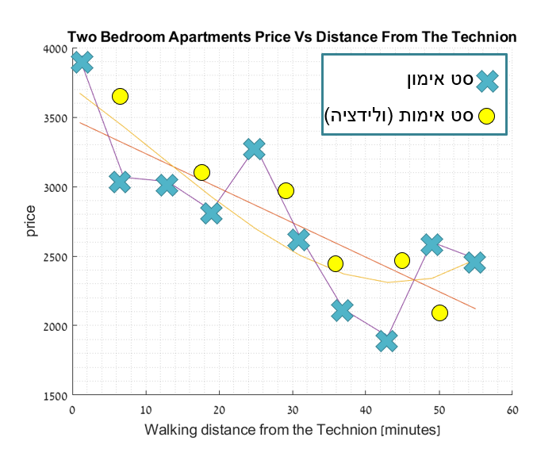

### K-fold Cross Validataion

במקרים בהם הData הניתן לנו הוא מוגבל, לא נרצה לבזבז Data על ידי הקצאתו לvalidataion set. שיטה זו מאפשרת לקבל הערכת לשגיאת השיערוך.

**input**: $$D=\left\lbrace x_i,y_i\right\rbrace_{i=1}^n$$, integer $$k$$, learning algorithm A, model M

1. Create $$k$$ data partitions: $$D_1,\ldots,D_k$$, $$\text{s.t.}\quad\bigcap_{j=1,\ldots,k}D_j=\phi,\quad\bigcup_{j=1,\ldots,k}D_j=D,\quad\forall j,l\left\lvert D\right\rvert\simeq\left\lvert D_l\right\rvert$$
2. For $$j=1,\ldots,k$$
   1. Fit model M by algorithm A with data $$\left\lbrace D\setminus D_j\right\rbrace$$
   2. Calcualte $$\hat{R}^{\left(j\right)}_n\left(M\right)$$
3. Return $$\frac{1}{k}\sum_{j=1}^k\hat{R}_n^{\left(j\right)}$$

#### דוגמא
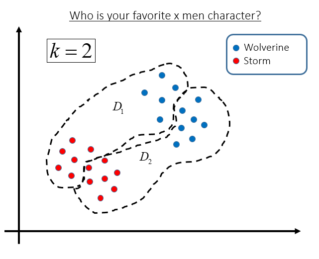

### סיווג בעזרת אלגוריתם K-NN (K-Nearest Neighbours)

1. מצא את $$K$$ השכנים הקרובים ביותר לנקודה החדשה.
2. מצא לאיזו קבוצה שייכים רוב השכנים. הנקודה החדשה שייכת לקבוצה זו.

- במקרה של שיוויון בשלב 2, השווה סכום מרחקים. הנקודה החדשה שייכת לקבוצה בעלת הסכום המינימאלי.
- במקרה של שיווון גם בין סכום המרחקים, בחר אקראית.

## תרגילים

#### ✍️ תרגיל 5.1

סטודנט נבון ניגש לבחור אבטיחים בסופרמרקט. ידוע כי זוהי רק תחילתה של עונת האבטיחים וקיים מספר לא מבוטל של אבטיחי בוסר הסטודנט שם לב כי ניתן לאפיין את האבטיחים ע"פ ההד בהקשה וע"פ קוטר האבטיח. הסטודנט החליט למפות את ניסיון העבר שלו:

1. הד חזק (עוצמה 1), רדיוס 8 ס"מ – מתוק
2. הד בינוני (עוצמה 2), רדיוס 10 ס"מ – חמוץ
3. הד בינוני (עוצמה 2),  רדיוס 5 ס"מ – מתוק
4. הד חלש (עוצמה 3), רדיוס 7 ס"מ – מתוק
5. הד רפה (עוצמה 4), רדיוס 6 ס"מ – חמוץ
6. הד רפה (עוצמה 4), רדיוס 11 ס"מ – חמוץ
7. הד עמום (עוצמה 5), רדיוס 8 ס"מ – מתוק

הסטודנט מחזיק בידו האבטיח בעל הד חלש רדיוס 8 ס"מ. האם סביר שהאבטיח מתוק או חמוץ?

א) בדקו את תוצאות ה-classification עבור k-nearest neighbors, כאשר K=1,3.
ב) בצע Cross Validation להערכת טיב המודל, עבור K=1,3 ו-7 קבוצות (Leave-one-out Cross Validation). באיזה מסווג נבחר?
ג) מה יקרה אם נבחר את k להיות בגודל ה-dataset.
ד) סטודנטית נבונה (אף יותר!) העירה לסטודנט כי קוטר האבטיח אינו משנה, וכי עליו להתייחס אך ורק להד. חזרו על התהליך במקרה זה. 

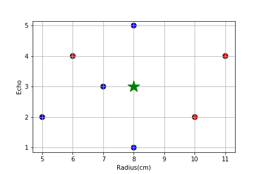

#### 💡 פיתרון

א) נמפה את הנתונים על גרף, כאשר ציר $$x$$ הינו הד האבטיח מ-1 (חזק) ל-5 (עמום). כל נקודה ניתן לרשום כ $$\left(x_i,w_i\right)$$ כאשר, הנקודה הנבדקת היא $$\left(\bar{x},\bar{w}\right)$$. בבדיקה ישירה במרחק אוקלידי: השכן הקרוב ביותר הוא $$x_4$$ ולכן נעניק לנקודה הנבדקת $$\bar{w}=w_4=\text{sweet}$$

שלושת השכנים בקרובים ביותר הם $$\bar{w}=w_4=\text{sweet}$$ וע"פ הצבעת רוב $$\bar{w}=\text{sour}$$

ב) כאמור הData שלנו הינו:

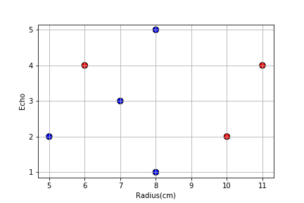

נזכור שבמצב שהנרחקים שווים, נבחר צבע באקראי. במקרה זה נניח שתמיד שובר השוויון הינו כחול, שכן יש לנו יותר נקודות כחולות. נבדוק כל אחת מהנקודות:

|         point         | label |       K=1      |  K=3   |
| --------------------- | ----- | -------------- | ------ |
| $$\left(5 ,2\right)$$ | blue  | ✓ blue(random) | ✓ blue |
| $$\left(6 ,4\right)$$ | red   | ✗ blue         | ✗ blue |
| $$\left(7 ,3\right)$$ | blue  | ✗ red          | ✓ blue |
| $$\left(8 ,1\right)$$ | blue  | ✓ blue(random) | ✓ blue |
| $$\left(8 ,5\right)$$ | blue  | ✓ blue(random) | ✗ red  |
| $$\left(10,2\right)$$ | red   | ✗ blue         | ✗ blue |
| $$\left(11,4\right)$$ | red   | ✓ red          | ✗ blue |
| ===================== | ===== | ============== | ====== |
| # of errors           |       |        3       |   4    |

נחשב את שגיאת ה-CV:

עבור K=1, מספר השגיאות הוא 3, ולכן שגיאת ה-CV הינה: $$\hat{L}_n^1=\frac{3}{7}$$
עבור K=3, מספר השגיאות הוא 4, ולכן שגיאת ה-CV הינה: $$\hat{L}_n^1=\frac{3}{7}$$

קיבלנו שעבור $$k=1$$ שגיאת המסווג קטנה יותר מאשר $$k=3$$, לכן - במקרה זה נבחר במסווג בעל $$k=1$$. משים לב כי במקרה זה תוצאות שני המסווגים גרועות ביותר.

ג) במצב כזה ההחלטה שלנו תקבע ישירות לפי באיזה מהמחלקות יש יותר דוגמאות (במקרה זה, לכל דוגמא חדשה יתקבל הצבע הכחול – כל האבטיחים מתוקים!).

## דוגמא נוספת

בשאלה זו ננסה לחזות את בחירתו של אזרח אמריקאי באמצעות אלגוריתם K-NN. לשם הפשטות, נניח כי כל אזרח מיוצג על ידי שני מאפיינים: 

מצבו הכלכלי (הציר האופקי - x) וקרבתו לדת (הציר האנכי – y).

בסימונים שלמדנו:

$$
x=\left(\text{wealth},\text{religiouness}\right)\in X = \mathbb{R}_+^2
$$

$$
y\in\left\lbrace\color{red}{\text{republican}},\color{blue}{\text{democrat}}\right\rbrace
$$

להלן ה- Dataset (מיוצג ע"י נקודות) ומשטחי ההחלטה שנובעים מאלגוריתם 1-nn:

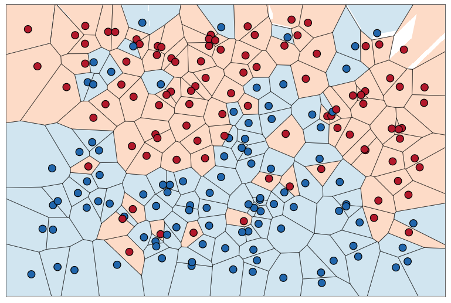

כעת, נבצע פרדיקציה לסט בחן לדוגמא: 

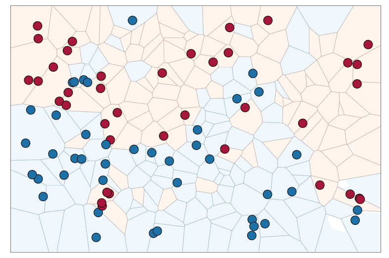

שאלה: איזה משפחה $$F$$ יותר עשירה? תוצאת סיווג עבור 1-nn או עבור 50-nn?

נראה זאת ויזואלית:

נסתכל על סט אימון גדול מאוד ונניח שהוא מתפזר בצורה אחידה על מרחב המאפיינים.

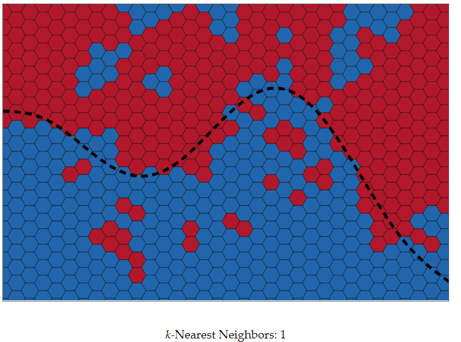

הקו השחור מייצג את קו ההחלטה שלפיו יוצרו הדוגמאות, לפני הוספה של רעש תיוג אקראי.

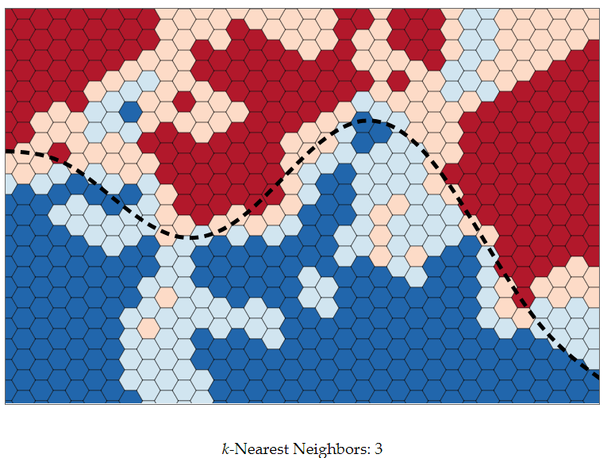

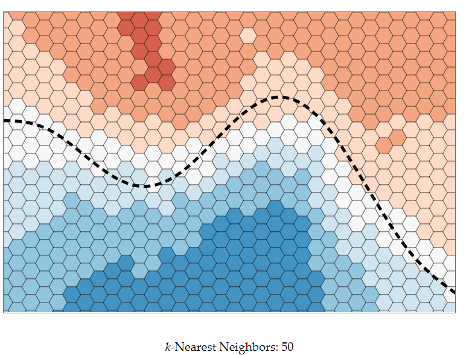

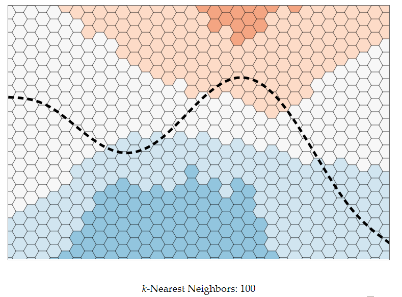

ניתן לראות שככל שנגדיל את מספר השכנים עליהם נסתכל בעת הסיווג משטחי ההחלטה יהפכו ליותר ויותר חלקים, כלומר המודלים יהיו פשוטים יותר.  במצב זה, אנחנו מאבדים עם הגדלת k אזורים מיוחדים וקטנים. יש לכך יתרון במידה ואזורים אלו נובעים מרעש, אך ייתכן Data שאינו פריד לינארית וקיימים בו "מובלעות" החלטה.

עם זאת, מידת הביטחון שלנו בפרדיקציות אשר קרובות לאזור ההחלטה ירדו, מאחר שיהיו שכנים רבים באופן יחסי מהמחלקה השנייה.

מה יקרה אם  k=n?

כל נקודה חדשה תסווג למחלקה השכיחה יותר בסט האימון. אם שני הסטים זהים בגודלם, כל נקודה תסווג באופן אקראי לחלוטין.

**הערה**: התמונות נלקחו מאתר [http://scott.fortmann-roe.com/docs/BiasVariance.html](http://scott.fortmann-roe.com/docs/BiasVariance.html), מומלץ לקרוא את ההסבר המלא.

## בעיה מעשית

### תיאור המדגם: Breast Cancer Wisconsin

שיטה נפוצה כיום לאבחנה של סרטן הינה בשיטת Fine-needle aspiration. בשיטה זו נלקחת דגימה של הרקמה בעזרת מחט ומבוצעת אנליזה בעזרת מיקרוסקופ על מנת לאבחן שני מקרים:

- Malignant - רקמה סרטנית
- or Benign - רקמה בריאה

להלן דוגמא לדגימה שכזו:

{: width="500px"}

*התמונה לקוחה [מויקיפדיה](https://en.wikipedia.org/wiki/Fine-needle_aspiration)

מדגם בשם **Breast Cancer Wisconsin Diagnostic** נאסף על ידי חוקרים מאוניברסיטת ויסקונסין. הוא כולל 30 ערכים מספריים, כגון שטח התא הממוצא, אשר חושבו בעבור 569 דגימות שונות, בנוסף לתווית של האם הדגימה הינה סרטנית או לא.

מדגם זה משמש לרוב כדוגמא לבעיית סיווג קלסית.

ניתן למצוא את המדגם המקורי פה: [Breast Cancer Wisconsin (Diagnostic) Data Set](https://archive.ics.uci.edu/ml/datasets/Breast+Cancer+Wisconsin+%28Diagnostic%29)

בקורס נשתמש בגרסא דומה לזו הנמצאת [פה](https://yairomer.github.io/ml_course/datasets/breast_cancer.csv)

## ❓️ הבעיה: חיזוי האם תא הינו סרטני או לא

אנו מעוניינים לעזור לצוות הרפואי לבצע אבחון נכון של הדגימות על סמך הנתונים המספריים שמחושבים לכל דגימה.

**הערה**: בהרבה שימושים רפואיים השאיפה הינה לספק סיוע לצוות הרפואי, לרוב על ידי סיפוק המלצות, ולא להחליף אותו.

### השדות במדגם

להלן 10 השורות הראשונות במדגם:

<table border="1" class="dataframe">
  <thead>
    <tr style="text-align: right;">
      <th></th>
      <th>id</th>
      <th>diagnosis</th>
      <th>radius_mean</th>
      <th>texture_mean</th>
      <th>perimeter_mean</th>
      <th>area_mean</th>
      <th>smoothness_mean</th>
      <th>compactness_mean</th>
      <th>concavity_mean</th>
      <th>concave points_mean</th>
      <th>...</th>
      <th>radius_worst</th>
      <th>texture_worst</th>
      <th>perimeter_worst</th>
      <th>area_worst</th>
      <th>smoothness_worst</th>
      <th>compactness_worst</th>
      <th>concavity_worst</th>
      <th>concave points_worst</th>
      <th>symmetry_worst</th>
      <th>fractal_dimension_worst</th>
    </tr>
  </thead>
  <tbody>
    <tr>
      <th>0</th>
      <td>842302</td>
      <td>M</td>
      <td>17.99</td>
      <td>10.38</td>
      <td>122.80</td>
      <td>1001.0</td>
      <td>0.11840</td>
      <td>0.27760</td>
      <td>0.30010</td>
      <td>0.14710</td>
      <td>...</td>
      <td>25.38</td>
      <td>17.33</td>
      <td>184.60</td>
      <td>2019.0</td>
      <td>0.1622</td>
      <td>0.6656</td>
      <td>0.7119</td>
      <td>0.2654</td>
      <td>0.4601</td>
      <td>0.11890</td>
    </tr>
    <tr>
      <th>1</th>
      <td>842517</td>
      <td>M</td>
      <td>20.57</td>
      <td>17.77</td>
      <td>132.90</td>
      <td>1326.0</td>
      <td>0.08474</td>
      <td>0.07864</td>
      <td>0.08690</td>
      <td>0.07017</td>
      <td>...</td>
      <td>24.99</td>
      <td>23.41</td>
      <td>158.80</td>
      <td>1956.0</td>
      <td>0.1238</td>
      <td>0.1866</td>
      <td>0.2416</td>
      <td>0.1860</td>
      <td>0.2750</td>
      <td>0.08902</td>
    </tr>
    <tr>
      <th>2</th>
      <td>84300903</td>
      <td>M</td>
      <td>19.69</td>
      <td>21.25</td>
      <td>130.00</td>
      <td>1203.0</td>
      <td>0.10960</td>
      <td>0.15990</td>
      <td>0.19740</td>
      <td>0.12790</td>
      <td>...</td>
      <td>23.57</td>
      <td>25.53</td>
      <td>152.50</td>
      <td>1709.0</td>
      <td>0.1444</td>
      <td>0.4245</td>
      <td>0.4504</td>
      <td>0.2430</td>
      <td>0.3613</td>
      <td>0.08758</td>
    </tr>
    <tr>
      <th>3</th>
      <td>84348301</td>
      <td>M</td>
      <td>11.42</td>
      <td>20.38</td>
      <td>77.58</td>
      <td>386.1</td>
      <td>0.14250</td>
      <td>0.28390</td>
      <td>0.24140</td>
      <td>0.10520</td>
      <td>...</td>
      <td>14.91</td>
      <td>26.50</td>
      <td>98.87</td>
      <td>567.7</td>
      <td>0.2098</td>
      <td>0.8663</td>
      <td>0.6869</td>
      <td>0.2575</td>
      <td>0.6638</td>
      <td>0.17300</td>
    </tr>
    <tr>
      <th>4</th>
      <td>84358402</td>
      <td>M</td>
      <td>20.29</td>
      <td>14.34</td>
      <td>135.10</td>
      <td>1297.0</td>
      <td>0.10030</td>
      <td>0.13280</td>
      <td>0.19800</td>
      <td>0.10430</td>
      <td>...</td>
      <td>22.54</td>
      <td>16.67</td>
      <td>152.20</td>
      <td>1575.0</td>
      <td>0.1374</td>
      <td>0.2050</td>
      <td>0.4000</td>
      <td>0.1625</td>
      <td>0.2364</td>
      <td>0.07678</td>
    </tr>
    <tr>
      <th>5</th>
      <td>843786</td>
      <td>M</td>
      <td>12.45</td>
      <td>15.70</td>
      <td>82.57</td>
      <td>477.1</td>
      <td>0.12780</td>
      <td>0.17000</td>
      <td>0.15780</td>
      <td>0.08089</td>
      <td>...</td>
      <td>15.47</td>
      <td>23.75</td>
      <td>103.40</td>
      <td>741.6</td>
      <td>0.1791</td>
      <td>0.5249</td>
      <td>0.5355</td>
      <td>0.1741</td>
      <td>0.3985</td>
      <td>0.12440</td>
    </tr>
    <tr>
      <th>6</th>
      <td>844359</td>
      <td>M</td>
      <td>18.25</td>
      <td>19.98</td>
      <td>119.60</td>
      <td>1040.0</td>
      <td>0.09463</td>
      <td>0.10900</td>
      <td>0.11270</td>
      <td>0.07400</td>
      <td>...</td>
      <td>22.88</td>
      <td>27.66</td>
      <td>153.20</td>
      <td>1606.0</td>
      <td>0.1442</td>
      <td>0.2576</td>
      <td>0.3784</td>
      <td>0.1932</td>
      <td>0.3063</td>
      <td>0.08368</td>
    </tr>
    <tr>
      <th>7</th>
      <td>84458202</td>
      <td>M</td>
      <td>13.71</td>
      <td>20.83</td>
      <td>90.20</td>
      <td>577.9</td>
      <td>0.11890</td>
      <td>0.16450</td>
      <td>0.09366</td>
      <td>0.05985</td>
      <td>...</td>
      <td>17.06</td>
      <td>28.14</td>
      <td>110.60</td>
      <td>897.0</td>
      <td>0.1654</td>
      <td>0.3682</td>
      <td>0.2678</td>
      <td>0.1556</td>
      <td>0.3196</td>
      <td>0.11510</td>
    </tr>
    <tr>
      <th>8</th>
      <td>844981</td>
      <td>M</td>
      <td>13.00</td>
      <td>21.82</td>
      <td>87.50</td>
      <td>519.8</td>
      <td>0.12730</td>
      <td>0.19320</td>
      <td>0.18590</td>
      <td>0.09353</td>
      <td>...</td>
      <td>15.49</td>
      <td>30.73</td>
      <td>106.20</td>
      <td>739.3</td>
      <td>0.1703</td>
      <td>0.5401</td>
      <td>0.5390</td>
      <td>0.2060</td>
      <td>0.4378</td>
      <td>0.10720</td>
    </tr>
    <tr>
      <th>9</th>
      <td>84501001</td>
      <td>M</td>
      <td>12.46</td>
      <td>24.04</td>
      <td>83.97</td>
      <td>475.9</td>
      <td>0.11860</td>
      <td>0.23960</td>
      <td>0.22730</td>
      <td>0.08543</td>
      <td>...</td>
      <td>15.09</td>
      <td>40.68</td>
      <td>97.65</td>
      <td>711.4</td>
      <td>0.1853</td>
      <td>1.0580</td>
      <td>1.1050</td>
      <td>0.2210</td>
      <td>0.4366</td>
      <td>0.20750</td>
    </tr>
  </tbody>
</table>

לשם פשטות (וממגבלות ויזואליזציה) אנו נעבוד רק עם שני שדות בנוסף לתווית:

- **diagnosis** - התווית של הדגימה: M = malignant (סרטני), B = benign (בריא)
- **radius_mean** - רדיוס התא הממוצא בדגימה
- **texture_mean** - סטיית התקן הממוצעת של רמת האפור בצבע של כל תא בדגימה.

תיאור מלא של כל השדות ניתן למצוא [כאן](https://archive.ics.uci.edu/ml/machine-learning-databases/breast-cancer-wisconsin/wdbc.names)

### קצת סטטיסטיקות

מספר הדגימות הסרטניות והבריות:

הפילוג של הדגימות כתלות בשני השדות שנעבוד איתם:

ובדו מימד:

### הגדרה פורמאלית של הבעיה

זוהי משימת לימוד מודרך של סיווג בינארי.

אנו נהיה מעניינים למצוא פונקציית חיזוי $$h\left(\cdot\right)$$, הממפה מהמרחב של $$\boldsymbol{x}=\left[\text{mean_radius},\text{mean_texture}\right]^T$$ למרחב התוויות $$y$$

פונקציית הסיכון שאותה נרצה למזער הינה פונקציית הmissclassification rate:

$$
R\left\lbrace h, \left\lbrace\boldsymbol{x},y\right\rbrace\right\rbrace=\frac{1}{N}\sum_i I\left\lbrace h\left(\boldsymbol{x}_i\right)\neq y_i\right\rbrace
$$

על מנת לחשב את פונקציית הסיכון עלינו להפריש חלק מהמדגם לשם יצירה של סט בחן. נקדיש 20% מהמדגם לשם כך.

### 💡 סיווג בעזרת 1-NN

נשתמש באלגוריתם השכן הקרוב על מנת לבצע את החיזוי. נשתמש בפונקציות [Voronoi](https://docs.scipy.org/doc/scipy-0.18.1/reference/generated/scipy.spatial.Voronoi.html) ו [voronoi_plot_2d](https://docs.scipy.org/doc/scipy-0.18.1/reference/generated/scipy.spatial.voronoi_plot_2d.html) שבחבילה הפייתונית SciPy על מנת לשרטט את מפת החיזוי.

#### תוצאות

##### הערכת ביצועים

שיערוך של פונקציית הסיכון בעזרת סט הבחן נותן סיכון של: $$0.14$$ (סיכוי של 14% לבצע חיזוי שגוי)

### 💡 סיווג בעזרת K-NN

ננסה לשפר את תוצאות החיזוי שלנו על ידי שימוש בK-NN. נמצא את K בעזרת בדיקת של כל הK-ים בין 1 ל100 והשוואה של הסיכון המשוערך.

נשתמש בפונקציה [KNeighborsClassifier](https://scikit-learn.org/stable/modules/generated/sklearn.neighbors.KNeighborsClassifier.html) בחבילה SciKit-Learn

#### תוצאות

על פי הגרף, הK האופטימאלי הינו $$K=12$$ אשר נותן סיכון משעורך על סט הבוחן של $$0.061$$.

## Train-Validation-Test Separation

כפי שציינו קודם לכן, בחירה של $$K$$ על פי סט האימון הינה שגויה מפני שהיא תניב שיערוך אופטימי מידי של הסיכון. בכדי להמנע מכך עלינו הינה להפריש מן המדגם חלק נוסף לשם יצירה של סט אימות.

נחלק את המדגם ל:
- 60% סט אימון.
- 20% סט אימות.
- 20% סט בחן.

נחזור על התהליך אך עם בחירה של $$K$$ על פי סט האימות.

#### תוצאות

על פי הגרף, הK האופטימאלי הינו $$K=19$$ אשר נותן סיכון משוערך על סט האימות של $$0.097$$.

שיערוך של פונקציית הסיכון בעזרת סט הבחן נותן סיכון של: $$0.087$$.

### 💡 שימוש ב Cross-Validation

כפי שציינו קודם, על מנת שלא לבזבז רבע מסט הלימוד לצורך הבניה של סט האיבחון נוכל להשתמש ב Cross-Validation.

{: width="700px"}

*התמונה לקוחה מ [SciKit-Learn](https://scikit-learn.org/stable/modules/cross_validation.html#cross-validation)

חזור על התהליך עם cross-validataion. נשתמש בפונקצייה [cross_val_score](https://scikit-learn.org/stable/modules/generated/sklearn.model_selection.cross_val_score.html) של SciKit-Learn.

#### תוצאות

על פי הגרף, הK האופטימאלי הינו $$K=22$$ אשר נותן סיכון משוערך על סט האימות של $$0.087$$.

שיערוך של פונקציית הסיכון בעזרת סט הבחן נותן סיכון של: $$0.079$$.
