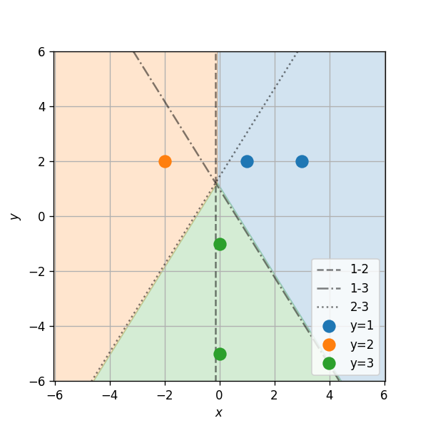

## תיאוריה

- $$\boldsymbol{X}$$ - משתנה/וקטור אקראי אשר יש באפשרותינו למדוד. לרוב נקרא המדידה או התצפית.
- $$Y$$ - משתנה אקראי אשר ברצונינו לחזות על סמך $$X$$. לרוב נקרא התווית.
- $$\hat{y}=h\left(x\right)$$ - פונקציית חיזוי של $$Y$$ כתלות ב$$X$$.
- $$\ell\left(\hat{y},y\right)$$ - פונקציית הפסד. קובעת את ה"קנס" המתקבל בעבור חיזוי שגוי $$\hat{y}$$ בהשוואה לערך האמיתי $$y$$.
- $$R\left\lbrace h\right\rbrace=\mathbb{E}\left[\ell\left(h\left(X\right),Y\right)\right]$$ - פנקציית הסיכון. התוחלת של ההפסד.

**המטרה**: למצוא פונקציית חיזוי אופטימאלית:

$$
h^*\left(x\right) = \underset{h}{\arg\min}\ R\left\lbrace h\right\rbrace= \underset{h}{\arg\min}\ \mathbb{E}\left[\ell\left(h\left(X\right),Y\right)\right]
$$

אנו מבחינים בין שני סוגי בעיות חיזוי:

- **סיווג**: כאשר תחום הערכים של התוויות הינו דיסקרטי וסופי.
- **רגרסיה**: כאשר תחום הערכים של התוויות הינו תחום רציף.

(בעיות שבהם התחום דיסקרטי ואין סופי לרוב פותרים בשיטות דומות לאלו של רגרסיה כאשר מעגלים את תוצאת החיזוי)

#### פונקציות הפסד נפוצות

##### הפסד אפס-אחד (zero-one loss)

$$
\ell\left(\hat{y},y\right) = I\left\lbrace \hat{y}=y\right\rbrace
$$

- ההפסד הנפוץ בבעיות סיווג.
- פונקציית הסיכון שלו נקראת: misclassification rate
- החזאי האופטימאלי תחת הפסד זה הינו: $$h\left(x\right)=\underset{y}{\arg\min}\quad p\left(y\lvert x\right)$$

##### הפסד מרחק ריבועי ($$l_2$$ loss)

$$
\ell\left(\hat{y},y\right) = \left(\hat{y}-y\right)^2
$$

- ההפסד הנפוץ בבעיות רגרסיה.
- פונקציית הסיכון שלו נקראת: Mean Square Error (MSE)
- החזאי האופטימאלי תחת הפסד זה הינו משערך התוחלת המותנית: $$h\left(x\right)=E\left[Y\lvert x\right]$$

### למידה מודרכת

בעיית למידה מודרכת עוסקת בבעיות חיזוי שבהם אין אנו יודעים את הפילוג המשותף של $$\boldsymbol{X}$$ ו $$Y$$, אך יש ברשותינו מדגם של $$N$$ דיגימות משותפות שלהם: $$D=\left\lbrace\boldsymbol{x}_i,y_i\right\rbrace$$

#### גישה גנרטיבית

בגישה הגנרטיבית אנו נשתמש במדגם על מנת לשערך את פונקציית הפילוג המשותפת $$p_{\boldsymbol{X},Y}$$, ובעזרתה לבנות את החזאי. שיטות אלו נקראות גנרטיביות משום שהם מנסות ללמוד את האופן שבו נוצר (generated) המדגם.

### שיטות סיווג גנרטיביות

בתרגול זה נעסוק בשיטות סיווג גנרטיביות. בבעיות אלו נפרק לרוב את הפונקציית הצפיפות המושתפת באופן הבא:

$$
p_{\boldsymbol{X},Y}\left(\boldsymbol{x},y\right)=p_{\boldsymbol{X}\lvert Y}\left(\boldsymbol{x}\lvert y\right)p_Y\left(y\right)
$$

ונשערך בנפרד את כל אחד משני הרכבים:

- מכיוון שאנו עוסקים בבעיות סיווג, אזי, $$p_Y$$ הינו פילוג דיסקרטי וסופי, ולכן ניתן לשערך אותו בקלות על פי:

  $$
  p_Y\left(j\right)=\frac{1}{N}\sum_{i=1}^N I\left\lbrace y_i=j\right\rbrace
  $$

- את $$p_{\boldsymbol{X}\lvert Y}$$ נשערך בנפרד בעבור כל ערך של $$Y$$ מתוך החלק של המדגם המתאים לו. זאת אומרת שאת $$P\left(x\lvert Y=j\right)$$ נשערך מתוך אוסף דגמים שמקיימות $$y_i=j$$.

שיטות הסיווג הגנרטיביות נבדלות אחת מהשניה במודל אותו הן מציעות בעבור הפילוג של $$p_{\boldsymbol{X}\lvert Y}$$, ואופן הלימוד שלו.

נתאר כאן שלוש שיטות לביצוע סיווג גנרטיבי.

#### מסווג בייס נאיבי (Naïve Bayse Classifier)

ההנחה: הרכיבים של $$\boldsymbol{X}$$ הינם בלתי תלויים סטטיסטית.

תחת הנחה זו $$p_{\boldsymbol{X}\lvert Y}\left(\boldsymbol{x}\lvert y\right)=\prod_{i=1}^d p_q\left(x_q\lvert y\right)$$, כאשר $$x_q$$ הוא הרכיב ה$$q$$ בוקטור $$\boldsymbol{x}$$ ו $$d$$ הוא המימד (אורך) שלו.

את הפילוגים החד מימדיים $$p_q\left(x_q\lvert y\right)$$ משערכים באופן בלתי תלוי בעבור כל ערך של $$Y$$ וכל אחד מ$$d$$ הרכיבים של $$\boldsymbol{X}$$.

שיטה זו לא מגדירה כיצד ללמוד את הפילוגים החד מימדיים, וניתן לדוגמא להשתמש בכל אחת מהשיטות שראינו בקורס לשיערוך פילוגים, כגון מודל של פילוג נורמאלי או KDE.

מצד אחד, שיטה זו פותרת את בעיית הCurse of Dimenionality, אך מצד שני, כשמה כן היא, היא מאד נאיבית שכן הנחת החוסר תלות בין הרכיבים לרוב רחוקה מלהיות נכונה)

#### Linear Discriminant Analysis (LDA)

הנחות:

1. הפילוגים $$p_{\boldsymbol{X}\lvert Y}$$ הינם פילוגים נורמאלייים לכל ערך של $$Y$$.
2. מטריצת convariance של הפילוג הנורמאלי $$p_{\boldsymbol{X}\lvert Y}$$ אינו תלוי בערך של $$Y$$.

ללא הגבלת הכלליות, נניח כי תחום הערכים שאותו מקבל $$Y$$ הינו $$\left\lbrace1,\ldots,M\right\rbrace$$. נשתמש בסימונים הבאים:

- $$G_j=\left\lbrace i:y_i=j\right\rbrace$$ - אוסף האינדקסים של הדגמים במדגם שמקיימים $$y_i=j$$.
- $$\mu_j$$ - וקטורי התוחלות של הפילוגים הנורמאלים בעבור כל אחד מ$$N$$ הערכים האפשריים של התוויות.
- $$\Sigma$$ - מטריצת הcovariance של הפילוגים. (מטריצה אחת בעבור כל ה$$N$$ פילוגים).

את הפרמטרים של מודל, $$\mu_j$$ ו $$\Sigma$$ הנרומאלים נמצא בעזרת MLE. התוצאה המתקבלת הינה:

$$
\boldsymbol{\mu}_j = \frac{1}{N_j}\sum_{i\in G_j}\boldsymbol{x}_i \\
\Sigma = \frac{1}{N}\sum_{i}\left(\boldsymbol{x}_i-\boldsymbol{\mu}_{y_i}\right)\left(\boldsymbol{x}_i-\boldsymbol{\mu}_{y_i}\right)^T
$$

##### הפרדה לינארית

בעבור המקרה של סיווג בינארי (סיווג לשני מחלקות) ושימוש בzero-one loss מתקבל החזאי הבא:

$$
h\left(x\right)=
\begin{cases}
1\qquad \boldsymbol{a}^T \boldsymbol{x} + b > 0 \\
0\qquad \text{otherwise}\\
\end{cases}
$$

כאשר:

$$
\boldsymbol{a}=\Sigma^{-1}\left(\boldsymbol{\mu}_1-\boldsymbol{\mu}_0\right) \\
b=\tfrac{1}{2}\left(\boldsymbol{\mu}_0^T\Sigma^{-1}\boldsymbol{\mu}_0 - \boldsymbol{\mu}_1^T\Sigma^{-1}\boldsymbol{\mu}_1\right) + \log\left(\frac{p_Y\left(1\right)}{p_Y\left(0\right)}\right)
$$

נשים לב כי תנאי ההחלטה שבין שני התחומים הינו לינארי, ומכאן מקבל האלגוריתמם את שמו)

#### Quadric Discriminant Analysis (QDA)

הנחות:

1. הפילוגים $$p_{\boldsymbol{X}\lvert Y}$$ הינם פילוגים נורמאלייים לכל ערך של $$Y$$.

QDA דומה מאד לLDA רק ללא ההנחה השניה. במקרה זה אנו משערכים באופן בלתי תלוי $$N$$ גאוסיאנים שונים. במקרה נקבל ש:

$$
\boldsymbol{\mu}_j = \frac{1}{N_j}\sum_{i\in G_j}\boldsymbol{x}_i \\
\Sigma_j = \frac{1}{N}\sum_{i\in G_j}\left(\boldsymbol{x}_i-\boldsymbol{\mu}_j\right)\left(\boldsymbol{x}_i-\boldsymbol{\mu}_j\right)^T
$$

##### משטח הפרדה ריבועי

בעבור המקרה של סיווג בינארי (סיווג לשני מחלקות) ושימוש בzero-one loss מתקבל החזאי הבא:

$$
h\left(x\right)=
\begin{cases}
0\qquad \boldsymbol{x}^T C \boldsymbol{x} + \boldsymbol{a}^T \boldsymbol{x} + b > 0 \\
1\qquad \text{otherwise}\\
\end{cases}
$$

כאשר:

$$
C=\tfrac{1}{2}\left(\Sigma_0^{-1}-\Sigma_1^{-1}\right) \\
\boldsymbol{a}=\Sigma_1^{-1}\boldsymbol{\mu}_1-\Sigma_0^{-1}\boldsymbol{\mu}_0 \\
b=\tfrac{1}{2}\left(\boldsymbol{\mu}_1^T\Sigma_1^{-1}\boldsymbol{\mu}_1 - \boldsymbol{\mu}_0^T\Sigma_0^{-1}\boldsymbol{\mu}_0\right) + \log\left(\frac{\left\lvert\Sigma_0\right\rvert^{1/2}p_Y\left(1\right)}{\left\lvert\Sigma_1\right\rvert^{1/2}p_Y\left(0\right)}\right)
$$

במקרה זה, משטח ההפרדה נתון על ידי פונקציה ריבועית ומכאן האלגוריתם מקבל את שמו.

## תרגיל

#### תרגיל 6.1

בסוואנה חיים שלושה זני פילים אשר נמצאים בסכנת הכחדה. ידוע כי כל אחד משלושת הזנים ניזון מצמחיה מעט שונה ועל מנת לשמר את אוכלוסיית הפילים מעוניינים לפזר להם אוכל ברחבי הסוואנה. בכדי למקסם את האפקטיביות של פעולה זו מעוניינים לשערך בכל נקודת חלוקה מהו הזן שהכי סביר להמצא באותה נקודה על מנת להתאים את סוג המזון לזן זה.

הפילוג של זני הפילים על פני הסוואנה אינו ידוע אך נתונות לנו התצפית הבאה של הקואורדינטות בהם נצפו הפילים:

| Type |  X |  Y |
| ---- | -- | -- |
|   1  |  1 |  2 |
|   1  |  3 |  2 |
|   2  | -2 |  2 |
|   3  |  0 | -1 |
|   3  |  0 | -5 |
{: dir="ltr" style="font-size:15px !important"}

השתמש במסווג LDA על מנת לבנות חזאי אשר ישערך את הזן הזפוץ ביותר בכל קואורדינטה.

##### פתרון

נסמן ב$$\boldsymbol{x}_i$$ את הקאורדינטה של התצפית ה$$i$$, וב$$y_i$$ את הזן של התצפית ה$$i$$. לדוגמא:

$$
\boldsymbol{x}_4=\begin{pmatrix}0\\-1\end{pmatrix}\\
y_4=3
$$

נסמן ב$$G_j$$ את אוסף כל התצפיות של שבהם הזן הוא $$j$$. לדוגמא:

$$
G_3=\left\lbrace 4,5\right\rbrace
$$

ראשית נחשב את הפילוג הא-פריורי של כל אחד מן הזנים:

$$
p_Y\left(1\right)=\frac{\left\lvert G_1\right\rvert}{N}=\frac{2}{5} \\
p_Y\left(2\right)=\frac{\left\lvert G_2\right\rvert}{N}=\frac{1}{5} \\
p_Y\left(3\right)=\frac{\left\lvert G_3\right\rvert}{N}=\frac{2}{5}
$$

נחשב את הפרמטרים של שלושת הפילוגים הנורמאלים:

$$
\boldsymbol{\mu}_1
=\frac{1}{\left\lvert G_1\right\rvert}\sum_{i\in G_1}\boldsymbol{x}_i
=\frac{1}{2}\left(\begin{pmatrix}1\\2\end{pmatrix}+\begin{pmatrix}3\\2\end{pmatrix}\right)
=\begin{pmatrix}2\\2\end{pmatrix}\\
\boldsymbol{\mu}_2
=\frac{1}{\left\lvert G_2\right\rvert}\sum_{i\in G_2}\boldsymbol{x}_i
=\begin{pmatrix}-2\\2\end{pmatrix}\\
\boldsymbol{\mu}_3
=\frac{1}{\left\lvert G_3\right\rvert}\sum_{i\in G_3}\boldsymbol{x}_i
=\frac{1}{2}\left(\begin{pmatrix}0\\-1\end{pmatrix}+\begin{pmatrix}0\\-5\end{pmatrix}\right)
=\begin{pmatrix}0\\-3\end{pmatrix}\\
$$

נחשב את מטריצת covariance המשותפת של הפילוגים:

$$
\Sigma=\frac{1}{N}\sum_{i}\left(\boldsymbol{x}_i-\boldsymbol{\mu}_{y_i}\right)\left(\boldsymbol{x}_i-\boldsymbol{\mu}_{y_i}\right)^T
$$

דרך נוחה לחשב את הסכום בביטוי זה הינה באופן הבא. נגדיר את המטריצה של התצפיות לאחר חיסור של התוחלת המתאימה לכל זן:

$$
\tilde{X}
=\begin{pmatrix}-\boldsymbol{x}_1-\\-\boldsymbol{x}_2-\\-\boldsymbol{x}_3-\\-\boldsymbol{x}_4-\\-\boldsymbol{x}_5-\end{pmatrix}-\begin{pmatrix}-\boldsymbol{\mu}_{y_1}-\\-\boldsymbol{\mu}_{y_2}-\\ -\boldsymbol{\mu}_{y_3}\\-\boldsymbol{\mu}_{y_4}-\\-\boldsymbol{\mu}_{y_5}-\end{pmatrix}
=\begin{pmatrix}1 & 2 \\ 3 & 2 \\ -2 & 2 \\ 0 & -1 \\ 0 & -5 \end{pmatrix}-\begin{pmatrix} 2 & 2 \\ 2 & 2 \\ -2  & 2 \\ 0 & -3 \\ 0 & -3 \end{pmatrix}
=\begin{pmatrix}-1 & 0 \\ 1 & 0 \\ 0 & 0 \\ 0 & 2 \\ 0 & -2 \end{pmatrix}
$$

ניתן להראות בקלות כי ניתן לכתוב את הסכום בביטוי ל $$\Sigma$$ באופן הבא:

$$
\begin{aligned}
\Sigma
& =\frac{1}{N}\sum_{i}\left(\boldsymbol{x}_i-\boldsymbol{\mu}_{y_i}\right)\left(\boldsymbol{x}_i-\boldsymbol{\mu}_{y_i}\right)^T=\frac{1}{N}\tilde{X}^T\tilde{X}\\
& =\frac{1}{5}\begin{pmatrix}-1 & 1 & 0 & 0 & 0 \\ 0 & 0 & 0 & 2 & -2 \end{pmatrix}\begin{pmatrix}-1 & 0 \\ 1 & 0 \\ 0 & 0 \\ 0 & 2 \\ 0 & -2 \end{pmatrix} \\
& =\frac{1}{5}\begin{pmatrix} 2  & 0 \\ 0 & 8 \end{pmatrix}
\end{aligned}
$$

נשתמש כעת בפילוגים שאותם שיערכנו על מנת לבנות את החזאי. האיזור שבו זן 1 הינו הזן הסביר ביותר הינו האיזור שבו מתקיים:

$$
\begin{cases}
p_{Y\lvert X}\left(1\lvert x\right) > p_{Y\lvert X}\left(2\lvert x\right) \\
p_{Y\lvert X}\left(1\lvert x\right) > p_{Y\lvert X}\left(3\lvert x\right)
\end{cases}
$$

נחשב את התנאי הראשון

$$
\begin{aligned}
p_{Y\lvert X}\left(1\lvert x\right)&> p_{Y\lvert X}\left(1\lvert x\right) \\
\Leftrightarrow p_{X\lvert Y}\left(x\lvert 1\right)p_Y\left(1\right)&> p_{X\lvert Y}\left(x\lvert 2\right)p_Y\left(2\right) \\
\Leftrightarrow \frac{1}{\sqrt{4\pi^2\left\lvert\Sigma\right\rvert}}e^{-\tfrac{1}{2}\left(x-\mu_1\right)^T\Sigma^{-1}\left(x-\mu_1\right)}p_Y\left(1\right)&>\frac{1}{\sqrt{4\pi^2\left\lvert\Sigma\right\rvert}}e^{-\tfrac{1}{2}\left(x-\mu_2\right)^T\Sigma^{-1}\left(x-\mu_2\right)}p_Y\left(2\right) \\
\Leftrightarrow -\tfrac{1}{2}\left(x-\mu_1\right)^T\Sigma^{-1}\left(x-\mu_1\right)+\log\left(p_Y\left(1\right)\right)&>-\tfrac{1}{2}\left(x-\mu_2\right)^T\Sigma^{-1}\left(x-\mu_2\right)+\log\left(p_Y\left(2\right)\right) \\
\end{aligned} \\
\Leftrightarrow x^T\Sigma^{-1}\left(\mu_1-\mu_2\right)+\tfrac{1}{2}\left(\mu_2^T\Sigma^{-1}\mu_2 -\mu_1^T\Sigma^{-1}\mu_1\right)+\log\left(\frac{p_Y\left(1\right)}{p_Y\left(2\right)}\right)>0\\
$$

זוהי למעשה הפרדה לשני תחומים על ידי הקו הבא:

$$
\boldsymbol{a}^T \boldsymbol{x}+b=0
$$

כאשר:

$$
\boldsymbol{a}=\Sigma^{-1}\left(\boldsymbol{\mu}_1-\boldsymbol{\mu}_2\right)
=\begin{pmatrix} 10 \\ 0 \end{pmatrix} \\
b=\tfrac{1}{2}\left(\boldsymbol{\mu}_2^T\Sigma^{-1}\boldsymbol{\mu}_2 - \boldsymbol{\mu}_1^T\Sigma^{-1}\boldsymbol{\mu}_1\right) + \log\left(\frac{p_Y\left(1\right)}{p_Y\left(2\right)}\right)
=\log\left(2\right)
$$

זוהי כמובן התוצאה עבור מסווג LDA בינארי בין שני הזנים של $$Y=1$$ ו $$Y=2$$.

מכאן שקו המפריד בין זן 1 ל זן 2 נתון על ידי:

$$
1-2:\quad 10x+\log\left(2\right)=0
$$

באופן דומה ניתן לחשב גם את שני קווי ההפרדה האחרים (בין 1 ל 3 ובין 2 ל 3):

$$
1-3:\quad 5x+\frac{25}{8}y+\frac{55}{16}=0 \\
2-3:\quad -5x+\frac{25}{8}y+\frac{55}{16}-\log\left(2\right)=0
$$

## בעיה מעשית

### המדגם: Breast Cancer Wisconsin

נעבוד שוב עם המדגם של דגימות התא לאבחון סרטן שד. (את המדגם המקורי ניתן למצוא [פה](https://archive.ics.uci.edu/ml/datasets/Breast+Cancer+Wisconsin+%28Diagnostic%29), בקורס נעבוד עם הגרסא [הזו](https://yairomer.github.io/ml_course/datasets/breast_cancer.csv))

{: width="500px"}

*התמונה לקוחה [מויקיפדיה](https://en.wikipedia.org/wiki/Fine-needle_aspiration)

### תזכורת לבעיה: חיזוי האם תא הינו סרטני או לא

אנו מעוניינים לעזור לצוות הרפואי לבצע אבחון נכון של דגימות לדגימות סרטיניות (malignant) או בריאות (benign) על מסך הנתונים המספריים שמחושבים לכל דגימה.

באופן פורמאלי, נגדיר את שני המשתנים האקראיים:

- $$X=\left[\text{mean_radius},\text{mean_texture}\right]^T$$ - ערכי התצפית של דגימה מסויימת.
- $$Y$$ - התווית הבינארית של האם הדגימה סרטנית או לא. (0-בריא, 1-סרטני)

נהיה מעוניינים למוא את פונקציית החיזוי אשר ממזערת את:

$$
R\left\lbrace h\right\rbrace=E\left[I\left\lbrace h\left(\boldsymbol{X}\right)\neq Y\right\rbrace\right]
$$

(השתמשנו כאן בzero-one loss)

### השדות במדגם

להלן 10 השורות הראשונות במדגם:

<table border="1" class="dataframe">
  <thead>
    <tr style="text-align: right;">
      <th></th>
      <th>id</th>
      <th>diagnosis</th>
      <th>radius_mean</th>
      <th>texture_mean</th>
      <th>perimeter_mean</th>
      <th>area_mean</th>
      <th>smoothness_mean</th>
      <th>compactness_mean</th>
      <th>concavity_mean</th>
      <th>concave points_mean</th>
      <th>...</th>
      <th>radius_worst</th>
      <th>texture_worst</th>
      <th>perimeter_worst</th>
      <th>area_worst</th>
      <th>smoothness_worst</th>
      <th>compactness_worst</th>
      <th>concavity_worst</th>
      <th>concave points_worst</th>
      <th>symmetry_worst</th>
      <th>fractal_dimension_worst</th>
    </tr>
  </thead>
  <tbody>
    <tr>
      <th>0</th>
      <td>842302</td>
      <td>M</td>
      <td>17.99</td>
      <td>10.38</td>
      <td>122.80</td>
      <td>1001.0</td>
      <td>0.11840</td>
      <td>0.27760</td>
      <td>0.30010</td>
      <td>0.14710</td>
      <td>...</td>
      <td>25.38</td>
      <td>17.33</td>
      <td>184.60</td>
      <td>2019.0</td>
      <td>0.1622</td>
      <td>0.6656</td>
      <td>0.7119</td>
      <td>0.2654</td>
      <td>0.4601</td>
      <td>0.11890</td>
    </tr>
    <tr>
      <th>1</th>
      <td>842517</td>
      <td>M</td>
      <td>20.57</td>
      <td>17.77</td>
      <td>132.90</td>
      <td>1326.0</td>
      <td>0.08474</td>
      <td>0.07864</td>
      <td>0.08690</td>
      <td>0.07017</td>
      <td>...</td>
      <td>24.99</td>
      <td>23.41</td>
      <td>158.80</td>
      <td>1956.0</td>
      <td>0.1238</td>
      <td>0.1866</td>
      <td>0.2416</td>
      <td>0.1860</td>
      <td>0.2750</td>
      <td>0.08902</td>
    </tr>
    <tr>
      <th>2</th>
      <td>84300903</td>
      <td>M</td>
      <td>19.69</td>
      <td>21.25</td>
      <td>130.00</td>
      <td>1203.0</td>
      <td>0.10960</td>
      <td>0.15990</td>
      <td>0.19740</td>
      <td>0.12790</td>
      <td>...</td>
      <td>23.57</td>
      <td>25.53</td>
      <td>152.50</td>
      <td>1709.0</td>
      <td>0.1444</td>
      <td>0.4245</td>
      <td>0.4504</td>
      <td>0.2430</td>
      <td>0.3613</td>
      <td>0.08758</td>
    </tr>
    <tr>
      <th>3</th>
      <td>84348301</td>
      <td>M</td>
      <td>11.42</td>
      <td>20.38</td>
      <td>77.58</td>
      <td>386.1</td>
      <td>0.14250</td>
      <td>0.28390</td>
      <td>0.24140</td>
      <td>0.10520</td>
      <td>...</td>
      <td>14.91</td>
      <td>26.50</td>
      <td>98.87</td>
      <td>567.7</td>
      <td>0.2098</td>
      <td>0.8663</td>
      <td>0.6869</td>
      <td>0.2575</td>
      <td>0.6638</td>
      <td>0.17300</td>
    </tr>
    <tr>
      <th>4</th>
      <td>84358402</td>
      <td>M</td>
      <td>20.29</td>
      <td>14.34</td>
      <td>135.10</td>
      <td>1297.0</td>
      <td>0.10030</td>
      <td>0.13280</td>
      <td>0.19800</td>
      <td>0.10430</td>
      <td>...</td>
      <td>22.54</td>
      <td>16.67</td>
      <td>152.20</td>
      <td>1575.0</td>
      <td>0.1374</td>
      <td>0.2050</td>
      <td>0.4000</td>
      <td>0.1625</td>
      <td>0.2364</td>
      <td>0.07678</td>
    </tr>
    <tr>
      <th>5</th>
      <td>843786</td>
      <td>M</td>
      <td>12.45</td>
      <td>15.70</td>
      <td>82.57</td>
      <td>477.1</td>
      <td>0.12780</td>
      <td>0.17000</td>
      <td>0.15780</td>
      <td>0.08089</td>
      <td>...</td>
      <td>15.47</td>
      <td>23.75</td>
      <td>103.40</td>
      <td>741.6</td>
      <td>0.1791</td>
      <td>0.5249</td>
      <td>0.5355</td>
      <td>0.1741</td>
      <td>0.3985</td>
      <td>0.12440</td>
    </tr>
    <tr>
      <th>6</th>
      <td>844359</td>
      <td>M</td>
      <td>18.25</td>
      <td>19.98</td>
      <td>119.60</td>
      <td>1040.0</td>
      <td>0.09463</td>
      <td>0.10900</td>
      <td>0.11270</td>
      <td>0.07400</td>
      <td>...</td>
      <td>22.88</td>
      <td>27.66</td>
      <td>153.20</td>
      <td>1606.0</td>
      <td>0.1442</td>
      <td>0.2576</td>
      <td>0.3784</td>
      <td>0.1932</td>
      <td>0.3063</td>
      <td>0.08368</td>
    </tr>
    <tr>
      <th>7</th>
      <td>84458202</td>
      <td>M</td>
      <td>13.71</td>
      <td>20.83</td>
      <td>90.20</td>
      <td>577.9</td>
      <td>0.11890</td>
      <td>0.16450</td>
      <td>0.09366</td>
      <td>0.05985</td>
      <td>...</td>
      <td>17.06</td>
      <td>28.14</td>
      <td>110.60</td>
      <td>897.0</td>
      <td>0.1654</td>
      <td>0.3682</td>
      <td>0.2678</td>
      <td>0.1556</td>
      <td>0.3196</td>
      <td>0.11510</td>
    </tr>
    <tr>
      <th>8</th>
      <td>844981</td>
      <td>M</td>
      <td>13.00</td>
      <td>21.82</td>
      <td>87.50</td>
      <td>519.8</td>
      <td>0.12730</td>
      <td>0.19320</td>
      <td>0.18590</td>
      <td>0.09353</td>
      <td>...</td>
      <td>15.49</td>
      <td>30.73</td>
      <td>106.20</td>
      <td>739.3</td>
      <td>0.1703</td>
      <td>0.5401</td>
      <td>0.5390</td>
      <td>0.2060</td>
      <td>0.4378</td>
      <td>0.10720</td>
    </tr>
    <tr>
      <th>9</th>
      <td>84501001</td>
      <td>M</td>
      <td>12.46</td>
      <td>24.04</td>
      <td>83.97</td>
      <td>475.9</td>
      <td>0.11860</td>
      <td>0.23960</td>
      <td>0.22730</td>
      <td>0.08543</td>
      <td>...</td>
      <td>15.09</td>
      <td>40.68</td>
      <td>97.65</td>
      <td>711.4</td>
      <td>0.1853</td>
      <td>1.0580</td>
      <td>1.1050</td>
      <td>0.2210</td>
      <td>0.4366</td>
      <td>0.20750</td>
    </tr>
  </tbody>
</table>

במדגם 569 שורות (דגימות).

גם הפעם, לשם הפשטות (וממגבלות הויזואליזציה) אנו נעבוד תחילה רק עם התווית ושני השדות הבאים:

- **diagnosis** - התווית של הדגימה: M = malignant (סרטני), B = benign (בריא)
- **radius_mean** - רדיוס התא הממוצא בדגימה
- **texture_mean** - סטיית התקן הממוצעת של רמת האפור בצבע של כל תא בדגימה.

(בהמשך נעבוד עם יתר השדות)

הפילוג של נתונים אלו נראה כך:

### הפרשה של סט בחן

לפני תחילת העבודה נפריש 20% מהמדגם לסט בחן (test set). זאת לשם שיערוך ביצועיו של החזאי. במודלים שאיתם נעבוד בתרגול זה אין hyper-parameters ולכן לא יהיה לנו צורך בסט אימות (validataion set).

### שיטה 1: LDA.

נבנה חזאי על ידי שימוש בLDA.

נחשב את הפרמטרים של המודל על פי:

$$
p_Y\left(j\right)=\frac{1}{N}\sum_{i=1}^N I\left\lbrace y_i=0\right\rbrace,\quad j\in\left(\lbrace 0,1\right\rbrace \\
\boldsymbol{\mu}_j = \frac{1}{N_j}\sum_{i\in G_j}\boldsymbol{x}_i \\
\Sigma = \frac{1}{N}\sum_{i}\left(\boldsymbol{x}_i-\boldsymbol{\mu}_{y_i}\right)\left(\boldsymbol{x}_i-\boldsymbol{\mu}_{y_i}\right)^T
$$

החזאי המקבל הינו:

$$
h\left(x\right)=
\begin{cases}
1\qquad \boldsymbol{a}^T \boldsymbol{x} + b > 0 \\
0\qquad \text{otherwise}\\
\end{cases}
$$

כאשר:

$$
\boldsymbol{a}=\Sigma^{-1}\left(\boldsymbol{\mu}_1-\boldsymbol{\mu}_0\right) \\
b=\tfrac{1}{2}\left(\boldsymbol{\mu}_0^T\Sigma^{-1}\boldsymbol{\mu}_0 - \boldsymbol{\mu}_1^T\Sigma^{-1}\boldsymbol{\mu}_1\right) + \log\left(\frac{p_Y\left(1\right)}{p_Y\left(0\right)}\right)
$$

נשרטט את הפילוגים הנורמאלים המתקבלים ואת קו ההפרדה הליניארי על גבי הנתונים:

##### הערכת ביצועים

נשערך את ביצועי החזאי על ידי חישוב הסיכון האמפירי המתקבל על סט הבחן.

$$
\hat{R}\left\lbrace h, \right\rbrace=\frac{1}{N}\sum_{i=1}^N I\left\lbrace h\left(\boldsymbol{x}_i\right)\neq y_i\right\rbrace
$$

הסיכון המשוערך המתקבל הינו: 0.096

##### ✍️ תרגיל 6.2

א) הציעו שיטה להעריך את מידת הודאות של החיזוי על סמך המודל שקיבלנו.

ב) כיצד היה משתנה החזאי במידה והיינו יודעים כי הסיכוי הא-פריוירי של דגימה להיות סרטנית הינה 5% (ולא כמו הפילוג המופיע במדגם)

##### פתרון

א) מכיוון שמדובר באלגוריתם גנרטיבי, יש בידינו את המודל ההסתברותי המלא (המשוערך), ולכן נוכל לשערך את ההסתברות לקבל תווית מסויימת בהניתן התצפיות. הסיכוי של דגימה נתונה להיות סרטנית (מתוך המודל ששיערכנו) הינו:

$$
p_{Y\lvert \boldsymbol{X}}\left(1\lvert\boldsymbol{x}\right) = \frac{p_{\boldsymbol{X}\lvert Y}\left(\boldsymbol{x}\lvert 1\right)p_Y\left(1\right)}{p_{\boldsymbol{X}\lvert Y}\left(\boldsymbol{x}\lvert 0\right)p_Y\left(0\right)+p_{\boldsymbol{X}\lvert Y}\left(\boldsymbol{x}\lvert 1\right)p_Y\left(1\right)} \\
$$

כאשר $$p_{\boldsymbol{X}\lvert Y}\left(\boldsymbol{x}\lvert j\right)=\frac{1}{2\pi\left\lvert\Sigma\right\rvert}\exp\left(-\tfrac{1}{2}\left(\boldsymbol{x}-\boldsymbol{\mu}_j\right)^T\Sigma^{-1}\left(\boldsymbol{x}-\boldsymbol{\mu}_j\right)\right)$$, ו $$\mu_j$$, $$\Sigma$$ ו $$p_Y\left(j\right)$$ הם הפרמטרים שכבר שיערכנו.

ב) במקרה והפילוג $$p_Y$$ ידוע נוכל פשוט להשתמש בפילוג הידוע במקום לשערך אותו. כל שאר החישוב יהיה זהה. במקרה של LDA, פילוג זה מופיע רק באיבר $$b$$ של פונקצייית החיזוי, אשר מגדיר את המיקום של משטח ההפרדה.

$$
b=\tfrac{1}{2}\left(\boldsymbol{\mu}_0^T\Sigma^{-1}\boldsymbol{\mu}_0 - \boldsymbol{\mu}_1^T\Sigma^{-1}\boldsymbol{\mu}_1\right) + \log\left(\frac{p_Y\left(1\right)}{p_Y\left(0\right)}\right)
$$

נשתמש כעת ב:

$$
p_Y\left(y\right)=\begin{cases}
0.95 & y=0 \\
0.05 & y=1 \\
\end{cases}
$$

ונקבל את פונקציית החיזוי הבאה:

כפי שניתן לראות, במקרה זה קו ההפרדה זז משמעותית לימין. ההסבר לזה היא העובדה היא שהפילוג הא-פריורי על התווית מקטין משמעותית את ההסתברות א-פריוירית שדגימה מסויימת הינה סרטנית, מה שמתבטא באופן דומה גם בסיכוי הפוסטריורי. לכן איזור גדול יותר ממופה כעת לתווית של "לא סרטני".

העובדה שאנו משתמשים בשיטה גנרטיבית מאפשרת לנו בקלות לפרש את התוצאה ולהכניס מידע א-פריורי נוסף. כאשר נדבר על שיטות לא גנרטיביות (דיסקימינטיביות), נראה שלא כך הדבר בעבור שיטות אלו.

### שיטה 2: QDA

נבנה חזאי על ידי שימוש בQDA.

לשם כך נחשב מטריצת covariance בעבור כל אחת מהתוויות בנפרד (שאר הפרמטרים לא משתנים בין LDA ל QDA).

$$
\Sigma_j = \frac{1}{N}\sum_{i\in G_j}\left(\boldsymbol{x}_i-\boldsymbol{\mu}_j\right)\left(\boldsymbol{x}_i-\boldsymbol{\mu}_j\right)^T
$$

החזאי המקבל הינו:

$$
h\left(x\right)=
\begin{cases}
0\qquad \boldsymbol{x}^T C \boldsymbol{x} + \boldsymbol{a}^T \boldsymbol{x} + b > 0 \\
1\qquad \text{otherwise}\\
\end{cases}
$$

כאשר:

$$
C=\tfrac{1}{2}\left(\Sigma_0^{-1}-\Sigma_1^{-1}\right) \\
\boldsymbol{a}=\Sigma_1^{-1}\boldsymbol{\mu}_1-\Sigma_0^{-1}\boldsymbol{\mu}_0 \\
b=\tfrac{1}{2}\left(\boldsymbol{\mu}_1^T\Sigma_1^{-1}\boldsymbol{\mu}_1 - \boldsymbol{\mu}_0^T\Sigma_0^{-1}\boldsymbol{\mu}_0\right) + \log\left(\frac{\left\lvert\Sigma_0\right\rvert^{1/2}p_Y\left(1\right)}{\left\lvert\Sigma_1\right\rvert^{1/2}p_Y\left(0\right)}\right)
$$

נשרטט את הפילוגים הנורמאלים המתקבלים ואת קו ההפרדה הליניארי על גבי הנתונים:

נשרטט זאת גם על תחום גדול יותר רק על מנת לראות את צורת משטח ההפרדה המתקבל:

הסיכון המשוערך על סט הבחן הינו: 0.088

קיבלנו שיפור קל בביצועים, ניתן לראות כי במקרה זה אכן יש לכל אחד מהפילוגים צורה מעט שונה וכי קו ההפרדה כבר לא לינארי, (אם כי בקרבת נקודות המדגם עצמם הקו יחסית קרוב לקו הלינארי של LDA).

### הגדלת כמות השדות בוקטור התצפיות

עד כה השתמשנו רק בשתי השדות הראשונים מתוך המדגם. נבחן כעת את ביצועי החזאי ככל שנעלה את כמות השדות.

(נושא זה מקשר לא מושג של מאפיינים שאותו נגדיר בשבוע הבא)

נחזור על תהליך של חיזוי בשיטת QDA כאשר אנו לוקחים בכל פעם את $$K$$ השדות הראשונים במדגם.

נשרטט את הסיכון המתקבל על סט האימון ועל סט הבחן כתלות ב$$K$$:

#### תרגיל 6.3

כיצד תסבירו את העובדה כי מנקודה מסויימת הסיכון על סט הבחן הולך ונעשה גרוע ככל שאנו מגדילים את כמות השדות? מהי כמות הפרמטרים במודל כתלות ב$$K$$? מה גודלו של סט האימון?

הציעו מניפולציה אותה ניתן לעשות למדגם על מנת לבנות חזאי אשר כן משתמש במידע מכל השדות אך עם מספר פרמטרים מוגבל.

#### פתרון

תופעה זו הינה דוגמא קלסית להתאמת יתר (overfitting). ככל שמספר השדות גדל, מספר הפרמטרים של המודל גדל והמודל יכול לייצג תלויות יותר ויותר מורכבות של התוויות בדגמים שבסט האימון. חלק מתלויות אלו אמיתיות (נובעות מהצורה של הפילוג האמיתי) וחלק מתלויות אלו אקראיות (נמצאות במדגם במקרה). ככל המספר שמורכבות המודל גדלה המשקל של אותם תלויות אקראיות גדלה. ספיציפית במקרה של QDA מספר הפרמטרים במודל הינו בערך $$K^2$$ בעיקר בגלל הפרמטרים שבמטריצות הcovariance, זאת אומרת במקרה של 30 שדות יש במודל בערך 900 פרמטרים בעוד שסט האימון הינו בגודל של $$80%\cdot596=455$$ דגימות.

ככלל אצבע, נרצה לרוב שמספר הפרמטרים במודל שלנו יהיה קטן בלפחות סדר גודל אחד ממספר הדגמים בסט האימון. (אם כי כלל זה נכון בעבור מרבית האלגוריתמים הקלאסיים בmachine learning, ישנם דוגמאות חדשות מהתקופה האחרונה, בעיקר בעבור מודלים של רשתות נוירונים, שמראים ביצועים טובים גם במקרים בהם חורגים מכלל זה)

דרך אחת להתמודד עם הבעיה זו הינה להגביל את גודל הוקטור שעליו פועל האלגוריתם. בכדי לעשות זאת מבלי להתעלם מחלק מהנתונים ניתן לבצע הורדת מימד לוקטור התצפיות בשיטות כגון PCA. בעזרת אלגוריתם יעיל להורדת מימד ניתן לרכז את מרבית המידע שאר קיימת בוקטור התצפיות בוקטור קטן יותר שעליו יפעל האלגוריתם.

## תרגילים נוספים

#### תרגיל 6.4 - MAP

ביום טוב, עומרי כספי קולע בהסתברות $$p$$ מהקו. ביום רע, הוא קולע בהסתברות $$q$$ מהקו. $$\alpha$$ מהימים הם ימים טובים עבור עומרי.

ביום מסויים זרק עומרי $$N$$ זריקות וקלע $$m$$ מתוכם. מאמנו של עומרי צריך לזהות האם מדובר ביום טוב או רע של השחקן (ולהשאיר אותו או להחליף אותו בהתאמה).

מהו חוק ההחלטה אשר ממקסם את סיכויי המאמן לצדוק?

הניחו כי בהינתן המידע של האם יום מסויים הוא טוב או לא, ההסברות לקלוע זריקות שונות הינה הסתברות בלתי תלויה.

##### פתרון

נגדיר את המשתנים האקראיים והפילוגים שלהם:

- $$X_i$$ - משתנה אקראי בינארי של האם עומרי קלע או לא בזריקה ה-$$i$$. (0-החטיא, 1-קלע)
- $$Y$$ - משתנה אקראי בינארי של האם היום הינו יום טוב או לא. (0-יום לא טוב, 1-יום טוב).

על פי הנתונים בשאלה:

$$
p\left(x_i\lvert Y=0\right)=\begin{cases}
1-q && x_i=0 \\
q && x_i=1 \\
\end{cases} \\
p\left(x_i\lvert Y=1\right)=\begin{cases}
1-p && x_i=0 \\
p && x_i=1 \\
\end{cases} \\
p\left(y\right)=\begin{cases}
1-\alpha && y=0 \\
\alpha && y=1 \\
\end{cases}
$$

זוהי למעשה בעיית MAP קלאסית, כאשר $$Y$$ משמש למעשה כפרמטר בפילוג של $$X\lvert Y$$. החזאי האופטימאלי של $$Y$$ הינו הערך אשר ממקסם את $$p\left(y\lvert \left\lbrace x_i\right\rbrace\right)$$:

$$
\begin{aligned}
\hat{y}
& = \underset{y}{\arg\max}\quad p\left(y \lvert \left\lbrace x_i\right\rbrace\right) \\
& = \underset{y}{\arg\max}\quad p\left(\left\lbrace x_i\right\rbrace \lvert y\right)p\left(y\right) \\
& = \underset{y}{\arg\max}\quad \left(\prod_{i=1}^d p\left(x_i \lvert y\right)\right)p\left(y\right) \\
\end{aligned}
$$

בעבור $$y=0$$ נקבל:

$$
\left(\prod_{i=1}^d p\left(x_i \lvert y\right)\right)p\left(y\right) = q^k\left(1-q\right)^{N-k}\left(1-\alpha\right)
$$

בעבור $$y=1$$ נקבל:

$$
\left(\prod_{i=1}^d p\left(x_i \lvert y\right)\right)p\left(y\right) = p^k\left(1-p\right)^{N-k}\alpha
$$

לכן החיזוי האופטימאלי יהיה:

$$
\begin{aligned}
\hat{y}
& = \begin{cases}
0 && q^k\left(1-q\right)^{N-k}\left(1-\alpha\right) > p^k\left(1-p\right)^{N-k}\alpha \\ 
1 && \text{otherwise}
\end{cases} \\
& = \begin{cases}
0 && \left(\frac{q}{p}\right)^k\left(\frac{1-q}{1-p}\right)^{N-k}\frac{1-\alpha}{\alpha} > 1 \\
1 && \text{otherwise}
\end{cases} \\
\end{aligned}
$$

#### תרגיל 6.5

ממידע מוקדם, ידוע כי ישנם שלושה אזורים בהם נפרסים מערכי שיגור רקטות, $$Y=\left\lbrace 1,2,3\right\rbrace$$. כאשר כל מערך מפולג גאוסייאנית סביב:

$$
\mu_1=\begin{pmatrix}0\\3\end{pmatrix},\mu_2=\begin{pmatrix}3\\0\end{pmatrix},\mu_3=\begin{pmatrix}-3\\0\end{pmatrix}
$$

בנוסף, הפילוג האפריורי הינו אחיד: $$p_Y\left(1\right)=p_Y\left(2\right)=p_Y\left(3\right)=\frac{1}{3}$$, וכן נתון כי מטריצת הקווארינס (האמפירית) בכל מערך שיגור היא

$$
\Sigma=\begin{pmatrix}\frac{1}{2}&0\\0&\frac{1}{2}\end{pmatrix}
$$

יש להחליט מאיזה מערך בוצע שיגור מסוים.

א) מהו חוק ההחלטה הבייסיאני האופטימאלי לזיהוי מערך השיגור? מהם תחומי ההחלטה במישור?

ב) האם עקום ההפרדה המתקבל במקרה הגאוסי תמיד זהה בצורתו? במה תלוי עקום זה?

ג) נתונות שתי קטגוריות $$\omega _{0} ,\omega _{1}$$ בעלות הסתברות אפריורית זהה, וכן נתונים הפילוגים

$$
p(x\lvert y=\omega _{0} )=\frac{1}{\sqrt{2\pi } } \exp \{ -(x-2)^{2} /2\} ,\, \, \, \, \, \, \, p(x\lvert y=\omega _{1} )=\frac{1}{2\sqrt{2\pi } } \exp \{ -(x-4)^{2} /8\}
$$

מהו חוק ההחלטה הבייסיאני האופטימאלי?

##### פתרון

א) נחשב את התנאי עבורו מתקיים: $$p_{Y\lvert X}\left(1\lvert x\right)\ge p_{Y\lvert X}\left(1\lvert x\right)$$:

$$
\begin{aligned}
p_{Y\lvert X}\left(1\lvert x\right)&\ge p_{Y\lvert X}\left(1\lvert x\right) \\
\Leftrightarrow p_{X\lvert Y}\left(x\lvert 1\right)p_Y\left(1\right)&\ge p_{X\lvert Y}\left(x\lvert 2\right)p_Y\left(2\right) \\
\Leftrightarrow \frac{1}{\sqrt{4\pi^2\left\lvert\Sigma\right\rvert}}e^{-\tfrac{1}{2}\left(x-\mu_1\right)^T\Sigma^{-1}\left(x-\mu_1\right)}p_Y\left(1\right)&\ge\frac{1}{\sqrt{4\pi^2\left\lvert\Sigma\right\rvert}}e^{-\tfrac{1}{2}\left(x-\mu_2\right)^T\Sigma^{-1}\left(x-\mu_2\right)}p_Y\left(2\right) \\
\Leftrightarrow -\tfrac{1}{2}\left(x-\mu_1\right)^T\Sigma^{-1}\left(x-\mu_1\right)+\log\left(p_Y\left(1\right)\right)&\ge-\tfrac{1}{2}\left(x-\mu_2\right)^T\Sigma^{-1}\left(x-\mu_2\right)\log\left(p_Y\left(2\right)\right) \\
\end{aligned} \\
\Leftrightarrow x^T\Sigma^{-1}\left(\mu_1-\mu_2\right)+\tfrac{1}{2}\left(\mu_2^T\Sigma^{-1}\mu_2 -\mu_1^T\Sigma^{-1}\mu_1\right)+\log\left(\frac{p_Y\left(1\right)}{p_Y\left(2\right)}\right)\ge0\\
$$

זוהי למעשה הפרדה לשני תחומים על ידי הקו הבא:

$$
\boldsymbol{a}^T \boldsymbol{x}+b=0
$$

כאשר:

$$
\boldsymbol{a}=\Sigma^{-1}\left(\boldsymbol{\mu}_1-\boldsymbol{\mu}_2\right) \\
b=\tfrac{1}{2}\left(\boldsymbol{\mu}_2^T\Sigma^{-1}\boldsymbol{\mu}_2 - \boldsymbol{\mu}_1^T\Sigma^{-1}\boldsymbol{\mu}_1\right) + \log\left(\frac{p_Y\left(1\right)}{p_Y\left(2\right)}\right)
$$

שזהו כמובן קו ההפרדה שקיבלנו בעבור מסווג LDA במקרה הבנארי.

ניתן באופן דומה למצוא את שני קווי ההפרדה הנוספים (ראה תרגיל 6.1)

ב) באופן כללי, נקבל כי משטח ההפרדה בין וקטורים גאוסיאנים הוא פולינום מדרגה שנייה בקוארדינטות. בדו מימד משטח ההפרדה הוא קו, מעגל, אליפסה, פרבולה או היפרבולה. במקרים בהם מטריצת הcovariance של ההגאוסיאנים זהה, משטח ההפרדה יתנוון למשטח הפרדה לינארי.

ג)

$$
\Pr (y=w_{1} \lvert x)\ge \Pr (y=w_{2} \lvert x) \\
\Leftrightarrow \Pr (x\lvert y=w_{1} )\Pr \left(y=w_{1} \right)\ge \Pr (x\lvert y=w_{2} )\Pr \left(y=w_{2} \right) \\
\Leftrightarrow \frac{1}{\sqrt{2\pi } } \exp \left(-\frac{1}{2} \left(x-2\right)^{2} \right)\ge \frac{1}{2\sqrt{2\pi } } \exp \left(-\frac{1}{8} \left(x-4\right)^{2} \right) \\
4\left(x-2\right)^{2} \le \left(x-4\right)^{2} +8\log 2 \\
3x^{2} -8x-8\log 2\le 0 \\
x_{1} =3.23,x_{2} =-0.57
$$

ולכן נשייך את $$x$$ במחלקה הראשונה אם ורק אם $$x\in [-0.57,3.23]$$.

#### תרגיל 6.6 - פונקציית הפסד לא סימטרית

נסתכל על בעיית החיזוי הבאה. ידוע הפילוג המותף של שני מתנים אקאריים $$X$$ ו $$Y$$, כאשר $$Y$$ הוא משתנה בינארי. כמו כן נתונה לנו פונקציית ההפסד הבאה:

$$l\left(y,\hat{y}\right)=\begin{cases} 1 & y=0,\hat{y}=1 \\ \alpha & y=1,y=0 \\ 0 & \text{otherwise} \end{cases}.$$

מצאו ביטוי לחזאי האופטימאלי של $$Y$$ בהינתן $$X$$ אשר ממזער את פונקציית הסיכון המתאימה לפנוקציית ההפסד הנתונה.

##### פתרון

$$
\begin{aligned}
h^*\left(x\right)
& = \underset{\hat{y}}{\arg\min}\quad \mathbb{E}\left[l\left(Y,\hat{y}\right)\lvert X=x\right] \\
& = \underset{\hat{y}}{\arg\min}\quad p_{Y\lvert X}\left(0\lvert x\right)l\left(0,\hat{y}\right)+p_{Y\lvert X}\left(1\lvert x\right)l\left(1,\hat{y}\right) \\
\end{aligned}
$$

בעבור $$\hat{y}=0$$ נקבל:

$$
p_{Y\lvert X}\left(0\lvert x\right)l\left(0,0\right)+p_{Y\lvert X}\left(1\lvert x\right)l\left(1,0\right)=\alpha p_{Y\lvert X}\left(1\lvert x\right)
$$

ובעבור $$\hat{y}=1$$ נקבל:

$$
p_{Y\lvert X}\left(0\lvert x\right)l\left(0,1\right)+p_{Y\lvert X}\left(1\lvert x\right)l\left(1,1\right)=p_{Y\lvert X}\left(0\lvert x\right)
$$

מכאן שהחזאי האופטימאלי יהיה:

$$
\begin{aligned}
h^*\left(x\right)
& = \begin{cases}
0 & \alpha p_{Y\lvert X}\left(1\lvert x\right) < p_{Y\lvert X}\left(0\lvert x\right) \\
1 & \text{otherwise}
\end{cases} \\
& = \begin{cases}
0 & \frac{p_{Y\lvert X}\left(0\lvert x\right)}{p_{Y\lvert X}\left(1\lvert x\right)}>\alpha \\
1 & \text{otherwise}
\end{cases}
\end{aligned}
$$
