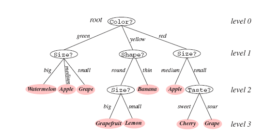
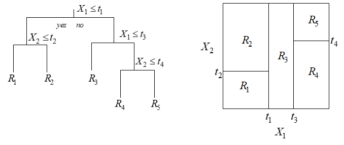
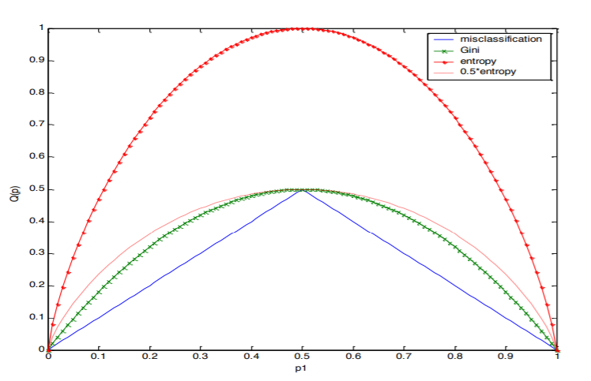
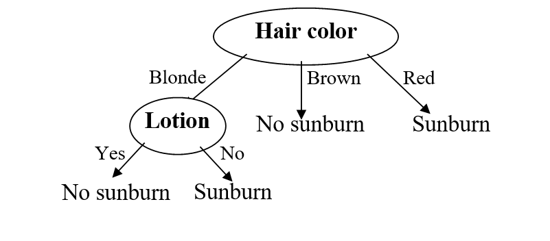
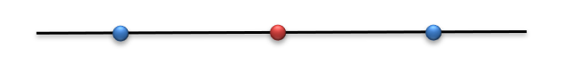

<section markdown="1">

## עצי החלטה 

 
 

#### תקציר התאוריה
 
עצי החלטה הינם כלי נפוץ ופשוט יחסית לסיווג ורגרסיה. בבסיסו עץ החלטה הינו מימוש מסוים של פונקציות לוגיות (כניסה ויציאה דיסקרטית), אולם ניתן ליישמו גם עבור משתנים רציפים על ידי דיסקרטיזציה.

</section><section markdown="1">

#### דוגמא: מאפיינים קטגורים
 

{: width="1100px"}

</section><section markdown="1">

#### דוגמא: מאפיינים רציפים
 

{: width="1100px"}

</section><section markdown="1">

#### תכונות רצויות בבניית עץ החלטה

 

1.	סיווג נכון של מרבית הדוגמאות.
2.	עץ קצר (פשוט) ככל הניתן.

תכונה 2 חשובה משתי סיבות:
1.	 פשטות המימוש.
2.	יכולת הכללה:  מניעת התאמת-יתר לאוסף הדוגמאות הנתון. 

</section><section markdown="1">

#### בחירת מאפיין מיטבי 

יהי $$D$$ אוסף של $$N$$ דוגמאות מסווגות $$D=\{x_i,y_i\}_{i=1}^N$$,
כך ש- $$y_i \in \{1, \dots, K \}$$ כאשר $$K$$ הינו מספר המחלקות האפשריות.
 
**השכיחות היחסית** (או "הפילוג האמפירי") של כל אחד מהסיווגים האפשריים בקבוצת הדוגמאות נתונה ע"י: 

$$
\hat{p}_j = \frac{1}{N} \sum_{i=1}^N I\{y_i = j \}\,, \quad \forall j = 1,\cdots, K
$$

</section><section markdown="1">

####  מדדים לחוסר אחידות של $$D$$: 

* שגיאת הסיווג: 

$$ 
Q(D) = 1 - \max_{j \in \{1, \dots, K \}} \hat{p}_j
$$

* אינדקס Gini: 

$$
Q(D) = \sum_{j \in \{1, \dots, K \}} \hat{p}_j(1 - \hat{p}_j)
$$

* אנטרופיה: 

$$
Q(D) = H(D) = \sum_{j \in \{1, \dots, K \}} \hat{p}_j \log \frac{1}{\hat{p}_j} = -\sum_{j \in \{1, \dots, K \}} \hat{p}_j \log {\hat{p}_j}
$$

</section><section markdown="1">

####  תכונות של $$Q(D)$$ : 

1.	$$Q(D)=0$$  עבור פילוג חד-ערכי ( $$\hat{p}_j=1$$ עבור $$j$$ כלשהו). 
2. $$Q(D)$$  מקבל את ערכו המכסימלי עבור פילוג אחיד ($$\hat{p}_j=\frac{1}{K}$$ ).

 

{: width="1100px"}

</section><section markdown="1">

#### תוספת המידע של מאפיין: 

נניח כי מאפיין $$A$$ כלשהו מחלק את $$D$$ למספר תת-קבוצות.
 נסמן תת-קבוצות אלו על ידי $$\{D_m\,, m \in 1, \cdots, M\}$$ , כאשר $$M$$ הינו אוסף הערכים האפשריים של $$A$$.

 __מדד חוסר-האחידות המשוקלל עבור האוסף__ $$\{D_m\}$$ יוגדר עתה על ידי:

$$
Q(D \lvert A) = \sum_{m=1}^M \frac{\lvert D_m \rvert }{N} Q(D_m)
$$
 
כאשר $$Q(D_m)$$ הוא מדד לחוסר האחידות של  תת-הקבוצה $$D_m$$.

</section><section markdown="1">

#### מדד טיב: 

מדד הטיב של המאפיין $$A$$ ביחס לקבוצת הדוגמאות $$D$$ יוגדר עתה על ידי

$$
\Delta Q(D \lvert A) = Q(D) - Q(D \lvert A)
$$
 
ניתן לראות כי זהו הגידול באחידות (או הקטנה בחוסר-האחידות) של האוסף $$\{D_m\}$$
לעומת קבוצת הדוגמאות המקורית $$D$$. כאשר  $$Q(\cdot)$$ הינה האנטרופיה,  $$\Delta Q(D|A)$$ נקרא גם תוספת המידע (information gain)  של המאפיין  $$A$$. 

</section><section markdown="1">

 

---

המאפיין $$A$$ שנבחר הוא (כעיקרון) זה שעבורו השיפור $$\Delta Q(D \lvert A) $$ הינו **מקסימלי** כלומר $$Q(D \lvert A)$$ **מינימלי**.

---

</section><section markdown="1">

### שאלה 12.1 – בניית עץ החלטה
בנה עץ החלטה המבוסס על קריטריון האנטרופיה, אשר בהינתן נתוני צבע שער, גובה, משקל, משתמש בקרם הגנה, קובע האם עתיד האדם להכוות מהשמש היוקדת.  
סט דוגמאות הלימוד לצורך בניית העץ מוצג בטבלה הבאה:

| Name	| Hair	  | Height	| Weight	| Lotion	| Result (Label)       |   
| ---   |   ---   | ---     | ---       | ---       | ---                  |
| Sarah	| blonde  |	average	| light	    | no	    | sunburned (positive) |
| Dana	| blonde  |	tall	| average	| yes	    | none (negative)      |
| Alex	| brown	  | short	| average	| yes	    | none                 |
| Annie	| blonde  |	short	| average	| no	    | sunburned            |
| Emily	| red     |	average	| heavy	    | no	    | sunburned            |
| Pete	| brown	  | tall	| heavy	    | no	    | none                 |
| John	| brown	  | average	| heavy	    | no	    | none                 |
| Katie	| blonde  |	short	| light	    | yes	    | none                 |

</section><section markdown="1">

### פתרון שאלה 12.1
אנו נמצאים בשורש ולכן $$D$$ הוא קבוצת כל האנשים. ראשית נחשב את האנטרופיה על פני כלל הדוגמאות:

$$
H(D) = -\frac{3}{8} \log{\frac{3}{8}} -\frac{5}{8} \log{\frac{5}{8}} = 0.954
$$

</section><section markdown="1">

####המשך פתרון: 

כעת נבחן את האנטרופיה שתושרה לאחר פיצול לפי כל אחד מהמאפיינים האפשריים:

**Hair:**

| Feature	| Distribution	  | $$H(D \lvert A)$$	| 
| ---   |   ---   | ---     | 
| Blonde	| $$+2/-2$$  |	$$H(D \lvert Hair = blonde ) = -\frac{1}{2} \log{\frac{1}{2}} -\frac{1}{2} \log{\frac{1}{2}} = 1 $$	| 
| Brown	| $$0/-3$$   |	$$ H(D \lvert Hair = brown ) = -\frac{1}{2} \log{\frac{1}{2}} -\frac{1}{2} \log{\frac{1}{2}} = 0	$$ | 
| Red	| $$+1/0$$  |	$$ H(D \lvert Hair = red ) = -1 \log 1 -0 \log{0} = 0	$$| 

ומדד הטיב של מאפיין Hair יחושב לפי האנטרופיה המשוקללת על פני הפיצולים האפשריים:

$$
\Delta H(D \lvert Hair ) = H(S) -( \frac{1}{2} \cdot 1 +  \frac{3}{8} \cdot 0 + \frac{1}{8} \cdot 0 = H(D) - \frac{1}{2}
$$

</section><section markdown="1">

####המשך פתרון: 

**Height:**

| Feature	| Distribution	  | $$H(D \lvert A)$$	| 
| ---       |   ---   | ---     | 
| Short     | $$+1/-2$$  |	$$H(D \lvert Height = Short ) = -\frac{1}{3} \log{\frac{1}{3}} -\frac{2}{3} \log{\frac{2}{3}} = 0.918 $$	| 
| Average	| $$2/-1$$   |	$$ H(D \lvert Height = Average ) = -\frac{2}{3} \log{\frac{2}{3}} -\frac{1}{3} \log{\frac{1}{3}} = 0.918	$$ | 
| Tall	    | $$0/-2$$  |	$$ H(D \lvert Height = Tall )  = 0	$$| 

ומדד הטיב של מאפיין Height יחושב לפי האנטרופיה המשוקללת על פני הפיצולים האפשריים:

$$
\Delta H(D \lvert Height ) = H(S) -( \frac{3}{8} \cdot 0.918 +  \frac{3}{8} \cdot 0.918 + \frac{2}{8} \cdot 0 = H(D) - 0.69
$$

</section><section markdown="1">

####המשך פתרון: 

**Weight:**

| Feature	| Distribution	  | $$H(D \lvert A)$$	| 
| ---       |   ---   | ---     | 
| Light     | $$+1/-1$$  |	$$H(D \lvert Weight = Light ) = -\frac{1}{2} \log{\frac{1}{2}} -\frac{1}{2} \log{\frac{1}{2}} = 1 $$	| 
| Average	| $$1/-2$$   |	$$ H(D \lvert Weight = Average ) = -\frac{1}{3} \log{\frac{1}{3}} -\frac{2}{3} \log{\frac{2}{3}} = 0.918	$$ | 
| Heavy	    | $$+1/-2$$  |	$$ H(D \lvert Weight = Heavy )  = -\frac{1}{3} \log{\frac{1}{3}} -\frac{2}{3} \log{\frac{2}{3}}  = 0.918	$$| 

ומדד הטיב של מאפיין weight יחושב לפי האנטרופיה המשוקללת על פני הפיצולים האפשריים:

$$
\Delta H(D \lvert Weight ) = H(S) -( \frac{2}{8} \cdot 1 + \frac{3}{8} \cdot 0.918 + \frac{3}{8} \cdot 0.918 = H(D) - 0.9385
$$

</section><section markdown="1">

####המשך פתרון: 

**Lotion:**

| Feature	| Distribution	  | $$H(D \lvert A)$$	| 
| ---       |   ---   | ---     | 
| No     | $$+3/-2$$  |	$$H(D \lvert Lotion = No ) = -\frac{3}{5} \log{\frac{3}{5}} -\frac{2}{5} \log{\frac{2}{5}} = 0.97 $$	| 
| Yes	| $$0/-3$$   |	$$ H(D \lvert Lotion = Yes ) = 0	$$ | 

ומדד הטיב של מאפיין lotion יחושב לפי האנטרופיה המשוקללת על פני הפיצולים האפשריים:

$$
\Delta H(D \lvert Lotion ) = H(S) -( \frac{5}{8} \cdot 0.97 + \frac{3}{8} \cdot 0 ) = H(D) - 0.606
$$

</section><section markdown="1">

####המשך פתרון: 

  

מכאן שהמאפיין האופטימלי לפיצול הראשון (על פי קריטריון האנטרופיה) הוא **Hair**.

</section><section markdown="1">

####המשך פתרון: 

עבור הפיצול של הרמה השנייה נשים לב כי הענפים של Hair=brown  ו  Hair=red בעלי אנטרופיה מקסימלית. כלומר, ניתן לסווג את הדוגמאות בצורה מושלמת לכן אין צורך בפיצולים נוספים. לגבי הענף Hair=blonde:
קבוצת הדוגמאות בענף זה היא: 

| Name	| Hair	  | Height	| Weight	| Lotion	| Result (Label)       |   
| ---   |   ---   | ---     | ---       | ---       | ---                  |
| Sarah	| blonde  |	average	| light	    | no	    | sunburned (positive) |
| Dana	| blonde  |	tall	| average	| yes	    | none (negative)      |
| Annie	| blonde  |	short	| average	| no	    | sunburned            |
| Katie	| blonde  |	short	| light	    | yes	    | none                 |

</section><section markdown="1">

####המשך פתרון: 

פיצול לפי מאפיין height ייתן:

| Feature	| Distribution	  | $$H(D \lvert A)$$	| 
| ---       |   ---   | ---     | 
| Short     | $$+1/-1$$  |	$$H(D \lvert Height = Short ) = -\frac{1}{2} \log{\frac{1}{2}} -\frac{1}{2} \log{\frac{1}{2}} = 1 $$	| 
| Average	| $$1/0$$   |	$$ H(D \lvert Height = Average ) = 0	$$ | 
| Tall	    | $$0/-1$$  |	$$ H(D \lvert Height = Tall )  = 0	$$| 

</section><section markdown="1">

####המשך פתרון: 

לפי weight:

| Feature	| Distribution	  | $$H(D \lvert A)$$	| 
| ---       |   ---   | ---     | 
| Light     | $$+1/-1$$  |	$$H(D \lvert Weight = Light ) = -\frac{1}{2} \log{\frac{1}{2}} -\frac{1}{2} \log{\frac{1}{2}} = 1 $$	| 
| Average	| $$1/-1$$   |	$$ H(D \lvert Weight = Average ) =  -\frac{1}{2} \log{\frac{1}{2}} -\frac{1}{2} \log{\frac{1}{2}} = 1	$$ | 
| Heavy	    | $$0/0$$  |	$$ H(D \lvert Weight = Heavy )  = 0	$$| 

</section><section markdown="1">

####המשך פתרון: 

לפי Lotion:

| Feature	| Distribution	  | $$H(D \lvert A)$$	| 
| ---       |   ---   | ---     | 
| No     | $$+2/0$$  |	$$H(D \lvert Lotion = No ) = 0 $$	| 
| Yes	| $$0/-2$$   |	$$ H(D \lvert Lotion = Yes ) = 0	$$ | 

</section><section markdown="1">

####המשך פתרון: 

לפיכך הקריטריון האופטימלי (זה שממזער את קריטריון הגידול) הוא Lotion.

</section><section markdown="1">

####המשך פתרון: 

עץ ההחלטה הסופי יראה כך:
{: width="600px"}

</section><section markdown="1">

### בעיית התאמת היתר (overfitting):
ניתן לסווג את הדוגמאות באופן מושלם רק על סמך "מאפיין"  **שם** ו"מאפיין" זה בוודאי ייבחר בצומת הראשונה לפי קריטריון "תוספת המידע". **אולם לקריטריון זה ערך מועט לצורך חיזוי**.

| Name	| Hair	  | Height	| Weight	| Lotion	| Result (Label)       |   
| ---   |   ---   | ---     | ---       | ---       | ---                  |
| **Sarah**	| blonde  |	average	| light	    | no	    | sunburned (positive) |
|**Dana**	| blonde  |	tall	| average	| yes	    | none (negative)      |
| **Alex**	| brown	  | short	| average	| yes	    | none                 |
| **Annie**	| blonde  |	short	| average	| no	    | sunburned            |
| **Emily**	| red     |	average	| heavy	    | no	    | sunburned            |
| **Pete**	| brown	  | tall	| heavy	    | no	    | none                 |
| **John**	| brown	  | average	| heavy	    | no	    | none                 |
| **Katie**	| blonde  |	short	| light	    | yes	    | none                 |

**מקור הבעיה:** בקריטריון שבו השתמשנו קיימת העדפה מובנית למאפיינים בעלי מספר ערכים רב.

</section><section markdown="1">

#### overfitting:

 

**פתרון אפשרי:** נרמול "תוספת המידע" של מאפיין $$A$$  באופן הבא:

$$
\Delta \widetilde{Q}(D \lvert A ) = \frac{\Delta Q(D \lvert A )}{\text{Split}(D , A)}
$$

$$ \text{Split}(D , A)$$ כאשר 
הינו מקדם פיצול מתאים. הגדרה מקובלת:

$$
\text{Split}(D , A) = \log n(A)
$$

$$ n(A) $$ כאשר,
היינו מספר הערכים השונים של הנאפיין $$A$$, המתקבלים על פני איברי הקבוצה $$D$$

</section><section markdown="1">

### מאפיינים רציפים:
  $$x=(x_1,…,x_d )^T$$ כולל רכיבים $$x_j$$ בעלי ערכים רציפים.
 במקרה זה, המבחן המקובל לגבי $$x_j$$ הינו מהצורה $$x_j \leq t_j$$.
 לפיכך, לבחירת המאפיין בכל צומת יש להוסיף את בחירת ערך הסף  $$t_j$$.  
עבור כל מבחן $$A=\{ x_j \leq t_j \}$$ ניתן להגדיר את תוספת המידע באופן הרגיל:

$$
\Delta Q(S \lvert x_j,t_j )= \Delta Q(S \lvert A)
$$

השלב הבא הוא מקסימיזציה על הסף $$t_i$$:

$$
\Delta Q(S \lvert x_j ,t_j^* )= \max_{t_j} \Delta Q(S \lvert x_j, t_j)
$$

ולאחר מכן בחירת המאפיין $$x_j$$ שעבורו מדד זה הינו מקסימלי.

</section><section markdown="1">

## Boosting - Adaboost

 

נסמן:
- $$N$$ - גודל ה dataset
- $$\left\lbrace\boldsymbol{x}_i,y_i\right\rbrace$$ - המדידות ותגיות.
- ערכי המחלקות הם  $$1,-1$$

</section><section markdown="1">

#### Adaboost algorithm

 

- אתחל באופן אחיד את המשקולות עבור כל נקודה  ב dataset:
$$w^{\left(t=0\right)}_i=\frac{1}{N}$$

</section><section markdown="1">

#### Adaboost algorithm

 

- אתחל באופן אחיד את המשקולות עבור כל נקודה  ב dataset:
$$w^{\left(t=0\right)}_i=\frac{1}{N}$$
- המשך באופן איטרטיבי עבור אינדקס $$t$$ עד להגעת תנאי עצירה: 
  1. בנה מסווג אופטימלי $$h_t$$ ביחס ל- dataset הממושקל 

</section><section markdown="1">

#### Adaboost algorithm

 

- אתחל באופן אחיד את המשקולות עבור כל נקודה  ב dataset:
$$w^{\left(t=0\right)}_i=\frac{1}{N}$$
- המשך באופן איטרטיבי עבור אינדקס $$t$$ עד להגעת תנאי עצירה: 
  1. בנה מסווג אופטימלי $$h_t$$ ביחס ל- dataset הממושקל 
  2. חשב את שגיאת הסיווג של $$h_t$$ עבור ה dataset הממושקל: $$\varepsilon=\sum_i w^t_iI\left\lbrace h\left(\boldsymbol{x}_i\right)\neq y_i\right\rbrace$$
  3. חשב את משקל עבור המסווג $$h_t$$ לפי: $$\alpha_t=\frac{1}{2}\ln\left(\frac{1-\varepsilon}{\varepsilon}\right)$$
  4. עדכן את המשקולות עבור כל נקודה ב-dataset : $$w^t_i=w^{t-1}_i\exp\left(-\alpha_ty_ih_t\left(\boldsymbol{x}_i\right)\right)$$
  5. נרמל את המשקולות לפי: $$Z=\sum_iw^t_i$$ according to: $$w^t_i=\frac{w^t_i}{Z}$$

#### Adaboost algorithm

 

- אתחל באופן אחיד את המשקולות עבור כל נקודה  ב dataset:
$$w^{\left(t=0\right)}_i=\frac{1}{N}$$
- המשך באופן איטרטיבי עבור אינדקס $$t$$ עד להגעת תנאי עצירה: 
  1. בנה מסווג אופטימלי $$h_t$$ ביחס ל- dataset הממושקל 
  2. חשב את שגיאת הסיווג של $$h_t$$ עבור ה dataset הממושקל: $$\varepsilon=\sum_i w^t_iI\left\lbrace h\left(\boldsymbol{x}_i\right)\neq y_i\right\rbrace$$
  3. חשב את משקל עבור המסווג $$h_t$$ לפי: $$\alpha_t=\frac{1}{2}\ln\left(\frac{1-\varepsilon}{\varepsilon}\right)$$
  4. עדכן את המשקולות עבור כל נקודה ב-dataset : $$w^t_i=w^{t-1}_i\exp\left(-\alpha_ty_ih_t\left(\boldsymbol{x}_i\right)\right)$$
  5. נרמל את המשקולות לפי: $$Z=\sum_iw^t_i$$ according to: $$w^t_i=\frac{w^t_i}{Z}$$

הסיווג הסופי נעשה על ידי קומבינציה לינארית של כל מסווגים והמשקל שלהם.

$$
H\left(\boldsymbol{x}_i\right)=\text{sign}\left(\sum_t\alpha_th_t\left(\boldsymbol{x}_i\right)\right)
$$

</section><section markdown="1">

## תרגיל 12.2: הדגמת האלגוריתם 

נתבונן בבעיית סיווג חד מימדית עבור סט דוגמאות האימון:

$$
\{(x_i,y_i)\}_{(i=1}^3=\{(0,-1), (1,1), (2,-1) \}.
$$

יהי המודל:
$$
H\left(\boldsymbol{x}_i\right)=\text{sign}\left(\sum_t\alpha_th_t\left(\boldsymbol{x}_i\right)\right)
$$

1. האם קיימים מסווגים ליניאריים $$\{h_t\}$$  ופרמטרים  $$\{\alpha\}$$ כך שהשגיאה של היפותזה $$H(x)$$ היא אפס על כל סט האימון? אם כן, מה ה-T  המינימאלי לקבל שגיאה אפס?

2. רשום את שלבי אלגוריתם AdaBoost עבור הדוגמא.

</section><section markdown="1">

##### פתרון סעיף א'
 
 

ראשית נסתכל בבעיה:

{: width="400px"}

נשים לב, שמסווג בודד לא יפתור את הבעיה משום שלא קיימת הפרדה לינארית בין המחלקות.
 עבור שני מסווגים לא ניתן למצוא מקדמים $$\alpha_t$$ שעבור נקבל שגיאת אימון אפס. ניתן לקבל שגיאה אפס עבור שלושה מסווגים חלשים בהן נתייג נכון את כל הדוגמאות.
 
 </section><section markdown="1">

##### פתרון סעיף ב'

נאתחל את הפילוג: 

$$
D_1=\frac{1}{3}
$$

</section><section markdown="1">

##### המשך פתרון סעיף ב' 

נקח את המסווג הבא:
$$
h_1 (x_i )=\{-1,-1,-1\}
$$

עבורו נקבל:

$$
\epsilon_1=P_{D_1} (h_1 (x_i ) \neq y_i ) = \frac{1}{3} \\
a_1= \frac{1}{2}  \log \frac{1 - \epsilon_1}{\epsilon_1} = 0.3466
$$

 לעדכן את התפלגות הדוגמאות:
 

$$
D_2 (i) = D_1 \cdot \exp frac{-a_1 y_i h_1 (x_i )}{Z_1} = \{0.25,0.5,0.25\} \\
Z_1= \sum_i D_1 (i) \cdot  \exp (-a_1 y_i h_1 (x_i ))
$$

</section><section markdown="1">

##### המשך פתרון סעיף ב' 

 

באיטרציה הבאה נבחר את המסווג הבא:

$$
h_2 (x_i )=\{-1,+1,+1\}
$$

עבורו נקבל:

$$
\epsilon_2=P_{D_2} (h_2 (x_i ) \neq y_i ) = 0.25 \\
a_2 = \frac{1}{2} \log \frac{1-\epsilon_2}{\epsilon_2} = 0.5493
$$

נעדכן את הפילוג לפי המסווג הנוסף:

$$
D_3(i) = D_2 \cdot \exp \frac{-a_2 y_i h_2 (x_i )}{Z_2} = \{0.1667,0.333,0.5\} \\
Z_2 = \sum_i D_2 (i) \cdot \exp (-a_2 y_i h_2 (x_i ))
$$

</section><section markdown="1">

##### המשך פתרון סעיף ב' 
 

עבור הבעיה בדוגמה, מספיק עוד מסווג חלש אחד אותו נבחר כך:

$$
h_3 (x_i )=\{+1,+1,-1\}
$$

עבורו נקבל:

$$
\epsilon_3=P_(D_3 ) (h_3 (x_i ) \neq y_i ) = 0.1667 \\
a_3 = \frac{1}{2} \log \frac{1-ϵ_3}{ϵ_3} = 0.8047
$$

נעדכן את הפילוג לפי המסווג הנוסף:

$$
D_4 (i) = D_3 \cdot \exp \frac{-a_3 y_i h_3 (x_i )}{Z_3}  = \{0.5,0.2,0.3\} \\
Z_3 = \sum_i D_3 (i) \cdot  \exp (-a_3 y_i h_3 (x_i ))
$$

</section><section markdown="1">

##### המשך פתרון סעיף ב' 
 

לבסוף המסווג עם שגיאה אפס המתקבל היינו:

$$
H(x) = sign(\sum_{t=1}^3 (\alpha_t h_t (x)))= \{-1,+1,-1\}
$$

</section><section markdown="1">

## AdaBoost חלק מעשי

 

#### האתגר: בחזרה לטיטניק

ננסה לחזות האם נוסע בטיטניק ישרוד או לא על סמך רישום ונתונים של הנוסעים.

{: width="200px"}

</section><section markdown="1">

#### Dataset: The Titanic Manifest
ניתן להוריד את הdataset מהקישור [הזה](http://biostat.mc.vanderbilt.edu/wiki/pub/Main/DataSets/titanic.html)

#### 🕵️ Data Inspection
התרשמות ראשונית ממאגר המידע, עשר שורות ראשונות מהרשומות:

<table border="1" class="dataframe">
  <thead>
    <tr style="text-align: right;">
      <th></th>
      <th>pclass</th>
      <th>survived</th>
      <th>name</th>
      <th>sex</th>
      <th>age</th>
      <th>sibsp</th>
      <th>parch</th>
      <th>ticket</th>
      <th>fare</th>
      <th>cabin</th>
      <th>embarked</th>
      <th>boat</th>
      <th>body</th>
      <th>home.dest</th>
      <th>numeric_sex</th>
    </tr>
  </thead>
  <tbody>
    <tr>
      <th>0</th>
      <td>1</td>
      <td>1</td>
      <td>Allen, Miss. Elisabeth Walton</td>
      <td>female</td>
      <td>29</td>
      <td>0</td>
      <td>0</td>
      <td>24160</td>
      <td>211.3375</td>
      <td>B5</td>
      <td>S</td>
      <td>2</td>
      <td>NaN</td>
      <td>St Louis, MO</td>
      <td>1</td>
    </tr>
    <tr>
      <th>1</th>
      <td>1</td>
      <td>0</td>
      <td>Allison, Miss. Helen Loraine</td>
      <td>female</td>
      <td>2</td>
      <td>1</td>
      <td>2</td>
      <td>113781</td>
      <td>151.5500</td>
      <td>C22 C26</td>
      <td>S</td>
      <td>NaN</td>
      <td>NaN</td>
      <td>Montreal, PQ / Chesterville, ON</td>
      <td>1</td>
    </tr>
    <tr>
      <th>2</th>
      <td>1</td>
      <td>0</td>
      <td>Allison, Mr. Hudson Joshua Creighton</td>
      <td>male</td>
      <td>30</td>
      <td>1</td>
      <td>2</td>
      <td>113781</td>
      <td>151.5500</td>
      <td>C22 C26</td>
      <td>S</td>
      <td>NaN</td>
      <td>135.0</td>
      <td>Montreal, PQ / Chesterville, ON</td>
      <td>0</td>
    </tr>
    <tr>
      <th>3</th>
      <td>1</td>
      <td>0</td>
      <td>Allison, Mrs. Hudson J C (Bessie Waldo Daniels)</td>
      <td>female</td>
      <td>25</td>
      <td>1</td>
      <td>2</td>
      <td>113781</td>
      <td>151.5500</td>
      <td>C22 C26</td>
      <td>S</td>
      <td>NaN</td>
      <td>NaN</td>
      <td>Montreal, PQ / Chesterville, ON</td>
      <td>1</td>
    </tr>
    <tr>
      <th>4</th>
      <td>1</td>
      <td>1</td>
      <td>Anderson, Mr. Harry</td>
      <td>male</td>
      <td>48</td>
      <td>0</td>
      <td>0</td>
      <td>19952</td>
      <td>26.5500</td>
      <td>E12</td>
      <td>S</td>
      <td>3</td>
      <td>NaN</td>
      <td>New York, NY</td>
      <td>0</td>
    </tr>
    <tr>
      <th>5</th>
      <td>1</td>
      <td>1</td>
      <td>Andrews, Miss. Kornelia Theodosia</td>
      <td>female</td>
      <td>63</td>
      <td>1</td>
      <td>0</td>
      <td>13502</td>
      <td>77.9583</td>
      <td>D7</td>
      <td>S</td>
      <td>10</td>
      <td>NaN</td>
      <td>Hudson, NY</td>
      <td>1</td>
    </tr>
    <tr>
      <th>6</th>
      <td>1</td>
      <td>0</td>
      <td>Andrews, Mr. Thomas Jr</td>
      <td>male</td>
      <td>39</td>
      <td>0</td>
      <td>0</td>
      <td>112050</td>
      <td>0.0000</td>
      <td>A36</td>
      <td>S</td>
      <td>NaN</td>
      <td>NaN</td>
      <td>Belfast, NI</td>
      <td>0</td>
    </tr>
    <tr>
      <th>7</th>
      <td>1</td>
      <td>1</td>
      <td>Appleton, Mrs. Edward Dale (Charlotte Lamson)</td>
      <td>female</td>
      <td>53</td>
      <td>2</td>
      <td>0</td>
      <td>11769</td>
      <td>51.4792</td>
      <td>C101</td>
      <td>S</td>
      <td>D</td>
      <td>NaN</td>
      <td>Bayside, Queens, NY</td>
      <td>1</td>
    </tr>
    <tr>
      <th>8</th>
      <td>1</td>
      <td>0</td>
      <td>Artagaveytia, Mr. Ramon</td>
      <td>male</td>
      <td>71</td>
      <td>0</td>
      <td>0</td>
      <td>PC 17609</td>
      <td>49.5042</td>
      <td>NaN</td>
      <td>C</td>
      <td>NaN</td>
      <td>22.0</td>
      <td>Montevideo, Uruguay</td>
      <td>0</td>
    </tr>
    <tr>
      <th>9</th>
      <td>1</td>
      <td>0</td>
      <td>Astor, Col. John Jacob</td>
      <td>male</td>
      <td>47</td>
      <td>1</td>
      <td>0</td>
      <td>PC 17757</td>
      <td>227.5250</td>
      <td>C62 C64</td>
      <td>C</td>
      <td>NaN</td>
      <td>124.0</td>
      <td>New York, NY</td>
      <td>0</td>
    </tr>
  </tbody>
</table>

סה"כ ישנם $$N=1001$$ רשומות במאגר מידע.

</section><section markdown="1">

#### The Data Fields and Types

 

נעשה שימוש בשדות (מאפיינים) הבאים:
- **pclass**: מחלקת הנוסע: 1, 2 או 3
- **sex**: מין הנוסע
- **age**: גיל הנוסע
- **sibsp**: מס' של אחים ובני זוג של כל נוסע על האוניה
- **parch**: מס' של ילדים או הורים של כל נוסע על האונייה
- **fare**: המחיר שהנוסע שילם על הכרטיס
- **embarked**: הנמל בו עלה הנוסע על האונייה (C = Cherbourg; Q = Queenstown; S = Southampton)
- **survived**: התיוג, האם הנוסע שרד או לא

</section><section markdown="1">

####  📉 התרשמות ראשונית בעזרת גרפים 
נציג את היחס בין המחלקות (שורדים ונספים) עבור המאפיינים:  

{: width="400px"}

</section><section markdown="1">
 

### 📜 הגדרת הבעיה :

- משתנים אקראיים:
  - $$ x_i $$ : מאפייני הנוסע
  - $$ y_i $$ : תיוג הנוסע, שרד או נספה
  
נמצא מסווג $$\hat{y}=h^*\left(\boldsymbol{x}\right)$$ אשר מביא למינימום את ה- miscalssification rate:

$$
h^*=\underset{h}{\arg\min}\ E\left[I\left\lbrace h\left(\boldsymbol{x}\right)\neq y\right\rbrace\right]
$$

</section><section markdown="1">
 

#### 💡 Model & Learning Method Suggestion: Stumps + AdaBoost
 .נשתמש בעץ בינארי בעל עומק אחד (נקרא Stump), שבעצם מסווג על פי מאפיין בודד בשילוב של אלגוריתם AdaBoost
 
 **הערה:** ניתן להגיד שהשילוב הנ"ל הוא וריאציה של Random Forest, אלגוריתם שמשלב מספר עצים. כמו כן הטכניקה הזאת נקראת גם Ensemble.
 
</section><section markdown="1">
 
 #### קריטריון בניית עץ 
 
 
 עבור קריטריון בניית עץ נשתמש ב**Gini אינדקס ממושקל** הנובע מה-data הממושקל.
 עבור חלוקה של ה-data לשני סטים $$\mathcal{C}_1$$ and $$\mathcal{C}_2$$ , וסט המשקולות של הדגימות $$\left\lbrace w_i\right\rbrace$$ נקבל את Gini אינדקס ממושקל:  
 
$$
N_1=\sum_{i\in\mathcal{C}_1}w_i\\
N_2=\sum_{i\in\mathcal{C}_2}w_i\\
p_1=\frac{1}{N_1}\sum_{i\in\mathcal{C}_1}w_iI\left\lbrace y_i=1\right\rbrace\\
p_2=\frac{1}{N_2}\sum_{i\in\mathcal{C}_2}w_iI\left\lbrace y_i=1\right\rbrace\\
G=N_1p_1\left(1-p_1\right)+N_2p_2\left(1-p_2\right)
$$

</section><section markdown="1">

#### פרמטרים נלמדים:

 

- החלוקה המתבצעת על ידי כל עץ.
- משקול כל עץ: $$\alpha_i$$.

#### Hyper-parameters

 

ההיפר פרמטרי היחידי הינו קריטריון העצירה עבור אלגוריתם Adaboost שעבורו מוחלט מס' עצי ההחלטה שמשולבים במסווג הסופי.

#### 📚 חלוקת ה-dataset
נחלק ל 80% סט אימון ו 20% סט בוחן.

</section><section markdown="1">

#### ⚙️ אימון 

נאתחל את המודל ונציג את העשר שורות הראשונות של הdataset הממושקל וההתפלגות לפי המאפיינים:

<table border="1" class="dataframe">
  <thead>
    <tr style="text-align: right;">
      <th></th>
      <th>age</th>
      <th>embarked</th>
      <th>fare</th>
      <th>parch</th>
      <th>pclass</th>
      <th>sex</th>
      <th>sibsp</th>
      <th>survived</th>
      <th>weights</th>
    </tr>
  </thead>
  <tbody>
    <tr>
      <th>724</th>
      <td>11</td>
      <td>2</td>
      <td>46.9000</td>
      <td>2</td>
      <td>2</td>
      <td>0</td>
      <td>5</td>
      <td>0</td>
      <td>0.001252</td>
    </tr>
    <tr>
      <th>77</th>
      <td>27</td>
      <td>2</td>
      <td>30.5000</td>
      <td>0</td>
      <td>0</td>
      <td>0</td>
      <td>0</td>
      <td>1</td>
      <td>0.001252</td>
    </tr>
    <tr>
      <th>879</th>
      <td>6</td>
      <td>2</td>
      <td>21.0750</td>
      <td>1</td>
      <td>2</td>
      <td>0</td>
      <td>3</td>
      <td>0</td>
      <td>0.001252</td>
    </tr>
    <tr>
      <th>615</th>
      <td>22</td>
      <td>2</td>
      <td>7.2500</td>
      <td>0</td>
      <td>2</td>
      <td>0</td>
      <td>1</td>
      <td>0</td>
      <td>0.001252</td>
    </tr>
    <tr>
      <th>905</th>
      <td>24</td>
      <td>2</td>
      <td>8.6625</td>
      <td>0</td>
      <td>2</td>
      <td>0</td>
      <td>0</td>
      <td>0</td>
      <td>0.001252</td>
    </tr>
    <tr>
      <th>533</th>
      <td>42</td>
      <td>2</td>
      <td>7.5500</td>
      <td>0</td>
      <td>2</td>
      <td>0</td>
      <td>0</td>
      <td>0</td>
      <td>0.001252</td>
    </tr>
    <tr>
      <th>401</th>
      <td>50</td>
      <td>2</td>
      <td>13.0000</td>
      <td>0</td>
      <td>1</td>
      <td>0</td>
      <td>0</td>
      <td>0</td>
      <td>0.001252</td>
    </tr>
    <tr>
      <th>454</th>
      <td>39</td>
      <td>2</td>
      <td>26.0000</td>
      <td>0</td>
      <td>1</td>
      <td>0</td>
      <td>0</td>
      <td>0</td>
      <td>0.001252</td>
    </tr>
    <tr>
      <th>31</th>
      <td>58</td>
      <td>2</td>
      <td>26.5500</td>
      <td>0</td>
      <td>0</td>
      <td>1</td>
      <td>0</td>
      <td>1</td>
      <td>0.001252</td>
    </tr>
    <tr>
      <th>358</th>
      <td>18</td>
      <td>2</td>
      <td>13.0000</td>
      <td>0</td>
      <td>1</td>
      <td>0</td>
      <td>0</td>
      <td>0</td>
      <td>0.001252</td>
    </tr>
  </tbody>
</table>

</section><section markdown="1">

#### Gini-Index $$t=0$$

{: width="600px"}

אינדקס Gini המושקלל מצויין בכותרת של כל גרף. בכל איטרציה של Adaboost נבחר את עץ שיפעל על המאפיין בעל האינדקס הנמוך ביותר. כשאר במקרה זה נבחר לפי **מין** הנוסע.

</section><section markdown="1">

#### Iteration: $$t=1$$
לאחר איטרציה בודדת של סיווג לפי מין קיבלנו:
* שגיאה: 0.22
* $$\alpha$$: 0.6320312618746508
* Classifing pclass according to: {0: [0], 1: [1, 2]}

 נציג את המשוקל של ה-data מחדש, וההתפלגויות החדשות:

<table border="1" class="dataframe">
  <thead>
    <tr style="text-align: right;">
      <th></th>
      <th>age</th>
      <th>embarked</th>
      <th>fare</th>
      <th>parch</th>
      <th>pclass</th>
      <th>sex</th>
      <th>sibsp</th>
      <th>survived</th>
      <th>weights</th>
    </tr>
  </thead>
  <tbody>
    <tr>
      <th>724</th>
      <td>11</td>
      <td>2</td>
      <td>46.9000</td>
      <td>2</td>
      <td>2</td>
      <td>0</td>
      <td>5</td>
      <td>0</td>
      <td>0.000803</td>
    </tr>
    <tr>
      <th>77</th>
      <td>27</td>
      <td>2</td>
      <td>30.5000</td>
      <td>0</td>
      <td>0</td>
      <td>0</td>
      <td>0</td>
      <td>1</td>
      <td>0.002841</td>
    </tr>
    <tr>
      <th>879</th>
      <td>6</td>
      <td>2</td>
      <td>21.0750</td>
      <td>1</td>
      <td>2</td>
      <td>0</td>
      <td>3</td>
      <td>0</td>
      <td>0.000803</td>
    </tr>
    <tr>
      <th>615</th>
      <td>22</td>
      <td>2</td>
      <td>7.2500</td>
      <td>0</td>
      <td>2</td>
      <td>0</td>
      <td>1</td>
      <td>0</td>
      <td>0.000803</td>
    </tr>
    <tr>
      <th>905</th>
      <td>24</td>
      <td>2</td>
      <td>8.6625</td>
      <td>0</td>
      <td>2</td>
      <td>0</td>
      <td>0</td>
      <td>0</td>
      <td>0.000803</td>
    </tr>
    <tr>
      <th>533</th>
      <td>42</td>
      <td>2</td>
      <td>7.5500</td>
      <td>0</td>
      <td>2</td>
      <td>0</td>
      <td>0</td>
      <td>0</td>
      <td>0.000803</td>
    </tr>
    <tr>
      <th>401</th>
      <td>50</td>
      <td>2</td>
      <td>13.0000</td>
      <td>0</td>
      <td>1</td>
      <td>0</td>
      <td>0</td>
      <td>0</td>
      <td>0.000803</td>
    </tr>
    <tr>
      <th>454</th>
      <td>39</td>
      <td>2</td>
      <td>26.0000</td>
      <td>0</td>
      <td>1</td>
      <td>0</td>
      <td>0</td>
      <td>0</td>
      <td>0.000803</td>
    </tr>
    <tr>
      <th>31</th>
      <td>58</td>
      <td>2</td>
      <td>26.5500</td>
      <td>0</td>
      <td>0</td>
      <td>1</td>
      <td>0</td>
      <td>1</td>
      <td>0.000803</td>
    </tr>
    <tr>
      <th>358</th>
      <td>18</td>
      <td>2</td>
      <td>13.0000</td>
      <td>0</td>
      <td>1</td>
      <td>0</td>
      <td>0</td>
      <td>0</td>
      <td>0.000803</td>
    </tr>
  </tbody>
</table>

</section><section markdown="1">

#### Gini-Index $$t=1$$

{: width="500px"}

</section><section markdown="1">

#### :bulb: 

נבחין בכך, שככל שנתקדם באיטרציות של האלגוריתם, ה-data הממושקל יתפלג באופן אחיד כפונקציה של המחלקות, כלומר ההתפלגות של הדגימות שעבורן $$y=1 $$ זהה להתפלגות של הדגימות שעבורןן $$y=-1$$.

 כתוצאה מכך, הסיווג על פי מאפיין בודד יהיה קשה יותר והשגיאה למסווג בודד תתקרב ל-0.5, ובאופן ישיר המשקל של כל מסווג $$ \alpha_t $$ ידעך.
 
 בשלב הבא נסווג לפי **pclass**:
 
 </section><section markdown="1">

#### Iteration $$t=2$$

 

לאחר איטרציה נוספת של סיווג לפי מחלקת נוסע קיבלנו:
* שגיאה: 0.66
* $$\alpha$$: -0.34
* Classifing embarked according to: {0: [0], 1: [1, 2]}

<table border="1" class="dataframe">
  <thead>
    <tr style="text-align: right;">
      <th></th>
      <th>age</th>
      <th>embarked</th>
      <th>fare</th>
      <th>parch</th>
      <th>pclass</th>
      <th>sex</th>
      <th>sibsp</th>
      <th>survived</th>
      <th>weights</th>
    </tr>
  </thead>
  <tbody>
    <tr>
      <th>724</th>
      <td>11</td>
      <td>2</td>
      <td>46.9000</td>
      <td>2</td>
      <td>2</td>
      <td>0</td>
      <td>5</td>
      <td>0</td>
      <td>0.000601</td>
    </tr>
    <tr>
      <th>77</th>
      <td>27</td>
      <td>2</td>
      <td>30.5000</td>
      <td>0</td>
      <td>0</td>
      <td>0</td>
      <td>0</td>
      <td>1</td>
      <td>0.002127</td>
    </tr>
    <tr>
      <th>879</th>
      <td>6</td>
      <td>2</td>
      <td>21.0750</td>
      <td>1</td>
      <td>2</td>
      <td>0</td>
      <td>3</td>
      <td>0</td>
      <td>0.000601</td>
    </tr>
    <tr>
      <th>615</th>
      <td>22</td>
      <td>2</td>
      <td>7.2500</td>
      <td>0</td>
      <td>2</td>
      <td>0</td>
      <td>1</td>
      <td>0</td>
      <td>0.000601</td>
    </tr>
    <tr>
      <th>905</th>
      <td>24</td>
      <td>2</td>
      <td>8.6625</td>
      <td>0</td>
      <td>2</td>
      <td>0</td>
      <td>0</td>
      <td>0</td>
      <td>0.000601</td>
    </tr>
    <tr>
      <th>533</th>
      <td>42</td>
      <td>2</td>
      <td>7.5500</td>
      <td>0</td>
      <td>2</td>
      <td>0</td>
      <td>0</td>
      <td>0</td>
      <td>0.000601</td>
    </tr>
    <tr>
      <th>401</th>
      <td>50</td>
      <td>2</td>
      <td>13.0000</td>
      <td>0</td>
      <td>1</td>
      <td>0</td>
      <td>0</td>
      <td>0</td>
      <td>0.000601</td>
    </tr>
    <tr>
      <th>454</th>
      <td>39</td>
      <td>2</td>
      <td>26.0000</td>
      <td>0</td>
      <td>1</td>
      <td>0</td>
      <td>0</td>
      <td>0</td>
      <td>0.000601</td>
    </tr>
    <tr>
      <th>31</th>
      <td>58</td>
      <td>2</td>
      <td>26.5500</td>
      <td>0</td>
      <td>0</td>
      <td>1</td>
      <td>0</td>
      <td>1</td>
      <td>0.000601</td>
    </tr>
    <tr>
      <th>358</th>
      <td>18</td>
      <td>2</td>
      <td>13.0000</td>
      <td>0</td>
      <td>1</td>
      <td>0</td>
      <td>0</td>
      <td>0</td>
      <td>0.000601</td>
    </tr>
  </tbody>
</table>

</section><section markdown="1">

#### Gini-Index $$t=2$$

{: width="500px"}

באיטרציה השלישית נסווג לפי **embarked**:

</section><section markdown="1">

#### Iteration $$t=3$$
 
* שגיאה: 0.53
* $$\alpha$$: -0.06
* Classifing pclass according to: {0: [0], 1: [1, 2]}

<table border="1" class="dataframe">
  <thead>
    <tr style="text-align: right;">
      <th></th>
      <th>age</th>
      <th>embarked</th>
      <th>fare</th>
      <th>parch</th>
      <th>pclass</th>
      <th>sex</th>
      <th>sibsp</th>
      <th>survived</th>
      <th>weights</th>
    </tr>
  </thead>
  <tbody>
    <tr>
      <th>724</th>
      <td>11</td>
      <td>2</td>
      <td>46.9000</td>
      <td>2</td>
      <td>2</td>
      <td>0</td>
      <td>5</td>
      <td>0</td>
      <td>0.000564</td>
    </tr>
    <tr>
      <th>77</th>
      <td>27</td>
      <td>2</td>
      <td>30.5000</td>
      <td>0</td>
      <td>0</td>
      <td>0</td>
      <td>0</td>
      <td>1</td>
      <td>0.002274</td>
    </tr>
    <tr>
      <th>879</th>
      <td>6</td>
      <td>2</td>
      <td>21.0750</td>
      <td>1</td>
      <td>2</td>
      <td>0</td>
      <td>3</td>
      <td>0</td>
      <td>0.000564</td>
    </tr>
    <tr>
      <th>615</th>
      <td>22</td>
      <td>2</td>
      <td>7.2500</td>
      <td>0</td>
      <td>2</td>
      <td>0</td>
      <td>1</td>
      <td>0</td>
      <td>0.000564</td>
    </tr>
    <tr>
      <th>905</th>
      <td>24</td>
      <td>2</td>
      <td>8.6625</td>
      <td>0</td>
      <td>2</td>
      <td>0</td>
      <td>0</td>
      <td>0</td>
      <td>0.000564</td>
    </tr>
    <tr>
      <th>533</th>
      <td>42</td>
      <td>2</td>
      <td>7.5500</td>
      <td>0</td>
      <td>2</td>
      <td>0</td>
      <td>0</td>
      <td>0</td>
      <td>0.000564</td>
    </tr>
    <tr>
      <th>401</th>
      <td>50</td>
      <td>2</td>
      <td>13.0000</td>
      <td>0</td>
      <td>1</td>
      <td>0</td>
      <td>0</td>
      <td>0</td>
      <td>0.000564</td>
    </tr>
    <tr>
      <th>454</th>
      <td>39</td>
      <td>2</td>
      <td>26.0000</td>
      <td>0</td>
      <td>1</td>
      <td>0</td>
      <td>0</td>
      <td>0</td>
      <td>0.000564</td>
    </tr>
    <tr>
      <th>31</th>
      <td>58</td>
      <td>2</td>
      <td>26.5500</td>
      <td>0</td>
      <td>0</td>
      <td>1</td>
      <td>0</td>
      <td>1</td>
      <td>0.000643</td>
    </tr>
    <tr>
      <th>358</th>
      <td>18</td>
      <td>2</td>
      <td>13.0000</td>
      <td>0</td>
      <td>1</td>
      <td>0</td>
      <td>0</td>
      <td>0</td>
      <td>0.000564</td>
    </tr>
  </tbody>
</table>

</section><section markdown="1">

#### Gini-Index $$t=3$$

{: width="500px"}

</section><section markdown="1">

#### Iteration $$t=4$$

Error: 0.5000000000000001
Alpha: -2.2204460492503136e-16
Classifing embarked according to: {0: [0], 1: [1, 2]}

<table border="1" class="dataframe">
  <thead>
    <tr style="text-align: right;">
      <th></th>
      <th>age</th>
      <th>embarked</th>
      <th>fare</th>
      <th>parch</th>
      <th>pclass</th>
      <th>sex</th>
      <th>sibsp</th>
      <th>survived</th>
      <th>weights</th>
    </tr>
  </thead>
  <tbody>
    <tr>
      <th>724</th>
      <td>11</td>
      <td>2</td>
      <td>46.9000</td>
      <td>2</td>
      <td>2</td>
      <td>0</td>
      <td>5</td>
      <td>0</td>
      <td>0.000564</td>
    </tr>
    <tr>
      <th>77</th>
      <td>27</td>
      <td>2</td>
      <td>30.5000</td>
      <td>0</td>
      <td>0</td>
      <td>0</td>
      <td>0</td>
      <td>1</td>
      <td>0.002274</td>
    </tr>
    <tr>
      <th>879</th>
      <td>6</td>
      <td>2</td>
      <td>21.0750</td>
      <td>1</td>
      <td>2</td>
      <td>0</td>
      <td>3</td>
      <td>0</td>
      <td>0.000564</td>
    </tr>
    <tr>
      <th>615</th>
      <td>22</td>
      <td>2</td>
      <td>7.2500</td>
      <td>0</td>
      <td>2</td>
      <td>0</td>
      <td>1</td>
      <td>0</td>
      <td>0.000564</td>
    </tr>
    <tr>
      <th>905</th>
      <td>24</td>
      <td>2</td>
      <td>8.6625</td>
      <td>0</td>
      <td>2</td>
      <td>0</td>
      <td>0</td>
      <td>0</td>
      <td>0.000564</td>
    </tr>
    <tr>
      <th>533</th>
      <td>42</td>
      <td>2</td>
      <td>7.5500</td>
      <td>0</td>
      <td>2</td>
      <td>0</td>
      <td>0</td>
      <td>0</td>
      <td>0.000564</td>
    </tr>
    <tr>
      <th>401</th>
      <td>50</td>
      <td>2</td>
      <td>13.0000</td>
      <td>0</td>
      <td>1</td>
      <td>0</td>
      <td>0</td>
      <td>0</td>
      <td>0.000564</td>
    </tr>
    <tr>
      <th>454</th>
      <td>39</td>
      <td>2</td>
      <td>26.0000</td>
      <td>0</td>
      <td>1</td>
      <td>0</td>
      <td>0</td>
      <td>0</td>
      <td>0.000564</td>
    </tr>
    <tr>
      <th>31</th>
      <td>58</td>
      <td>2</td>
      <td>26.5500</td>
      <td>0</td>
      <td>0</td>
      <td>1</td>
      <td>0</td>
      <td>1</td>
      <td>0.000643</td>
    </tr>
    <tr>
      <th>358</th>
      <td>18</td>
      <td>2</td>
      <td>13.0000</td>
      <td>0</td>
      <td>1</td>
      <td>0</td>
      <td>0</td>
      <td>0</td>
      <td>0.000564</td>
    </tr>
  </tbody>
</table>

</section><section markdown="1">

#### Gini-Index $$t=4$$

{: width="500px"}

באיטרציה האחרונה קיבלנו ששגיאת המסווג קרובה ל 0.5 והמשקל שלו $$ \alpha_t \approx 0$$, לכן ניתן להפסיק את תהליך הלימוד.

</section><section markdown="1">

### ⏱️ ביצועים:

נריץ את האלגוריתם המאומן על סט המבחן ונקבל שהסיכון היינו: **$$0.225$$**

</section>
