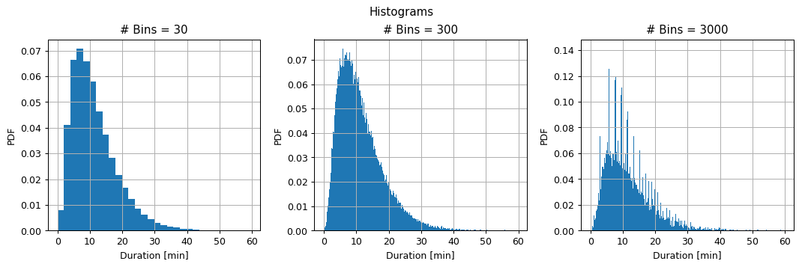


## 🎰 A Random Phenomenon

In most cases in machine learning, we will describe the process which generates the data as a random phenomenon. 

Let us have a short recap of the concepts we use to handle random phenomenons. As an example we will take a look at the following random phenomenon:

> We take a glass full of juice and pour it on the floor (don't try this at home) and look at the shape of the resulting spill. 

Below is a table defining some of the concepts which we will be using when working with random phenomenons, along with the example of spilling the glass of juice.

| name | Usually donated by | Definition | Example  |
| :--- | --- | --- | --- |
| **A random phenomenon**<br><br><br><br> |- | Some process which generates random outcomes |  Spilling a glass of juice on the floor and examining at the shape of the spill |
| **A sample**<br><br><br><br> | $$\omega$$ | A single outcome of the process |  Some specific spill shape |
| **Sample space**<br><br><br><br> | $$\Omega$$ | The space of all possible outcomes of the given process. $$\Omega=\left\lbrace\forall\omega\right\rbrace$$ |  The space of all possible spill shapes |
| **Random Variables**<br><br><br><br> | $$X\left(\omega\right)$$,$$Y\left(\omega\right)$$,... | A function $$X:\Omega\rightarrow\mathbb{R}$$ which assigns a real number to a given sample | A function which returns the perimeter of a spill:<br>$$X_1\left(\omega\right)$$<br>A function which returns the area of a spill:<br> $$X_2\left(\omega\right)$$ |
| **An event**<br><br><br><br> | $$A$$ | A collection of events, i.e., a subset of the sample space $$A\subseteq\Omega$$.<br>We would often define an event through a condition on random variables. |  The collection of all spills with a perimeter smaller than 2:<br>$$A=\left\lbrace\omega: X_1\left(\omega\right)<2 \right\rbrace$$<br>The collection of all spills with a area larger than 1:<br>$$B=\left\lbrace\omega: X_2\left(\omega\right)>1 \right\rbrace$$ |
| **Event space**<br><br><br><br> | $$\mathcal{F}$$ | A space of events. $$A\in\mathcal{F}$$  | The space of all possible collections of spills shape |
| **Probability measure**<br><br><br><br> | $$P\left(A\right)$$ | A function $$P:\mathcal{F}\rightarrow\left[0,1\right]$$ which returns the probability of a random sample to be an element in some event $$A$$ | $$P\left(A\right)=P\left(X_1<2\right)=0.1$$<br>$$P\left(X_1<0\right)=P\left(\emptyset\right)=0$$<br>$$P\left(0\leq X_1\right)=P\left(\Omega\right)=1$$<br>$$P\left(A\cup B\right)=P\left(X_1<2\ \text{or}\ X_2>1\right)=0.6$$<br>$$P\left(A\cap B\right)=P\left(X_1<2\ \text{and}\ X_2>1\right)=0.01$$ |
| **Conditional probability measure**<br><br><br><br> | $$P\left(AǀB\right)$$ | A function $$P:\mathcal{F}_1\times\mathcal{F}_2\rightarrow\left[0,1\right]$$ which returns the probability of a random sample to be an element in event $$A$$ given that it is an element in event $$B$$ | The probability of a spill to have a diameter smaller than 2, given that it has a area larger than 1:<br>$$P\left(AǀB\right)=P\left(X_1<2ǀX_2>1\right)=0.02$$ |

In the last two rows we have used $$X<2$$ as a shorthand for $$\left\lbrace\omega:X\left(\omega\right)<2\right\rbrace$$. This is in fact a common shorthand writing and we will usually be using it from here on.

<br>
<center></center>
## 📊 Distributions


**Realizations**: The outcomes of the random variable, i.e., the output value we get for a random outcome of the process, is called realization. We usually denote random variables by upper case letter and denote their realization using the equivalent lower case one, for example, the random variable $$X$$ and its realization $$x$$. 

In many cases, the term samples is used to refer to the realizations themselves without making the distinction between the actual samples and the result of the random variable operating in them.   

The distribution of a random variable describes the probability of getting realizations values. The distribution is usually described by one of the following functions.

### The Cumulative Distribution Function (the CDF)

The CDF of a random variable $$X$$ is usually denoted by $$F_X\left(x\right)$$ and is defined as:
$$
F_{X}\left(x\right)=P\left(X\leq x\right)
$$

### The Probability Density Function (the PDF) - For a Continues Random Variable

*Not the documents file format* 😉

The PDF of a random variable $$X$$ is usually denoted by $$f_X\left(x\right)$$ or $$p_X\left(x\right)$$ and is defined as a function for which:

$$
F_X\left(x\right)=\int_{-\infty}^{x}p_X\left(x\right)dx
$$

If $$F_X\left(x\right)$$ is differentiable then:

$$
p_X\left(x\right)=\frac{d}{dx}F_X\left(x\right)
$$

### The Probability Mass Function (the PMF) - For a Discrete Random Variable

The PMF of a random variable $$X$$ is also usually denoted by $$f_X\left(x\right)$$ or $$p_X\left(x\right)$$ and is defined as:

$$
p_X\left(x\right)=P\left(X=x\right)
$$

## 🗜️ Expectation Value

In the discrete case, the expectation value of a random variable $$X$$ is the weighted average of the outcomes random variable can produce, where the weights are the probability assigned to each outcome, i.e., the PMF. We will denote it by $$\mathbb{E}\left[x\right]$$. It is calculated by:
$$
\mathbb{E}\left[x\right]=\sum_{x\in\left\lbrace X\left(\omega\right),\omega\in\Omega\right\rbrace} x\cdot p_X\left(x\right)
$$

Where $$\left\lbrace X\left(\omega\right),\omega\in\Omega\right\rbrace$$ represents the space of all possible outcomes of the random variable $$X$$.

It can be shown that the expectation value of the random variable $$g\left(X\left(\omega\right)\right)$$, for any given $$g$$, can be calculated as:

$$
\mathbb{E}\left[g\left(x\right)\right]=\sum_{g\left(x\right)} g\left(x\right)\cdot p_{g\left(X\right)}\left(g\left(x\right)\right)=\sum_{x} g\left(x\right)\cdot p_X\left(x\right)
$$

In the continues case, the expectation value is calculated by:

$$
\mathbb{E}\left[g\left(x\right)\right]=\int_{-\infty}^\infty g\left(x\right)\cdot p_X\left(x\right)dx
$$


## 📐 Estimating the distribution

In the context of machine learning, we would like to estimate the unknown distribution of a random variable based on a set of samples of it which we will call the dataset. **We will always assume here that the samples in the dataset are statistically independent**.

We will usually denote an estimation of some value $$x$$ using the "hat" sign: $$\hat{x}$$.

### Empirical Measure

Before we look at evaluating distributions, let us start by defining the empirical measure and empirical mean.

The empirical measure is an estimation of a probability measure given a set of samples. Using the following notation:

- $$N$$ - the number of samples in the dataset.
- $$\omega_i$$ - the $$i$$-th sample.
- $$I\left\lbrace\omega_i \in A\right\rbrace$$ - An indicator function of whether or not $$\omega_i$$ is an element in event $$A$$.

The empirical measure of the probability measure $$P\left(A\right)$$ is defined as:

$$
\hat{p}_A=\tfrac{1}{N}\sum_{i=1}^N I\left\lbrace\omega_i\in A\right\rbrace
$$

Put in words, we estimate the probability of an event as the fraction of samples in the dataset which are members of the event.

### Empirical Mean

The empirical mean is a way to estimates the value of an expectation value given a set of samples. Adding the following notation:

- $$x_i$$ - the realization value of the $$i$$-th sample, i.e., $$X\left(\omega_i\right)$$. **From here on we will refer to $$X_i$$ is as the $$X$$ value of the $$i$$-th sample.**

The empirical mean of the expectation value $$\mathbb{E}\left[f\left(x\right)\right]$$ is then defined as:

$$
\hat{\mu}_{f\left(x\right)}=\tfrac{1}{N}\sum_{i=1}^N f\left(x_i\right)
$$

## 📊 Estimating the PMF

We can use the empirical measure we can estimate the PMF of a random variable $$X$$. We shall denote:

- $$N$$ - the number of samples in the dataset.
- $$x_i$$ - the $$X$$ value of the $$i$$-th sample.
- $$I\left\lbrace x_i = x\right\rbrace$$ - An indicator function of whether or not $$x_i$$ is equal to $$x$$.

The PMF estimation of $$p_{X}\left(x\right)$$ is then given by:
$$
\hat{p}_{X}\left(x\right)=\tfrac{1}{N}\sum_{i=1}^N I\left\lbrace x_i = x\right\rbrace
$$

## 📈 The Empirical Cumulative Distribution Function (the ECDF)

Similarly, we can estimate the CDF of a random variable $$X$$. We shall denote:

- $$N$$ - the number of samples in the dataset.
- $$x_i$$ - the $$X$$ value of the $$i$$-th sample.
- $$I\left\lbrace x_i \leq x\right\rbrace$$ - An indicator function of whether or not $$x_i$$ is smaller then $$x$$.

The ECDF estimation of the CDF $$F_{X}\left(x\right)$$ is then given by:
$$
\hat{F}_{X}\left(x\right)=\tfrac{1}{N}\sum_{i=1}^N I\left\lbrace x_i \leq x\right\rbrace
$$

The ECDF results in a non-continuous CDF which is a sum of step functions.

## 📶 Histogram

A histogram is constructed by dividing the range of possible outcomes a random variable can take into bins and then estimating the probability density (the value of the PDF) in each bin. The bins must be non-overlapping and to cover the full range of possible outcomes. The estimation of the probability density in each bin is estimated in a manner similar to the PMF. We shall denote:

- $$N$$ the number of samples of the random variable $$X$$.
- $$x_i$$ - the $$X$$ value of the $$i$$-th sample.
- $$l_k$$, $$r_k$$ - The left and right edges of the $$k$$'s bin.
- $$I\left\lbrace l_k \leq x_i < r_k\right\rbrace$$ - An indicator function of whether or not $$x_i$$ is the $$k$$'s bin

The histogram which estimates the PDF $$p_X\left(x\right)$$ is given by:
$$
h_X\left(l_k \leq x < r_k\right) = \tfrac{1}{N\cdot\left(r_k-l_k\right)}\sum_{i=1}^N I\left\lbrace l_k \leq x_i < r_k\right\rbrace
$$

the additional division by $$\left(r_k-l_k\right)$$ is to produce a probability density from the estimated probability.

*The actual calculation for when and how good is this approximation is outside the scope of this course.* 

The selection of the bins significantly effects how well the histogram approximates the PDF. A common rule of thumb for selecting the bins is to divide the range of values into $$\sqrt{N}$$ equal bins.

## 📉 Kernel Density Estimation (KDE)

KDE is another method for estimating the PDF. In KDE the samples are smoothed out using a smoothing function called the **Parzan window**. 

One way of understanding the resulting PDF is by thinking of it as a PDF which was generated by placing a Dirac delta function in each sampled value and then smoothing it out using the Parzen window.

We shall denote:

- $$N$$ the number of samples of the random variable $$X$$.
- $$x_i$$ - the $$X$$ value of the $$i$$-th sample.
- $$\phi\left(x\right)$$ - the selected Parzen window.

The KDE which estimates the PDF $$p_X\left(x\right)$$ is given by:
$$
\hat{p}_{\phi,X}\left(x\right) = \frac{1}{N}\sum_{i=1}^N \phi\left(x-x_i\right)
$$

It is common to add a scaling factor $$h$$, called the bandwidth, to the Parzen window to control the width of the window. We shall denote the scaled version of the window by $$\phi_h\left(x\right)=\frac{1}{h}\phi\left(\frac{x}{h}\right)$$. Plugging this into the definition of the KDE, we get:

$$
\hat{p}_{\phi,h,X}\left(x\right) = \frac{1}{N\cdot h}\sum_{i=1}^N \phi\left(\frac{x-x_i}{h}\right)
$$

Two common choices of the Parzen window are:
- A Gaussian: $$\frac{1}{\sqrt{2\pi}}\exp\left(-\frac{x^2}{2}\right)$$
- A rectangular function $$I\left\lbrace\left|x\right|\leq0.5\right\rbrace$$

A rule of thumb for selecting the bandwidth for the Gaussian window is: $$\left(\frac{4\cdot\text{std}\left\lbrace x_i\right\rbrace}{3N}\right)^\frac{1}{5}$$

<center><h1 class="workshop-title">Workshop 2<br>Non-Parametric Density Estimation</h1></center>
## 🚖 The NYC Taxi Dataset 

As part of the effort of NYC to make its data publicly available and accessible, the city releases every month the full list of all taxi rides around the city. We will be using the dataset from January 2016, which can be found [here](https://www1.nyc.gov/site/tlc/about/tlc-trip-record-data.page)

The full dataset includes over 10M taxi rides. In our course, we will be using a smaller subset of this dataset with only 100k rides (which has also been cleaned up a bit). The smaller dataset can be found [here](https://technion046195.github.io/semester_2019_spring/datasets/nyc_taxi_rides.csv)

## ❓️ Problem: Estimating the Distribution of Trip Duration

A taxi driver would like to give an estimation for the distributions of trip durations. He has taken the course in machine learning and has figured that he can use historical rides data to estimate this distribution. Let us help the driver with his estimation.

## 🔃 The Workflow

**Distribution Estimation Evaluation**: The subject of evaluating how good a distribution fits a set of sampled data is an important one, but it is outside the scope of this course. Therefore, for the next two workshops, we will skip the evaluation step in our workflow.

The workflow is then:

<center></center>
## ⤵️ Applying the Workflow

We will start by importing some useful packages


```python
# Importing packages
import numpy as np  # Numerical package (mainly multi-dimensional arrays and linear algebra)
import pandas as pd  # A package for working with data frames
import matplotlib.pyplot as plt  # A plotting package

## Setup matplotlib to output figures into the notebook
## - To make the figures interactive (zoomable, tooltip, etc.) use ""%matplotlib notebook" instead
%matplotlib inline

plt.rcParams['figure.figsize'] = (5.0, 5.0)  # Set default plot's sizes
plt.rcParams['figure.dpi'] = 90  # Set default plot's dpi (increase fonts' size)
plt.rcParams['axes.grid'] = True  # Show grid by default in figures

## A function to add Latex (equations) to output which works also in Google Colabrtroy
## In a regular notebook this could simply be replaced with "display(Markdown(x))"
from IPython.display import HTML
def print_math(x):  # Define a function to preview markdown outputs as HTML using mathjax
    display(HTML(''.join(['<p><script src=\'https://cdnjs.cloudflare.com/ajax/libs/mathjax/2.7.3/latest.js?config=TeX-AMS_CHTML\'></script>',x,'</p>'])))
```

## 🕵️ Data Inspection

We will start by loading the data and taking a look at it by printing out the 10 first rows.

- The data can be found at [https://technion046195.github.io/semester_2019_spring/datasets/nyc_taxi_rides.csv](https://technion046195.github.io/semester_2019_spring/datasets/nyc_taxi_rides.csv) 


```python
data_file = 'https://technion046195.github.io/semester_2019_spring/datasets/nyc_taxi_rides.csv'

## Loading the data
dataset = pd.read_csv(data_file)

## Print the number of rows in the data set
number_of_rows = len(dataset)
print_math('Number of rows in the dataset: $$N={}$$'.format(number_of_rows))

## Show the first 10 rows
dataset.head(10)
```


Number of rows in the dataset: $$N=100000$$


<div>
<style scoped>
    .dataframe tbody tr th:only-of-type {
        vertical-align: middle;
    }

    .dataframe tbody tr th {
        vertical-align: top;
    }
    
    .dataframe thead th {
        text-align: right;
    }
</style>
<table border="1" class="dataframe">
  <thead>
    <tr style="text-align: right;">
      <th></th>
      <th>passenger_count</th>
      <th>trip_distance</th>
      <th>payment_type</th>
      <th>fare_amount</th>
      <th>tip_amount</th>
      <th>pickup_easting</th>
      <th>pickup_northing</th>
      <th>dropoff_easting</th>
      <th>dropoff_northing</th>
      <th>duration</th>
      <th>day_of_week</th>
      <th>day_of_month</th>
      <th>time_of_day</th>
    </tr>
  </thead>
  <tbody>
    <tr>
      <th>0</th>
      <td>2</td>
      <td>2.768065</td>
      <td>2</td>
      <td>9.5</td>
      <td>0.00</td>
      <td>586.996941</td>
      <td>4512.979705</td>
      <td>588.155118</td>
      <td>4515.180889</td>
      <td>11.516667</td>
      <td>3</td>
      <td>13</td>
      <td>12.801944</td>
    </tr>
    <tr>
      <th>1</th>
      <td>1</td>
      <td>3.218680</td>
      <td>2</td>
      <td>10.0</td>
      <td>0.00</td>
      <td>587.151523</td>
      <td>4512.923924</td>
      <td>584.850489</td>
      <td>4512.632082</td>
      <td>12.666667</td>
      <td>6</td>
      <td>16</td>
      <td>20.961389</td>
    </tr>
    <tr>
      <th>2</th>
      <td>1</td>
      <td>2.574944</td>
      <td>1</td>
      <td>7.0</td>
      <td>2.49</td>
      <td>587.005357</td>
      <td>4513.359700</td>
      <td>585.434188</td>
      <td>4513.174964</td>
      <td>5.516667</td>
      <td>0</td>
      <td>31</td>
      <td>20.412778</td>
    </tr>
    <tr>
      <th>3</th>
      <td>1</td>
      <td>0.965604</td>
      <td>1</td>
      <td>7.5</td>
      <td>1.65</td>
      <td>586.648975</td>
      <td>4511.729212</td>
      <td>586.671530</td>
      <td>4512.554065</td>
      <td>9.883333</td>
      <td>1</td>
      <td>25</td>
      <td>13.031389</td>
    </tr>
    <tr>
      <th>4</th>
      <td>1</td>
      <td>2.462290</td>
      <td>1</td>
      <td>7.5</td>
      <td>1.66</td>
      <td>586.967178</td>
      <td>4511.894301</td>
      <td>585.262474</td>
      <td>4511.755477</td>
      <td>8.683333</td>
      <td>2</td>
      <td>5</td>
      <td>7.703333</td>
    </tr>
    <tr>
      <th>5</th>
      <td>5</td>
      <td>1.561060</td>
      <td>1</td>
      <td>7.5</td>
      <td>2.20</td>
      <td>585.926415</td>
      <td>4512.880385</td>
      <td>585.168973</td>
      <td>4511.540103</td>
      <td>9.433333</td>
      <td>3</td>
      <td>20</td>
      <td>20.667222</td>
    </tr>
    <tr>
      <th>6</th>
      <td>1</td>
      <td>2.574944</td>
      <td>1</td>
      <td>8.0</td>
      <td>1.00</td>
      <td>586.731409</td>
      <td>4515.084445</td>
      <td>588.710175</td>
      <td>4514.209184</td>
      <td>7.950000</td>
      <td>5</td>
      <td>8</td>
      <td>23.841944</td>
    </tr>
    <tr>
      <th>7</th>
      <td>1</td>
      <td>0.804670</td>
      <td>2</td>
      <td>5.0</td>
      <td>0.00</td>
      <td>585.344614</td>
      <td>4509.712541</td>
      <td>585.843967</td>
      <td>4509.545089</td>
      <td>4.950000</td>
      <td>5</td>
      <td>29</td>
      <td>15.831389</td>
    </tr>
    <tr>
      <th>8</th>
      <td>1</td>
      <td>3.653202</td>
      <td>1</td>
      <td>10.0</td>
      <td>1.10</td>
      <td>585.422062</td>
      <td>4509.477536</td>
      <td>583.671081</td>
      <td>4507.735573</td>
      <td>11.066667</td>
      <td>5</td>
      <td>8</td>
      <td>2.098333</td>
    </tr>
    <tr>
      <th>9</th>
      <td>6</td>
      <td>1.625433</td>
      <td>1</td>
      <td>5.5</td>
      <td>1.36</td>
      <td>587.875433</td>
      <td>4514.931073</td>
      <td>587.701248</td>
      <td>4513.709691</td>
      <td>4.216667</td>
      <td>3</td>
      <td>13</td>
      <td>21.783056</td>
    </tr>
  </tbody>
</table>
</div>


## The Data Fields and Types

In this exercise we will only be interested in the following columns:

- **duration**: The total duration of the ride (in minutes)
- **time_of_day**: A number between 0 and 24 indicating the time of the pickup. The integer part is the hour in 24H format and the decimal part are the minutes and seconds

(A full description for each of the other columns can be found [here](https://www1.nyc.gov/assets/tlc/downloads/pdf/data_dictionary_trip_records_yellow.pdf))

## 📜 Problem Definition

### ✍️ Exercise 2.1 - The Underlying Process

For the random phenomenon generating the taxi rides data, define or make-up examples for:
- A sample
- 3 random variable
- An event
- A probability measure

#### Solution 2.1

- **A sample**: A single taxi ride, for example, $$\omega$$: A ride from downtown to central park, which began at 8:15 and took 30 minutes.
- **Random variables**:
 - A function which returns the ride's duration in hours as a real number. (A continues random variable): $$X_\text{duration}\left(\omega\right)=0.5$$
  - A function which returns the pickup hour of the day as an integer between 0 and 23. (A discrete random variable): $$X_\text{hour}\left(\omega\right)=8$$
  - A function which returns 1 if the ride ended to the west of East River and 0 if it ended to the east of it. (A binary random variable): $$X_\text{East River}\left(\omega\right)=1$$
- **An event**: A set of taxi rides, For example, all taxi rides which started before 11 a.m: $$A=\left\lbrace\omega,X_\text{hour}(\omega)<11\right\rbrace$$
- **Probability measure**: For example, the probability of a randomly generated ride to start before 11 a.m. $$P\left(A\right)=\tfrac{1}{3}$$

### The Task and the Goal

Our task here is to estimate the distribution of the rides durations. We will represent it as a CDF or a PDF.

###  📚 Splitting the dataset

We will split the data into 80% train set and 20% test set for later evaluations


```python
n_samples = len(dataset)

## Generate a random generator with a fixed seed (this is important to make our result reproducible)
rand_gen = np.random.RandomState(0)

## Generating a vector of indices
indices = np.arange(n_samples)

## Shuffle the indices
rand_gen.shuffle(indices)

## Split the indices into 80% train / 20% test
n_samples_train = int(n_samples * 0.8)
train_indices = indices[:n_samples_train]
test_indices = indices[n_samples_train:]

train_set = dataset.iloc[train_indices]
test_set = dataset.iloc[test_indices]
```

## 💡 Model & Learning Method Suggestion 1 : ECDF

We shall start be trying to estimate the CDF of the distribution using the ECDF.

In this case the ECDF defines both the model which we will be using and the way to calculate it. In the general case, as we will see in the next workshop, the model and the method used to calculate a model based on the model can be two separate things.

## ⚙️ Learning

We will now turn to actually calculate the ECDF from the data.

### ✍️ Exercise 2.2 - ECDF

1. Calculate and plot the ECDF of the durations.
2. According to the ECDF graph, what is the estimated probability of a ride to have a duration longer than 20 min?

#### Solution 2.2-1

We shall calculate the ECDF over a grid of durations.

**Reminder**, the ECDF is defined as:

$$
\hat{F}_{X}\left(x\right)=\tfrac{1}{N}\sum_{i=1}^N I\left\lbrace x_i \leq x\right\rbrace
$$


```python
def calculate_ecdf(x, duration_grid):
    
    ## Initialize a an array for the calculated ECDF
    ecdf = np.zeros(duration_grid.shape)
    
    ## Calculate the ECDF by definition
    for i, duration in enumerate(duration_grid):   # enumerate adds an index to the list's values
        ecdf[i] = (x <= duration).mean()
    
    return ecdf
    

## extarcting the samples
x = train_set['duration'].values

## Define the grid
duration_grid = np.arange(0, x.max() + 0.001, 0.001)  # We add the step size to the end of the range to include the endpoint

## Create the ECDF
ecdf = calculate_ecdf(x, duration_grid)

# plot the ECDF
fig, ax = plt.subplots()
ax.plot(duration_grid, ecdf)
ax.set_title('ECDF')
ax.set_ylabel('CDF')
ax.set_xlabel('Duration [min]')

## Plot a zoomed in version
fig, ax = plt.subplots()
ax.plot(duration_grid, ecdf)
ax.set_title('ECDF - Zoom in')
ax.set_ylabel('CDF')
ax.set_xlabel('Duration [min]')
ax.set_xlim(19.5, 20.5)
ax.set_ylim(0.88, 0.9);
```


*Note that the ECDF is a sum of step functions.*

#### Solution 2.2-2

The CDF graph describes the probability of $$X_\text{duration}\leq x$$. We want to evaluate:

$$
P\left(X_\text{duration}>20 \text{min}\right)=1 - P\left(X_\text{duration}\leq 20 \text{min}\right)=1-\hat{F}_{X}\left(20\right)=1-0.89=0.11
$$

### ✍️  Exercise 2.3 - The Dependency on the Dataset's size

Recalculate the EDCF using a smaller amount of data. Randomly sample N = 10, 100 and 1000 samples from the train set and use them to calculate the ECDF.

#### Solution 2.3


```python
## Create the figure and axis
fig, ax = plt.subplots()
ax.set_title('ECDF - Smaller dataset')
ax.set_ylabel('CDF')
ax.set_xlabel('Duration [min]')

## Generate a random generator for the sampling
rand_gen = np.random.RandomState(0)

for n_samples in [10, 100, 1000, len(x)]:
    x_smaller = rand_gen.choice(x, n_samples, replace=False)
    
    ## Create the ECDF
    ecdf = calculate_ecdf(x_smaller, duration_grid)

    ## Plot the ECDF
    ax.plot(duration_grid, ecdf, label=str(n_samples))

## Add a legend
ax.legend();
```


Not surprisingly, we can see that as we increase the number of points, the estimation becomes smoother, and although we have not defined an evaluation method, we will note that for all the popular distribution evaluation methods the error indeed decreases.

## 💡 Model & Learning Method Suggestion 2: Histogram

We shall try to estimate the PDF of the distribution using an histogram.

## ⚙️ Learning

###  ✍️ Exercise 2.4 - Histogram

1. Calculate and plot the histogram of the duration for the case of 30, 300 and 3000 bins.
2. Split the train set into 8 equal subsets and calculate the histogram for each of the subsets. What can you say about the variability of the bins height as a function of the number of bins?

*Reminder: the rule of thumb suggests to use a number of bins equal to $$\sqrt{N}=\sqrt{80000}\approx 280$$*

#### Solution 2.4-1


```python
def calculate_hist(x, n_bins):
    ## Define bins
    bins_edges = np.linspace(0, x.max() + 1e-9, n_bins + 1)
    bins_width = np.diff(bins_edges) ## Equal to running: bins[1:] - bins[:-1]

    ## Calculate the histogram
    hist_values = np.zeros(n_bins)
    for k in range(n_bins):
        hist_values[k] = \
            np.sum((x >= bins_edges[k]) & 
                   (x < bins_edges[k + 1])
                   ) / n_samples / bins_width[k]
    
    return hist_values, bins_edges, bins_width

## Prepare the figure
fig, ax = plt.subplots(1, 3, figsize=(12, 4))
## Loop over the number of bins
for i_bins, n_bins in enumerate((30, 300, 3000)):
    ## Calculate the histogram
    hist_values, bins_edges, bins_width = calculate_hist(x, n_bins)
    
    ## Plot the histogram
    ax[i_bins].bar(bins_edges[:-1], hist_values, width=bins_width, align='edge');
    ax[i_bins].set_title('# Bins = {}'.format(n_bins))
    ax[i_bins].set_ylabel('PDF')
    ax[i_bins].set_xlabel('Duration [min]')

fig.suptitle('Histograms');
plt.tight_layout(rect=(0, 0, 1, 0.95))
```





From here on we will use the [plt.hist](https://matplotlib.org/api/_as_gen/matplotlib.axes.Axes.hist.html?highlight=hist#matplotlib.axes.Axes.hist) or [numpy.histogram](https://docs.scipy.org/doc/numpy/reference/generated/numpy.histogram.html) functions for calculating histograms.

##### Solution 2.4-2

Let us split the data and repeat the previous calculation on each subset. 


```python
## Generate a random generator for the shuffling
rand_gen = np.random.RandomState(0)
## Shuffle the array (the array is copied in order to preserve the order of the original array)
x_shuffled = x.copy()
rand_gen.shuffle(x_shuffled)
## Split the shuffled array
x_splited = np.split(x_shuffled, 8)

## Prepare the figure
fig, ax = plt.subplots(1, 3, figsize=(12, 4))
## Loop over the number of bins
for i_bins, n_bins in enumerate([30, 300, 3000]):
    ## Define bins
    bins_edges = np.linspace(0, x.max() + 1e-9, n_bins + 1)
    
    ## Loop over the subsets
    for x_subset in x_splited:
        ## Plot histogram
        ax[i_bins].hist(x_subset, bins=bins_edges, density=True, histtype='step', fill=False);
    ax[i_bins].set_title('# Bins = {}'.format(n_bins))
    ax[i_bins].set_ylabel('PDF')
    ax[i_bins].set_xlabel('Duration [min]')

fig.suptitle('Histograms Variability');
plt.tight_layout(rect=(0, 0, 1, 0.95))
```


To better visualize the variance let us plot the above graphs after removing the mean value:


```python
## Prepare the figure
fig, ax = plt.subplots(1, 3, figsize=(12, 4))
## Loop over the number of bins
for i_bins, n_bins in enumerate([30, 300, 3000]):
    ## Define bins
    bins_edges = np.linspace(0, x.max() + 1e-9, n_bins + 1)
    
    ## Initialize an array to store the histograms values
    histograms = np.zeros((len(x_splited), len(bins_edges) - 1))
    
    ## Loop over the subsets
    for i_subset, x_subset in enumerate(x_splited):
        ## Calculate the histograms
        histograms[i_subset] = np.histogram(x_subset, bins=bins_edges, density=True)[0]

    ## Remove the mean value
    histograms_error = histograms - histograms.mean(axis=0)
    
    ## Plot the histograms error
    ax[i_bins].plot(bins_edges[:-1], histograms_error.T, '.')
    ax[i_bins].set_title('# Bins = {}'.format(n_bins))
    ax[i_bins].set_ylabel('PDF Error')
    ax[i_bins].set_xlabel('Duration [min]')
    ax[i_bins].set_ylim(-0.06, 0.06)

fig.suptitle('Histogram Diviation from the Mean');
plt.tight_layout(rect=(0, 0, 1, 0.95))
```


We can see that:

- **For a large number of bins**, the deviations between the subsets are large, but the bins are narrow.
- **For the small number of bins**, the deviations between the subsets are small, but the bins are wide.

##### Sources of Estimation Error

- In the first case, the main source of error is due to the stochastic nature of the process which results in a large variance in our estimation. This error will be very significant for a small amount of data, but it will decrease as we add more data.

- In the second case, the main source of estimation error will be mostly due to the model's limited representation capability. This type of error is unrelated to the amount of data.

## 💡 Model & Learning Method Suggestion 3: KDE

We shall try to estimate the PDF of the distribution using an KDE.

## ⚙️ Learning

###  ✍️ Exercise 2.5 - KDE

Calculate and plot the KDE of the durations using a Gaussian Parzen window with widths ($$\sigma$$) of 0.08, 0.8, 8. 

Add on the same axes the plot of a histogram with 300 bins for comparison.

*Reminder: the rule of thumb suggests a width of: $$\left(\frac{4\cdot\text{std}\left\lbrace x_i\right\rbrace}{3N}\right)^\frac{1}{5}$$*

#### Solution 2.5


```python
## Calculate the suggested bandwidth
suggested_bandwidth = 1.06 * np.std(x) / n_samples ** (1 / 5.)
print_math('The rule of thumb suggests a bandwidth of $$\\left(\\frac{{4\\cdot\\text{{std}}\\left\\{{x_i\\right\\}}}}{{3N}}\\right)^\\frac{{1}}{{5}}\\approx{:.3f}$$'.format(suggested_bandwidth))

def calculate_gaussian_kde(x, bandwidth, duration_grid):
    ## Calculate a matrix of (x_grid_j - x_i)^2 
    delta_squared = (duration_grid[:, None] - x[None, :]) ** 2

    ## Calculate the KDE
    kde = (1 / np.sqrt(2 * np.pi * bandwidth ** 2) * np.exp(- delta_squared / 2 / bandwidth ** 2)).mean(axis=1)
    
    return kde

## Define the grid
duration_grid = np.arange(0, x.max() + 0.01, 0.01)

## Prepare the figure
fig, ax = plt.subplots()
ax.hist(x, bins=300 ,density=True, label='Histogram')
## Loop over the bandwidth
for i_bandwidth, bandwidth in enumerate([0.08, 0.8, 8]):
    ## Calculate KDE
    kde = calculate_gaussian_kde(x, bandwidth, duration_grid)
    
    ## Plot histogram
    ax.plot(duration_grid, kde, linewidth=2, label=str(bandwidth))

ax.set_title('KDE')
ax.set_ylabel('PDF')
ax.set_xlabel('Duration [min]')
ax.legend();
```


The rule of thumb suggests a bandwidth of $$\left(\frac{4\cdot\text{std}\left\lbrace x_i\right\rbrace}{3N}\right)^\frac{1}{5}\approx0.775$$


From here on we will use the [KernelDensity](https://scikit-learn.org/stable/modules/generated/sklearn.neighbors.KernelDensity.html#sklearn.neighbors.KernelDensity) object from scikit-learn to calculate KDEs.

Again we see behavior similar to that of the histogram. For a narrow bandwidth, we get finer details, but the estimation is more "noisy", which is related to the high variance of the estimation. For the wide bandwidth, we get fewer details, but we expect the estimation to have smaller variance.

## ❓️ Problem: Work Hours Prediction

### ✍️ Exercise 2.6 - Constant prediction

We would like to predict whether a random given ride occurred during the work hours, , which we will define as between 7 a.m. and 18 p.m., based only on the duration of the ride.

For that let as define the random binary variable $$Y$$. The random variable $$Y$$ returns 1 if a ride occurred during the work hours, and 0 otherwise.

We shall denote $$p_Y\left(y\right)=P\left(Y=y\right)$$

1. Based on the data estimate $$p_Y\left(0\right)$$ and $$p_Y\left(1\right)$$, the probability of a random ride to occur on and off the work hours
2. Which of the constant predictions, 0 or 1, would result in a larger probability guess $$Y$$ correctly?

#### solution 2.6-1

We will estimate $$p_Y\left(y\right)$$ using the empirical measure estimation: $$\frac{1}{N}\sum_i I\left\lbrace y_i=y\right\rbrace$$


```python
## Define {y}
y = (train_set['time_of_day'].values > 7) & (train_set['time_of_day'].values < 18)

## Calculate the probability p_Y(1)
prob_y1 = y.mean()
print_math('$$p_Y(1)\\approx{:.2f}$$'.format(prob_y1))

## Calculate the probability p_Y(0)
prob_y0 = (~y).mean()
print_math('$$p_Y(0)\\approx{:.2f}$$'.format(prob_y0))
```


$$p_Y(1)\approx0.51$$


$$p_Y(0)\approx0.49$$


#### solution 2.6-2

Basically, we would like to select our constant prediction $$\hat{y}$$ such that:

$$
\hat{y}=\underset{y\in\left\lbrace 0,1\right\rbrace}{\arg\max}\ \ P\left(Y=y\right)
$$

Which, not surprisingly, means picking the value of $$Y$$ with the highest probability.Since there is a slightly higher probability of $$Y$$ being equal to 1 our constant prediction would be:

$$
\hat{y}=1
$$

## ⏱️ Performance evaluation - Constant Prediction

Let us test our prediction method on the test set, using the misclassification rate risk:


```python
## Define {y} for the test set
y_test = (test_set['time_of_day'].values > 7) & (test_set['time_of_day'].values < 18)

predictions = 1
test_risk = (y_test != predictions).mean()
print_math('The test risk is: $$R_\\text{{test}}\\{{ \\hat{{y}}=1 \\}}={:.2}$$'.format(test_risk))
```


The test risk is: $$R_\text{test}\{ \hat{y}=1 \}=0.49$$


Similarly to the train set we we're correct 51% of the time, which is only slightly better then a 50:50 random guess.

### ✍️ Exercise 2.7 - Prediction Based on Duration

Let us now try to improve our prediction using the duration data. We would now like to make our prediction based on the the known duration of the ride, i.e., we would like to predict:

$$
\hat{y}\left(x\right)=\underset{y\in\left\lbrace 0,1\right\rbrace}{\arg\max}\ \ p_{Y|X}\left(y|x\right)
$$

1. Use Bayes rule to write $$p_{Y|X}$$ using $$p_{X|Y}$$, $$p_X$$ and $$p_Y$$
2. Use KDE to estimate $$p_{X|Y}\left(x|y=0\right)$$ and $$p_{X|Y}\left(x|y=1\right)$$.
3. Calculate the new predictor. 

#### solution 2.7-1

Using Bayes rule:
$$
p_{Y|X}\left(y|x\right)=\frac{p_{X|Y}\left(x|y\right)\cdot p_Y\left(y\right)}{p_X\left(x\right)}
$$

#### solution 2.7-2

To evaluate $$p_{X|Y}\left(x|y=1\right)$$ we will calculate a KDE using only the samples with $$Y=1$$, and the same for $$p_{X|Y}\left(x|y=0\right)$$ 


```python
## Import the KDE class from scikit-learn
from sklearn.neighbors import KernelDensity

## Define the grid
duration_grid = np.arange(0, 60 + 0.1, 0.1)

## Initialize a KDE estimation object
kde_func = KernelDensity(kernel='gaussian', bandwidth=0.8)

## Y=1
## Update the KDE object with the data for Y=1
kde_func.fit(x[y, None])
## Calculate the desity over the grid
kde_y1 = np.exp(kde_func.score_samples(duration_grid[:, None]))  ## score_samples retuns log(p(x))

## Y=0
## Update the KDE object with the data for Y=1
kde_func.fit(x[~y, None])
## Calculate the desity over the grid
kde_y0 = np.exp(kde_func.score_samples(duration_grid[:, None]))  ## score_samples retuns log(p(x))

fig, ax = plt.subplots()
ax.plot(duration_grid, kde_y1, label='$$p_{X|Y}(x|y=1)$$')
ax.plot(duration_grid, kde_y0, label='$$p_{X|Y}(x|y=0)$$')
ax.set_title('Conditional KDE')
ax.set_ylabel('PDF')
ax.set_xlabel('Duration [min]')
ax.legend();
```


We can see here that during the work hours, $$Y=1$$, a ride has a slightly higher probability to have a longer duration. Let us see if we can use this fact to improve our prediction.

#### solution 2.7-3

The result of 

$$
\hat{y}\left(x\right)=\underset{y\in\left\lbrace 0,1\right\rbrace}{\arg\max}\ \ p_{Y|X}\left(y|x\right)
$$

will simply be:

$$
\hat{y}\left(x\right)
=\underset{y\in\left\lbrace 0,1\right\rbrace}{\arg\max}\ \  p_{Y|X}\left(y|x\right)
= 
\begin{cases}
1 & p_{Y|X}\left(y=1|x\right)\geq p_{X|Y}\left(y=0|x\right) \\
0 & \text{otherwise}
\end{cases}
$$

Let us use the Bayes equality we wrote in order to evaluate the condition here:

$$
p_{Y|X}\left(1|x\right)\overset{?}{\geq}p_{Y|X}\left(0|x\right) \\
\Leftrightarrow
\frac{p_{X|Y}\left(x|1\right)\cdot p_Y\left(1\right)}{p_X\left(x\right)}\overset{?}{\geq}\frac{p_{X|Y}\left(x|0\right)\cdot p_Y\left(0\right)}{p_X\left(x\right)} \\
\Leftrightarrow
p_{X|Y}\left(x|1\right)\cdot p_Y\left(1\right)\overset{?}{\geq}p_{X|Y}\left(x|0\right)\cdot p_Y\left(0\right)
$$

We will evaluate $$\hat{y}$$ numerically by substituting the quantities which we have already calculated into this inequality:


```python
## Calculate the prediction over the grid
prediction = kde_y1 * prob_y1 >= kde_y0 * prob_y0

## Plot the prediction
fig, ax = plt.subplots()
ax.plot(duration_grid, prediction)
ax.set_title('Prediction')
ax.set_ylabel('$$\hat{y}$$')
ax.set_xlabel('Duration [min]');
```


Therefore our prediction would be:

$$
\hat{y}\left(x\right)=
\begin{cases}
1 & x\geq11.4 \\
0 & \text{otherwise}
\end{cases}
$$

## ⏱️ Performance evaluation - Based on Duration

Let us test our prediction method on the test set:


```python
x_test = test_set['duration'].values

predictions = x_test > 11.4
test_risk = (y_test != predictions).mean()
print_math('The test risk is: $$R_\\text{{test}}\\{{ \\hat{{y}}(x) \\}}={:.2}$$'.format(test_risk))
```


The test risk is: $$R_\text{test}\{ \hat{y}(x) \}=0.46$$


We were able to slightly improve our prediction. Although it is a very small improvement, there are cases where it can be very significant.


```python
%%html
<link rel="stylesheet" href="../css/style.css"> <!--Setting styles - You can simply ignore this line-->
```


<link rel="stylesheet" href="../css/style.css"> <!--Setting styles - You can simply ignore this line-->


